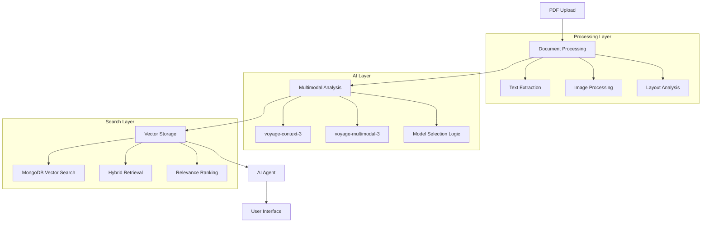

# 🤖 Build a Multimodal PDF Agent Workshop

> **The ultimate hands-on workshop for AI4 Conference**: Learn to build production-ready AI agents that process documents using cutting-edge multimodal AI, vector search, and automation.

## 🎯 Workshop Overview

This comprehensive workshop teaches developers how to build intelligent document processing systems that can understand both text and visual content from PDFs. Participants will create complete AI agents using modern tools and deploy them to production.

### What You'll Build

By the end of this workshop, you'll have created:
- **Intelligent PDF Processing Pipeline** - Extracts and analyzes both text and images
- **Multimodal AI Agent** - Understands and responds to questions about document content
- **Production-Ready System** - Scalable, monitored, and secure
- **Interactive Web Interface** - Upload and query documents in real-time

### Technologies Covered

| Technology | Purpose | Level |
|------------|---------|-------|
| **🚀 n8n** | Visual workflow automation | Beginner → Advanced |
| **🗄️ MongoDB Atlas** | Vector database and search | Intermediate |
| **🧠 Voyage AI** | Multimodal embeddings (text + images) | Intermediate |
| **🐍 Python/Jupyter** | Alternative implementation path | Advanced |
| **☁️ Production Deployment** | Scaling and monitoring | Advanced |

## 🏆 Perfect for AI4 Conference Attendees

### Who Should Attend
- **Backend Developers** building AI-powered applications
- **Data Engineers** working with document processing
- **ML Engineers** exploring multimodal AI applications
- **Solution Architects** designing intelligent document systems
- **Product Managers** understanding AI implementation possibilities

### Prerequisites
- Basic programming experience (JavaScript or Python)
- Familiarity with APIs and databases
- Docker basics (helpful but not required)
- Curiosity about AI and automation!

## 🚀 Quick Start Options

### Option 1: GitHub Codespaces (Recommended)
Perfect for the conference - no local setup required!

1. Click: [](https://codespaces.new/mongodb-developer/multimodal-pdf-agent-n8n)
2. Wait for environment setup (2-3 minutes)
3. Follow the workshop documentation
4. Start building immediately!

### Option 2: Local Development
```bash
# Clone the workshop
git clone https://github.com/mrlynn/ai4-multimodal-agents-n8n.git
cd multimodal-pdf-agent-n8n

# Start all services
npm run dev

# Open documentation
open http://localhost:3000
```

## 📚 Workshop Structure & Timing

### Part 1: Foundation (45 minutes)
- **Environment Setup** (10 min) - Codespaces, MongoDB Atlas, Voyage AI
- **PDF Processing Pipeline** (20 min) - Extract text and images from documents
- **Vector Search Implementation** (15 min) - Store and search document embeddings

### Part 2: AI Agent Development (60 minutes)
- **Basic AI Agent** (25 min) - Question answering over documents
- **Multimodal Enhancement** (20 min) - Processing images and visual content
- **Advanced Features** (15 min) - Memory, context, and tool calling

### Part 3: Production & Advanced Topics (45 minutes)
- **Scaling & Performance** (15 min) - Handle large document volumes
- **Security & Monitoring** (15 min) - Production-ready deployment
- **Enterprise Integration** (15 min) - APIs, webhooks, and workflows

### Part 4: Open Lab & Q&A (30 minutes)
- **Custom Implementation** - Apply learnings to your use case
- **Troubleshooting** - Get help with specific challenges
- **Advanced Patterns** - Multi-agent systems, hybrid approaches

*Total: 3 hours | Difficulty: Beginner → Advanced*

## 🎯 Learning Outcomes

By completing this workshop, participants will be able to:

### Technical Skills
- ✅ Build visual workflows with n8n for document processing
- ✅ Implement vector search with MongoDB Atlas
- ✅ Use multimodal AI models for text and image understanding
- ✅ Create conversational AI agents with memory and context
- ✅ Deploy and monitor production AI systems

### Strategic Understanding
- ✅ Choose appropriate AI models for different content types
- ✅ Design scalable document processing architectures
- ✅ Implement cost-effective AI solutions
- ✅ Navigate security and compliance considerations
- ✅ Plan enterprise AI integration strategies

## 🛠️ Development Environment

### Included Services
- **n8n Workflow Automation** - Visual pipeline builder
- **MongoDB Atlas** - Vector database with search
- **Workshop API Gateway** - Simplified AI model access
- **File Upload Interface** - Test document processing
- **Real-time Monitoring** - Track system performance

### Pre-configured Examples
- ✅ Sample PDF documents (legal, technical, visual)
- ✅ Pre-built workflow templates
- ✅ Test queries and expected responses
- ✅ Performance benchmarks and metrics
- ✅ Common troubleshooting scenarios

## 🌟 What Makes This Workshop Special

### 1. **Multimodal Focus**
Most workshops focus on text-only AI. We cover the full spectrum:
- Text understanding with context-aware models
- Image processing and visual document analysis
- Hybrid approaches combining multiple AI models

### 2. **Production-Ready**
Beyond proof-of-concepts - learn patterns used in real enterprise systems:
- Scalable architecture design
- Cost optimization strategies
- Security and compliance considerations
- Monitoring and observability

### 3. **Multiple Learning Paths**
- **Visual/No-Code**: n8n workflows for rapid prototyping
- **Programmatic**: Python/Jupyter for maximum control
- **Hybrid**: Combine both approaches strategically

### 4. **Real-World Applications**
- **Legal**: Contract analysis and compliance checking
- **Technical**: API documentation and user manuals
- **Financial**: Report analysis and data extraction
- **Academic**: Research paper processing and synthesis

## 📊 Success Metrics & Validation

### Built-in Assessment Tools
- **Interactive Quizzes** - Test understanding of key concepts
- **Live System Monitoring** - Verify your implementations work
- **Performance Benchmarks** - Compare against optimal solutions
- **Security Scans** - Ensure production-ready security

### Take-Home Value
- **Complete Working System** - Deployed and accessible after the workshop
- **Source Code Repository** - All examples and implementations
- **Production Deployment Guide** - Scale beyond the workshop
- **Community Access** - Ongoing support and advanced patterns

## 🏗️ Architecture Overview



## 🚀 Deploy Workshop Documentation

### Quick Deploy to Vercel
[](https://vercel.com/new/clone?repository-url=https%3A%2F%2Fgithub.com%2Fmongodb-developer%2Fmultimodal-pdf-agent-n8n-docs)

### Local Development
```bash
# Install dependencies
npm install

# Start development server
npm start

# Build for production
npm run build
npm run serve
```

## 📁 Repository Structure

```
workshop-docs/
├── docs/                    # Workshop content and guides
│   ├── 10-intro.mdx        # Workshop introduction
│   ├── 15-github-codespaces.mdx
│   ├── 20-prerequisites.mdx
│   ├── 40-pdf-processing-workflow.mdx
│   ├── 70-complete-multimodal-agent.mdx
│   └── ...                 # Additional guides
├── src/
│   ├── components/         # Interactive React components
│   │   ├── LiveStatusBadge/    # Real-time system monitoring
│   │   ├── EmbeddingTester/    # Test AI models
│   │   ├── Quiz/               # Knowledge validation
│   │   └── ...
│   └── pages/              # Custom pages
├── static/
│   ├── workflows/          # Pre-built n8n workflows
│   ├── img/               # Documentation assets
│   └── upload-interface.html  # File upload tool
└── docusaurus.config.js   # Site configuration
```

## 🤝 Contributing

This workshop is continuously improved based on participant feedback and emerging AI capabilities.

### Current Focus Areas
- **Enhanced multimodal processing** with latest Voyage AI models
- **Production monitoring** and observability patterns
- **Enterprise integration** examples and case studies
- **Performance optimization** for large-scale deployments

## 📞 Support & Community

- **Workshop Issues**: [GitHub Issues](https://github.com/mrlynn/ai4-multimodal-agents-n8n/issues)
- **MongoDB Community**: [Developer Forums](https://www.mongodb.com/community/forums)
- **n8n Community**: [Community Forum](https://community.n8n.io/)
- **Voyage AI Documentation**: [API Reference](https://docs.voyageai.com/)

## 📄 License

This workshop content is licensed under [MIT License](LICENSE). Feel free to use, modify, and share!

---

**Ready to build the future of document intelligence?** 
🚀 [Start the Workshop](https://your-workshop-docs.vercel.app) | 💻 [Open in Codespaces](https://codespaces.new/mongodb-developer/multimodal-pdf-agent-n8n)