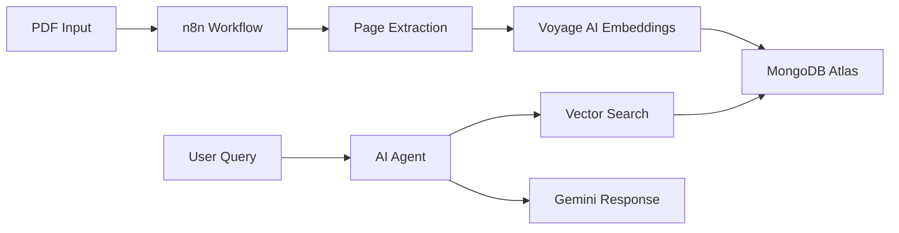

# 📘 Introduction to Multimodal PDF Agents with n8n

import Tabs from '@theme/Tabs';
import TabItem from '@theme/TabItem';

|Workshop goals|Build a multimodal AI agent that processes PDFs using n8n, MongoDB Atlas, and Voyage AI|
|-|-|
|What you'll learn|Visual workflow automation, vector search, multimodal embeddings, AI agent patterns|
|Prerequisites|n8n installed, MongoDB Atlas account, Voyage AI API key|
|Time to complete|2 hours|

<ProgressTracker steps={[
  {
    title: "Environment Setup",
    description: "Set up Docker, n8n, and MongoDB Atlas",
    timeEstimate: "15 minutes",
    difficulty: "beginner"
  },
  {
    title: "PDF Processing Workflow", 
    description: "Build workflow to extract and process PDF content",
    timeEstimate: "25 minutes",
    difficulty: "intermediate"
  },
  {
    title: "Vector Search Implementation",
    description: "Configure MongoDB Atlas Vector Search",
    timeEstimate: "20 minutes", 
    difficulty: "intermediate"
  },
  {
    title: "AI Agent Creation",
    description: "Build intelligent agent with tool calling",
    timeEstimate: "30 minutes",
    difficulty: "advanced"
  },
  {
    title: "Memory & Context",
    description: "Add conversation history and context management",
    timeEstimate: "20 minutes",
    difficulty: "advanced"
  },
  {
    title: "Production Deployment",
    description: "Deploy and scale your multimodal agent",
    timeEstimate: "15 minutes",
    difficulty: "intermediate"
  }
]} />

## 🎯 What We're Building

A production-ready system that:
- **Ingests PDFs** and extracts both text and images
- **Generates multimodal embeddings** using Voyage AI
- **Stores in MongoDB Atlas** with vector search capabilities
- **Provides an AI agent** with tool calling via Gemini 2.0
- **Maintains conversation memory** for context
- **Implements ReAct pattern** for intelligent reasoning

## 🏗️ Architecture Overview

## 🚀 Why This Approach?

### Visual Development
- No code complexity
- See data flow in real-time
- Easy debugging and modification

### Production Ready
- Built-in error handling
- Scalable architecture
- Enterprise features

### Best-in-Class Tools
- **MongoDB Atlas**: Leading vector database
- **Voyage AI**: State-of-the-art multimodal embeddings
- **n8n**: Powerful workflow automation
- **Gemini 2.0**: Advanced AI capabilities

## 🚀 Choose Your Setup Method

<WorkshopExercise 
  title="Setup Your Development Environment" 
  difficulty="beginner"
  timeEstimate="15 minutes"
  objectives={[
    "Choose between Codespaces or local development",
    "Set up all required services and tools", 
    "Verify your environment is working correctly"
  ]}
>

<Tabs>
  <TabItem value="cloud" label="☁️ GitHub Codespaces (Fastest)" default>

<ExerciseStep stepNumber="1" title="Launch GitHub Codespaces">

**Zero Installation Required!** Everything runs in your browser:

<TerminalCommand 
  command="# Navigate to deployment repository"
  output="Opening: https://github.com/mongodb-developer/multimodal-pdf-agent-n8n"
/>

1. Go to [deployment repository](https://github.com/mongodb-developer/multimodal-pdf-agent-n8n)
2. Click **Code** → **Codespaces** → **Create codespace**  
3. Wait for automatic setup (3-5 minutes first time)
4. All services start automatically

**Requirements:**
- GitHub account (free)
- Web browser
- Internet connection

</ExerciseStep>

<ExerciseValidation 
  title="Verify Codespaces Setup"
  checks={[
    {
      id: "codespace_running",
      description: "Codespace is running and accessible",
      hint: "Check that VS Code opens in your browser"
    },
    {
      id: "ports_forwarded", 
      description: "Ports are automatically forwarded (check Ports tab)",
      hint: "Look for ports 5678, 8081, and 3000 in the Ports panel"
    },
    {
      id: "services_healthy",
      description: "All Docker services are running (green status)",
      hint: "Run 'docker-compose ps' in the terminal"
    }
  ]}
/>

👉 **[Continue with Codespaces Setup](./github-codespaces)**

  </TabItem>
  <TabItem value="local" label="🐳 Local Docker">

<ExerciseStep stepNumber="1" title="Clone and Start Services">

**Full control** - Work offline, customize everything:

<CodeBlock language="bash" title="Local Setup Commands">
{`# Clone workshop deployment repo
git clone https://github.com/mongodb-developer/multimodal-pdf-agent-n8n.git
cd multimodal-pdf-agent-n8n

# Start services
cp .env.example .env
docker-compose up -d`}
</CodeBlock>

<ServiceTester 
  serviceName="n8n"
  testUrl="http://localhost:5678"
  testData={{}}
/>

**Requirements:**
- Docker Desktop
- Git
- 8GB RAM

</ExerciseStep>

<ExerciseValidation 
  title="Verify Local Setup"
  checks={[
    {
      id: "docker_running",
      description: "Docker Desktop is running",
      hint: "Check Docker icon in system tray"
    },
    {
      id: "services_up",
      description: "All services are up (docker-compose ps shows 'Up')",
      hint: "Run 'docker-compose ps' to check status"
    },
    {
      id: "n8n_accessible",
      description: "n8n is accessible at http://localhost:5678",
      hint: "Open the URL in your browser"
    },
    {
      id: "mongodb_accessible",
      description: "MongoDB Express is accessible at http://localhost:8081",
      hint: "Open the URL in your browser"
    }
  ]}
/>

👉 **[Continue with Local Setup](./prerequisites)**

  </TabItem>
</Tabs>

</WorkshopExercise>

## 📋 Required for Both Methods

✅ **MongoDB Atlas account** (free tier) - [Sign up](https://www.mongodb.com/try)  
✅ **Google AI Studio API key** for Gemini (optional) - [Get key](https://makersuite.google.com/app/apikey)  
✅ **Sample PDFs** for testing  

## 🗺️ Workshop Journey

1. **Environment Setup** → Get all tools configured
2. **PDF Processing** → Build ingestion workflow
3. **Vector Search** → Implement similarity search
4. **AI Agent** → Create intelligent assistant
5. **Memory & Context** → Add conversation history
6. **ReAct Pattern** → Implement reasoning loops
7. **Production Deploy** → Scale your solution

## 💡 Key Concepts

### Multimodal Embeddings
Voyage AI's `voyage-multimodal-3` model processes both text and images into a unified vector space, enabling semantic search across different content types.

### Vector Search
MongoDB Atlas Vector Search provides efficient similarity search at scale, perfect for RAG (Retrieval Augmented Generation) applications.

### Visual Workflows
n8n's node-based interface makes complex integrations intuitive, with built-in error handling and monitoring.

### Agent Patterns
We'll implement industry-standard patterns like tool calling and ReAct (Reasoning and Acting) for intelligent agent behavior.

## 🎓 Learning Outcomes

By the end of this workshop, you'll be able to:

1. **Design and build** visual AI workflows in n8n
2. **Process multimodal content** from PDFs
3. **Implement vector search** with MongoDB Atlas
4. **Create AI agents** with tool calling capabilities
5. **Add memory** to maintain context
6. **Deploy to production** with confidence

## 🚦 Ready to Start?

Let's begin by setting up your development environment and ensuring all prerequisites are in place.

[Get Started with Prerequisites →](./prerequisites)