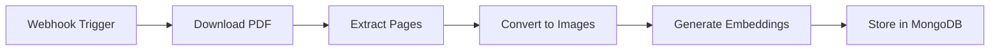

# 📄 PDF Processing Workflow

Build your first n8n workflow to process PDFs into searchable multimodal embeddings.

<SlideRecap 
  title="From Documents to Intelligent Data"
  items={[
    {
      icon: "📄",
      title: "PDF Ingestion Pipeline",
      description: "How to automatically process documents and extract both text and visual content"
    },
    {
      icon: "🎨", 
      title: "Multimodal Understanding",
      description: "Why processing images and text together creates richer, more accurate search"
    },
    {
      icon: "🔄",
      title: "n8n Visual Workflows",
      description: "Building complex data pipelines with visual, no-code automation"
    }
  ]}
  nextSection="Time to build your first multimodal processing pipeline!"
/>

<InstructorNotes 
  timing="PDF Processing Workflow (25-30 minutes)"
  notes={[
    "This is the heart of the workshop - expect debugging time",
    "PDF download node often fails due to CORS or authentication issues",
    "PDF toolkit node can be memory intensive with large files",
    "Embedding generation is the slowest step - use smaller PDFs for demos",
    "MongoDB connection issues surface here if Atlas wasn't configured properly"
  ]}
  tips={[
    "Start with a simple 1-2 page PDF for initial testing",
    "Use the sample PDFs provided in the workshop repo",
    "Show attendees how to use the debug panel to inspect data flow",
    "Expect 5-10 minutes for first successful workflow execution",
    "Have attendees save workflow frequently - crashes can happen",
    "Demonstrate error handling patterns they'll need later"
  ]}
/>

## Workflow Overview



## Step 1: Create the Webhook Trigger

### Add Webhook Node

1. Create a new workflow in n8n
2. Click the **+** button to add a node
3. Search for **"Webhook"**
4. Configure:
   - **HTTP Method**: POST
   - **Path**: `/process-pdf`
   - **Response Mode**: Immediately respond
   - **Response Code**: 200
   - **Response Data**: `{"status": "processing"}`

### Copy the Webhook URL

1. Click on the Webhook node
2. Copy the **Test URL** (for development)
3. It will look like: `http://localhost:5678/webhook-test/process-pdf`

:::tip Production URLs
In production, use the Production URL instead of Test URL.
:::

## Step 2: Download PDF

### Add HTTP Request Node

1. Add **HTTP Request** node
2. Connect it to the Webhook node
3. Configure:
   - **Method**: GET
   - **URL**: `{{ $json.pdf_url }}`
   - **Response Format**: File
   - **Binary Property**: data

### Test Data Structure

Your webhook should receive:
```json
{
  "pdf_url": "https://example.com/sample.pdf",
  "metadata": {
    "source": "user_upload",
    "tags": ["ai", "workshop"]
  }
}
```

## Step 3: Extract PDF Pages

### Add Read PDF Node

1. Add **Read PDF** node (from community nodes if needed)
2. Connect to HTTP Request node
3. Configure:
   - **Operation**: Extract Pages as Images
   - **Binary Property**: data
   - **Output Format**: Separate Items
   - **Image Format**: PNG
   - **DPI**: 150 (balance quality/size)

:::info Alternative Approach
If Read PDF node isn't available, use a Code node with pdf-parse library.
:::

### Code Node Alternative

```javascript
const PDFParser = require('pdf-parse');
const { createCanvas } = require('canvas');
const items = [];

// Get PDF buffer
const pdfBuffer = $binary.data.buffer;

// Parse PDF
const pdfData = await PDFParser(pdfBuffer);

// Extract text pages
for (let i = 0; i < pdfData.numpages; i++) {
  items.push({
    json: {
      page_number: i + 1,
      text: pdfData.text, // Simplified - real implementation would get page text
      total_pages: pdfData.numpages
    }
  });
}

return items;
```

## Step 4: Generate Embeddings

Before building the embedding code, let's verify our API is working:

<QuickEmbeddingTest 
  text="This is sample PDF content that will be processed by our workflow"
  label="Test Embedding API"
/>

### Add Code Node for Voyage AI

1. Add **Code** node
2. Connect to PDF extraction node
3. Add this code:

```javascript
const items = [];

for (const item of $input.all()) {
  try {
    // Get image data
    const imageBuffer = await item.binary.data.buffer;
    const base64Image = imageBuffer.toString('base64');
    
    // Prepare input based on content type
    const input = item.json.content_type === 'image' 
      ? `data:image/png;base64,${base64Image}`
      : item.json.text_content;
    
    // Call Workshop Embedding Service
    const response = await $http.request({
      method: 'POST',
      url: 'https://workshop-embedding-api.vercel.app/api/embed',
      headers: {
        'Content-Type': 'application/json'
      },
      body: {
        text: input,
        model: 'voyage-3'
      }
    });
    
    // Prepare document for MongoDB
    items.push({
      json: {
        filename: $('Webhook').item.json.metadata.filename || 'unknown.pdf',
        page_number: item.json.page_number,
        content_type: item.json.content_type || 'image',
        embedding: response.embeddings[0],
        metadata: {
          source_url: $('Webhook').item.json.pdf_url,
          processed_at: new Date().toISOString(),
          total_pages: item.json.total_pages,
          ...$('Webhook').item.json.metadata
        },
        text_content: item.json.text_content || null,
        image_data: {
          width: item.json.width || null,
          height: item.json.height || null,
          format: 'png'
        }
      }
    });
    
  } catch (error) {
    console.error(`Error processing page ${item.json.page_number}:`, error);
    // Continue with other pages
  }
}

return items;
```

## Step 5: Store in MongoDB

### Add MongoDB Node

1. Add **MongoDB** node
2. Connect to Code node
3. Configure:
   - **Credential**: Select your MongoDB Atlas credential
   - **Operation**: Insert
   - **Collection**: `pdf_documents`
   - **Options**:
     - **Multiple Documents**: Toggle ON

## Complete Workflow

Your workflow should now look like:

```
[Webhook] → [HTTP Request] → [Extract PDF] → [Generate Embeddings] → [MongoDB]
```

## Testing the Workflow

### 1. Activate the Workflow

Click **"Execute Workflow"** to activate test mode.

### 2. Send Test Request

Use cURL or Postman:

```bash
curl -X POST http://localhost:5678/webhook-test/process-pdf \
  -H "Content-Type: application/json" \
  -d '{
    "pdf_url": "https://example.com/sample.pdf",
    "metadata": {
      "filename": "ai-workshop.pdf",
      "source": "workshop_test"
    }
  }'
```

### 3. Monitor Execution

1. Check each node for green checkmarks
2. Click nodes to see output data
3. Verify documents in MongoDB Atlas

## Error Handling

### Add Error Workflow

1. Create new workflow: "PDF Processing Error Handler"
2. Add **Error Trigger** node
3. Add **MongoDB** node to log errors:
   ```javascript
   {
     collection: "processing_errors",
     error: $json.error,
     workflow: $json.workflow,
     timestamp: new Date()
   }
   ```

### Link Error Handler

1. Go to main workflow settings
2. Set **Error Workflow** to your error handler
3. Errors will now be logged

## Performance Optimization

### Batch Processing

For multiple PDFs, modify the workflow:

1. Use **Split In Batches** node after webhook
2. Process 5 PDFs at a time
3. Add delay between batches

### Caching Strategy

Add a check before processing:

```javascript
// Check if already processed
const existing = await $mongodb.find({
  filename: filename,
  page_number: pageNumber
});

if (existing.length > 0) {
  return [{json: {skipped: true, reason: 'Already processed'}}];
}
```

## Monitoring & Logging

### Add Logging Node

Create a simple logger:

```javascript
const logEntry = {
  workflow_id: $workflow.id,
  execution_id: $execution.id,
  timestamp: new Date(),
  status: 'completed',
  stats: {
    pages_processed: items.length,
    pdf_url: $('Webhook').item.json.pdf_url,
    processing_time: Date.now() - $execution.startedAt
  }
};

// Log to MongoDB
await $mongodb.insert('workflow_logs', logEntry);
```

## Next Steps

Your PDF processing pipeline is ready! You can now:

✅ Accept PDF URLs via webhook  
✅ Extract pages as images  
✅ Generate multimodal embeddings  
✅ Store in MongoDB with vector search  

Let's build the search functionality next!

[Continue to Vector Search →](./vector-search-workflow)