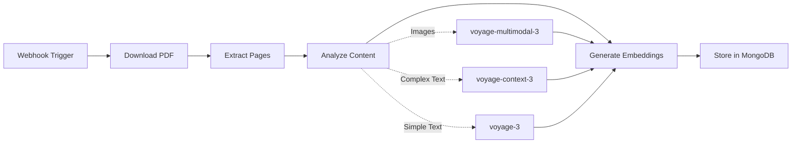

# 📄 PDF Processing Workflow

Build your first n8n workflow to process PDFs into searchable multimodal embeddings.

:::tip Quick Start with Pre-built Workflow
Download and import the ready-made workflow: [02-pdf-processor.json](/workflows/02-pdf-processor.json)

This workflow includes all the steps below, pre-configured and ready to use!
:::

<SlideRecap 
  title="From Documents to Intelligent Data"
  items={[
    {
      icon: "📄",
      title: "PDF Ingestion Pipeline",
      description: "How to automatically process documents and extract both text and visual content"
    },
    {
      icon: "🎨", 
      title: "Multimodal Understanding",
      description: "Why processing images and text together creates richer, more accurate search"
    },
    {
      icon: "🔄",
      title: "n8n Visual Workflows",
      description: "Building complex data pipelines with visual, no-code automation"
    }
  ]}
  nextSection="Time to build your first multimodal processing pipeline!"
/>

<InstructorNotes 
  timing="PDF Processing Workflow (25-30 minutes)"
  notes={[
    "This is the heart of the workshop - expect debugging time",
    "PDF download node often fails due to CORS or authentication issues",
    "PDF toolkit node can be memory intensive with large files",
    "Embedding generation is the slowest step - use smaller PDFs for demos",
    "MongoDB connection issues surface here if Atlas wasn't configured properly"
  ]}
  tips={[
    "Start with a simple 1-2 page PDF for initial testing",
    "Use the sample PDFs provided in the workshop repo",
    "Show attendees how to use the debug panel to inspect data flow",
    "Expect 5-10 minutes for first successful workflow execution",
    "Have attendees save workflow frequently - crashes can happen",
    "Demonstrate error handling patterns they'll need later"
  ]}
/>

## Workflow Overview

This workflow creates an intelligent document processing pipeline that:
1. **Receives** PDF URLs via webhook
2. **Downloads** the PDF file
3. **Extracts** each page as an image (preserving visual elements)
4. **Analyzes** content to select the optimal AI model
5. **Generates** embeddings using the appropriate Voyage AI model
6. **Stores** structured documents in MongoDB for vector search



## Step 1: Create the Webhook Trigger

### Add Webhook Node

1. Create a new workflow in n8n
2. Click the **+** button to add a node
3. Search for **"Webhook"**
4. Configure:
   - **HTTP Method**: POST
   - **Path**: `/process-pdf`
   - **Response Mode**: Immediately respond
   - **Response Code**: 200
   - **Response Data**: `{"status": "processing"}`

### Copy the Webhook URL

1. Click on the Webhook node
2. Copy the **Test URL** (for development)
3. It will look like: `http://localhost:5678/webhook-test/process-pdf`

:::tip Production URLs
In production, use the Production URL instead of Test URL.
:::

## Step 2: Download PDF

### Add HTTP Request Node

1. Add **HTTP Request** node
2. Connect it to the Webhook node
3. Configure:
   - **Method**: GET
   - **URL**: `{{ $json.pdf_url }}`
   - **Response Format**: File
   - **Binary Property**: data

### Test Data Structure

Your webhook should receive:
```json
{
  "pdf_url": "https://arxiv.org/pdf/2501.12948",
  "metadata": {
    "source": "user_upload",
    "tags": ["ai", "research", "arxiv"]
  }
}
```

:::tip Workshop Test Document
We're using [this recent arXiv paper](https://arxiv.org/pdf/2501.12948) as our test document. It's a perfect example for this workshop as it contains:
- **Complex technical text** (ideal for Context-3 model testing)
- **Diagrams and figures** (great for multimodal processing)
- **Research content** (relevant to AI4 conference attendees)
- **Multiple pages** (demonstrates batch processing)
:::

## Step 3: Extract PDF Pages

### Add Read PDF Node

1. Add **Read PDF** node (from community nodes if needed)
2. Connect to HTTP Request node
3. Configure:
   - **Operation**: Extract Pages as Images
   - **Binary Property**: data
   - **Output Format**: Separate Items
   - **Image Format**: PNG
   - **DPI**: 150 (balance quality/size)

:::important Why Extract as Images?
Even text-only PDFs are extracted as images to:
- Preserve layout and formatting
- Capture visual elements (logos, signatures, diagrams)
- Enable multimodal AI processing
- Maintain consistency across all document types
:::

:::info Alternative Approach
If Read PDF node isn't available, use a Code node with pdf-parse library.
:::

### Code Node Alternative

```javascript
const PDFParser = require('pdf-parse');
const { createCanvas } = require('canvas');
const items = [];

// Get PDF buffer
const pdfBuffer = $binary.data.buffer;

// Parse PDF
const pdfData = await PDFParser(pdfBuffer);

// Extract text pages
for (let i = 0; i < pdfData.numpages; i++) {
  items.push({
    json: {
      page_number: i + 1,
      text: pdfData.text, // Simplified - real implementation would get page text
      total_pages: pdfData.numpages
    }
  });
}

return items;
```

## Step 4: Generate Embeddings

Before building the embedding code, let's verify our API is working:

<QuickEmbeddingTest 
  text="This is sample PDF content that will be processed by our workflow"
  label="Test Embedding API"
/>

### Choosing the Right Embedding Model

The workshop now supports three Voyage AI models:
- **voyage-3**: General purpose, fast and efficient
- **voyage-multimodal-3**: For content with images, diagrams, or visual elements
- **voyage-context-3**: For complex text requiring deep understanding (legal, technical)

### Add Code Node for Intelligent Embedding Generation

1. Add **Code** node
2. Connect to PDF extraction node
3. Add this code that performs several critical functions:

**What this code does:**
- **Receives** each PDF page as an image from the previous node
- **Converts** images to base64 format for API transmission
- **Analyzes** content to determine the best embedding model
- **Calls** the workshop embedding API with the selected model
- **Structures** the response for MongoDB storage
- **Handles** errors gracefully to process all pages

```javascript
const items = [];

for (const item of $input.all()) {
  try {
    // Each 'item' represents one PDF page from the extraction step
    
    // Get the page image data (all pages are converted to images)
    const imageBuffer = await item.binary.data.buffer;
    const base64Image = imageBuffer.toString('base64');
    
    // Prepare input format for the embedding API
    // Note: Even text pages are processed as images to preserve layout
    const input = item.json.content_type === 'image' 
      ? `data:image/png;base64,${base64Image}`  // Standard base64 image format
      : item.json.text_content;                 // Pure text (if available)
    
    // Analyze content to select appropriate model
    const model = selectEmbeddingModel(item.json);
    
    // Call Workshop Embedding Service
    // This API proxies requests to Voyage AI, handling authentication
    const response = await $http.request({
      method: 'POST',
      url: 'https://workshop-embedding-api.vercel.app/api/embed',
      headers: {
        'Content-Type': 'application/json'
      },
      body: {
        text: input,              // Base64 image OR text content
        model: model,             // Selected Voyage AI model
        input_type: 'document',   // Tells API this is document content
        // Context-3 model benefits from additional context
        context: model === 'voyage-context-3' ? getPageContext(item.json) : undefined
      }
    });
    
    // Prepare a structured document for MongoDB
    items.push({
      json: {
        // Document identification
        filename: $('Webhook').item.json.metadata.filename || 'unknown.pdf',
        page_number: item.json.page_number,
        
        // Content classification
        content_type: item.json.content_type || 'image',
        
        // The vector embedding (1024 dimensions for multimodal/context-3)
        embedding: response.embeddings[0],
        
        // Rich metadata for filtering and context
        metadata: {
          source_url: $('Webhook').item.json.pdf_url,
          processed_at: new Date().toISOString(),
          total_pages: item.json.total_pages,
          embedding_model: model,  // Track which model was used
          ...$('Webhook').item.json.metadata
        },
        
        // Original content (for retrieval and display)
        text_content: item.json.text_content || null,
        
        // Image metadata (for rendering and analysis)
        image_data: {
          width: item.json.width || null,
          height: item.json.height || null,
          format: 'png'
        }
      }
    });
    
  } catch (error) {
    console.error(`Error processing page ${item.json.page_number}:`, error);
    // Continue with other pages
  }
}

return items;

// Helper function to intelligently select the optimal embedding model
function selectEmbeddingModel(pageData) {
  // Check if this page contains visual content
  const hasImages = pageData.content_type === 'image';
  
  // Analyze text complexity
  const textLength = pageData.text_content ? pageData.text_content.length : 0;
  const hasComplexText = textLength > 500 && 
    (pageData.text_content.includes('whereas') ||    // Legal language
     pageData.text_content.includes('liability') ||  // Contract terms
     pageData.text_content.includes('pursuant'));    // Formal documents
  
  // Model selection logic:
  if (hasImages) {
    // Use multimodal-3 for any visual content (charts, diagrams, scanned pages)
    return 'voyage-multimodal-3';
  } else if (hasComplexText) {
    // Use context-3 for complex documents requiring deep understanding
    return 'voyage-context-3';
  }
  
  // Use voyage-3 for simple text (fast and efficient)
  return 'voyage-3';
}

// Helper function to provide additional context for the context-3 model
function getPageContext(pageData) {
  // Context-3 benefits from knowing the document structure
  return `Page ${pageData.page_number} of ${pageData.total_pages}. ` +
         `Document type: ${pageData.metadata?.document_type || 'general'}`;
  // This context helps the model understand:
  // - Where this content appears in the document
  // - The type of document being processed
  // - Relationships between pages
}
```

## Step 5: Store in MongoDB

### Add MongoDB Node

1. Add **MongoDB** node
2. Connect to Code node
3. Configure:
   - **Credential**: Select your MongoDB Atlas credential
   - **Operation**: Insert
   - **Collection**: `pdf_documents`
   - **Options**:
     - **Multiple Documents**: Toggle ON

## Complete Workflow Architecture

Your workflow creates an intelligent document processing pipeline:

```
[Webhook] → [HTTP Request] → [Extract PDF] → [Generate Embeddings] → [MongoDB]
    ↓             ↓               ↓                    ↓                   ↓
 Receives     Downloads      Converts to         Analyzes &          Stores with
 PDF URL      PDF file       PNG images       Generates vectors    vector index
```

### Data Flow Through the Pipeline

Understanding how data transforms at each step:

1. **Webhook Input**: 
   ```json
   {"pdf_url": "https://arxiv.org/pdf/2501.12948", "metadata": {"filename": "arxiv-paper.pdf"}}
   ```

2. **After PDF Download**: 
   ```
   Binary PDF file (stored in item.binary.data)
   ```

3. **After Page Extraction**: 
   ```json
   [
     {"binary": {"data": "<page1_image>"}, "json": {"page_number": 1, "total_pages": 5}},
     {"binary": {"data": "<page2_image>"}, "json": {"page_number": 2, "total_pages": 5}},
     ...
   ]
   ```

4. **After Embedding Generation**: 
   ```json
   [
     {
       "filename": "contract.pdf",
       "page_number": 1,
       "embedding": [0.123, -0.456, 0.789, ...],  // 1024 dimensions
       "content_type": "image",
       "metadata": {"source_url": "...", "embedding_model": "voyage-multimodal-3"}
     }
   ]
   ```

5. **Final MongoDB Storage**: 
   ```
   Collection: pdf_documents
   Vector Index: On 'embedding' field for similarity search
   ```

### Advanced: Hybrid Approach

For documents with both complex text and images, you can implement a hybrid approach:

```javascript
// Process the same page with multiple models
if (hasImages && hasComplexText) {
  // First pass: Multimodal for visual content
  const visualEmbedding = await generateEmbedding(input, 'voyage-multimodal-3');
  
  // Second pass: Context-3 for text understanding
  const textEmbedding = await generateEmbedding(
    item.json.text_content, 
    'voyage-context-3',
    { context: getPageContext(item.json) }
  );
  
  // Store both embeddings
  items.push({
    ...baseDocument,
    multimodal_embedding: visualEmbedding,
    context_embedding: textEmbedding,
    processing_strategy: 'hybrid'
  });
}
```

This hybrid approach provides the most comprehensive understanding of complex documents by leveraging the strengths of each model.

## Testing the Workflow

### 1. Activate the Workflow

Click **"Execute Workflow"** to activate test mode.

### 2. Send Test Request

Use cURL or Postman:

```bash
curl -X POST http://localhost:5678/webhook-test/process-pdf \
  -H "Content-Type: application/json" \
  -d '{
    "pdf_url": "https://arxiv.org/pdf/2501.12948",
    "metadata": {
      "filename": "arxiv-paper.pdf",
      "source": "workshop_test"
    }
  }'
```

### 3. Monitor Execution

1. Check each node for green checkmarks
2. Click nodes to see output data
3. Verify documents in MongoDB Atlas

## Error Handling

### Add Error Workflow

1. Create new workflow: "PDF Processing Error Handler"
2. Add **Error Trigger** node
3. Add **MongoDB** node to log errors:
   ```javascript
   {
     collection: "processing_errors",
     error: $json.error,
     workflow: $json.workflow,
     timestamp: new Date()
   }
   ```

### Link Error Handler

1. Go to main workflow settings
2. Set **Error Workflow** to your error handler
3. Errors will now be logged

## Performance Optimization

### Batch Processing

For multiple PDFs, modify the workflow:

1. Use **Split In Batches** node after webhook
2. Process 5 PDFs at a time
3. Add delay between batches

### Caching Strategy

Add a check before processing:

```javascript
// Check if already processed
const existing = await $mongodb.find({
  filename: filename,
  page_number: pageNumber
});

if (existing.length > 0) {
  return [{json: {skipped: true, reason: 'Already processed'}}];
}
```

## Monitoring & Logging

### Add Logging Node

Create a simple logger:

```javascript
const logEntry = {
  workflow_id: $workflow.id,
  execution_id: $execution.id,
  timestamp: new Date(),
  status: 'completed',
  stats: {
    pages_processed: items.length,
    pdf_url: $('Webhook').item.json.pdf_url,
    processing_time: Date.now() - $execution.startedAt
  }
};

// Log to MongoDB
await $mongodb.insert('workflow_logs', logEntry);
```

## Next Steps

Your PDF processing pipeline is ready! You can now:

✅ Accept PDF URLs via webhook  
✅ Extract pages as images  
✅ Generate multimodal embeddings  
✅ Store in MongoDB with vector search  

Let's build the search functionality next!

[Continue to Vector Search →](./vector-search-workflow)