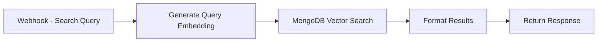

# 🔍 Vector Search Workflow

Create a search endpoint that uses MongoDB Atlas Vector Search to find relevant PDF content.

<InstructorNotes 
  timing="Vector Search Implementation (20-25 minutes)"
  notes={[
    "Vector search index creation can take 5-10 minutes - start this early",
    "Common error: querying before index is built ('index not found')",
    "MongoDB aggregation pipeline syntax trips up SQL developers",
    "Search quality depends heavily on having enough documents ingested",
    "Similarity scores need explanation - attendees expect exact matches"
  ]}
  tips={[
    "Create the vector index immediately after PDF ingestion finishes",
    "Use MongoDB Atlas UI to monitor index building progress",
    "Test with queries that should return obvious matches first",
    "Explain that cosine similarity scores range from 0-1 (higher = more similar)",
    "Have 3-5 test queries ready that demonstrate different search capabilities",
    "Show attendees how to interpret search results and similarity scores"
  ]}
/>

## Search Workflow Structure



## Implementation Steps

### 1. Search Webhook

Add a new **Webhook** node:

1. **HTTP Method**: POST
2. **Path**: `/search`
3. **Response Mode**: Last Node
4. **Response Code**: 200

Expected request format:
```json
{
  "query": "What is machine learning?",
  "limit": 5,
  "filters": {
    "source": "workshop_pdfs"
  }
}
```

### 2. Query Embedding Generation

Add a **Code** node to generate query embeddings:

```javascript
const query = $json.query;

if (!query || query.trim() === '') {
  throw new Error('Query cannot be empty');
}

// Call Workshop Embedding Service with query input type
const response = await $http.request({
  method: 'POST',
  url: 'https://ai4-workshop-embeddings.vercel.app/api/embed',
  headers: {
    'Content-Type': 'application/json'
  },
  body: {
    input: query,
    input_type: 'query' // Important: use 'query' for search
  }
});

return [{
  json: {
    query: query,
    embedding: response.embedding,
    limit: $json.limit || 5,
    filters: $json.filters || {}
  }
}];
```

### 3. MongoDB Vector Search

Add a **MongoDB** node with aggregation pipeline:

1. **Operation**: Aggregate
2. **Collection**: `pdf_documents`
3. **Pipeline**:

```javascript
[
  {
    "$vectorSearch": {
      "index": "vector_index",
      "path": "embedding",
      "queryVector": $json.embedding,
      "numCandidates": 100,
      "limit": $json.limit || 5
    }
  },
  {
    "$project": {
      "_id": 1,
      "filename": 1,
      "page_number": 1,
      "content_type": 1,
      "text_content": 1,
      "metadata": 1,
      "score": { "$meta": "vectorSearchScore" }
    }
  }
]
```

:::tip Vector Search Parameters
- **queryVector**: The embedding vector to search for
- **numCandidates**: Number of candidates to consider (should be >= limit)
- **limit**: Final number of results to return
- **index**: Must match your Atlas Vector Search index name
:::

### 4. Format Results

Add a **Code** node to format the response:

```javascript
const results = $json;
const query = $('Webhook').item.json.query;

// Format results for easy consumption
const formattedResults = results.map((doc, index) => ({
  rank: index + 1,
  score: doc.score,
  filename: doc.filename,
  page_number: doc.page_number,
  content_type: doc.content_type,
  preview: doc.text_content ? 
    doc.text_content.substring(0, 200) + '...' : 
    'Image content',
  metadata: doc.metadata
}));

return [{
  json: {
    query: query,
    total_results: formattedResults.length,
    results: formattedResults,
    search_timestamp: new Date().toISOString()
  }
}];
```

## Advanced Search Features

### Hybrid Search (Text + Image)

Modify your search to handle both text queries and image queries:

```javascript
// Detect if input is image or text
const input = $json.query;
let searchInput;
let inputType = 'query';

if (input.startsWith('data:image')) {
  // Image search
  searchInput = input;
} else {
  // Text search
  searchInput = input;
}

// Generate embedding
const embedding = await getVoyageEmbedding(searchInput, inputType);
```

### Semantic + Metadata Filtering

Combine vector search with metadata filters:

```javascript
[
  {
    "$vectorSearch": {
      "index": "vector_index",
      "path": "embedding",
      "queryVector": $json.embedding,
      "numCandidates": 100,
      "limit": 20,
      "filter": {
        "metadata.tags": { "$in": ["ai", "ml"] }
      }
    }
  },
  {
    "$limit": $json.limit || 5
  }
]
```

### Vector Search with Pre-Filtering

Use the filter fields defined in your index:

```javascript
[
  {
    "$vectorSearch": {
      "index": "vector_index",
      "path": "embedding", 
      "queryVector": $json.embedding,
      "numCandidates": 100,
      "limit": $json.limit || 5,
      "filter": {
        "$and": [
          { "content_type": { "$eq": "image" } },
          { "filename": { "$regex": "^ml_", "$options": "i" } }
        ]
      }
    }
  },
  {
    "$project": {
      "_id": 1,
      "filename": 1,
      "page_number": 1,
      "content_type": 1,
      "text_content": 1,
      "metadata": 1,
      "score": { "$meta": "vectorSearchScore" }
    }
  }
]
```

:::tip Filter Performance
- Only use fields that are indexed as `"type": "filter"` in your vector search index
- Complex filters may impact search performance
- Pre-filtering reduces the candidate set before vector similarity calculation
:::

### Multi-Stage Search

Implement a two-stage search for better relevance:

```javascript
// Stage 1: Initial broad search
const initialResults = await vectorSearch(embedding, 20);

// Stage 2: Rerank using additional criteria
const rerankedResults = initialResults
  .map(doc => ({
    ...doc,
    relevanceScore: calculateRelevance(doc, query)
  }))
  .sort((a, b) => b.relevanceScore - a.relevanceScore)
  .slice(0, limit);
```

## Testing Your Search

### Test Queries

Create test requests:

```bash
# Text search
curl -X POST http://localhost:5678/webhook/search \
  -H "Content-Type: application/json" \
  -d '{
    "query": "machine learning algorithms",
    "limit": 3
  }'

# Search with filters
curl -X POST http://localhost:5678/webhook/search \
  -H "Content-Type: application/json" \
  -d '{
    "query": "neural networks",
    "limit": 5,
    "filters": {
      "source": "workshop_pdfs"
    }
  }'
```

### Expected Response

```json
{
  "query": "machine learning algorithms",
  "total_results": 3,
  "results": [
    {
      "rank": 1,
      "score": 0.92,
      "filename": "ml-basics.pdf",
      "page_number": 5,
      "content_type": "image",
      "preview": "Image content",
      "metadata": {
        "source_url": "https://arxiv.org/pdf/2501.12948",
        "processed_at": "2024-01-20T10:30:00Z"
      }
    }
  ],
  "search_timestamp": "2024-01-20T11:00:00Z"
}
```

## Performance Optimization

### 1. Caching Layer

Add Redis caching for frequent queries:

```javascript
// Check cache first
const cacheKey = `search:${query}:${limit}`;
const cached = await redis.get(cacheKey);
if (cached) {
  return JSON.parse(cached);
}

// Perform search
const results = await performVectorSearch(query);

// Cache results (5 minute TTL)
await redis.setex(cacheKey, 300, JSON.stringify(results));
```

### 2. Query Expansion

Improve recall with query expansion:

```javascript
// Generate variations of the query
const expandedQueries = [
  query,
  await generateSynonyms(query),
  await generateRelatedTerms(query)
];

// Get embeddings for all variations
const embeddings = await Promise.all(
  expandedQueries.map(q => getVoyageEmbedding(q))
);

// Average the embeddings
const avgEmbedding = averageVectors(embeddings);
```

### 3. Result Deduplication

Remove duplicate content:

```javascript
const uniqueResults = results.reduce((acc, current) => {
  const isDuplicate = acc.find(item => 
    item.filename === current.filename && 
    Math.abs(item.page_number - current.page_number) <= 1
  );
  
  if (!isDuplicate) {
    acc.push(current);
  }
  
  return acc;
}, []);
```

## Error Handling

### Add Error Boundaries

```javascript
try {
  // Main search logic
  const results = await performSearch();
  
  if (!results || results.length === 0) {
    return [{
      json: {
        query: query,
        total_results: 0,
        results: [],
        message: "No results found. Try different keywords."
      }
    }];
  }
  
  return formatResults(results);
  
} catch (error) {
  console.error('Search error:', error);
  
  // Return graceful error response
  return [{
    json: {
      error: true,
      message: "Search temporarily unavailable",
      query: query,
      timestamp: new Date().toISOString()
    }
  }];
}
```

## Monitoring Search Quality

### Log Search Analytics

```javascript
// Log search metrics
const searchMetrics = {
  query: query,
  results_count: results.length,
  top_score: results[0]?.score || 0,
  response_time: Date.now() - startTime,
  has_results: results.length > 0,
  timestamp: new Date()
};

await $mongodb.insert('search_analytics', searchMetrics);
```

## Next Steps

Your vector search is now operational! You can:

✅ Accept search queries via API  
✅ Generate query embeddings  
✅ Perform similarity search  
✅ Return formatted results  

Let's add AI intelligence to create a conversational agent!

[Continue to AI Agent →](./ai-agent-workflow)