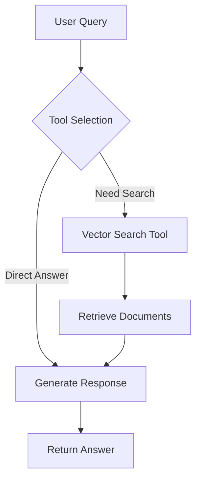

# 🤖 AI Agent with Function Calling

Build an intelligent agent using Gemini 2.0 Flash and n8n's powerful workflow capabilities.

<SlideRecap 
  title="AI Agents & Intelligent Reasoning"
  items={[
    {
      icon: "🤖",
      title: "Function Calling & Tool Use",
      description: "How modern AI agents decide when and how to use external tools for better answers"
    },
    {
      icon: "🧠", 
      title: "ReAct Pattern",
      description: "Reasoning and Acting - the industry-standard pattern for intelligent agent behavior"
    },
    {
      icon: "⚡",
      title: "Gemini 2.0 Integration",
      description: "Leveraging Google's latest multimodal AI model for sophisticated agent capabilities"
    }
  ]}
  nextSection="Let's build your intelligent agent step by step!"
/>

<InstructorNotes 
  timing="AI Agent Creation (30-35 minutes)"
  notes={[
    "This is the most complex section - expect questions about function calling",
    "Gemini API key signup requires Google account (some attendees may not have)",
    "Function calling syntax in n8n is different from OpenAI - emphasize this",
    "Tool selection logic often needs multiple iterations to get right",
    "Response formatting is crucial for good user experience"
  ]}
  tips={[
    "Demo the difference between simple chat and function calling first",
    "Show how to test function definitions before building full agent",
    "Use clear, simple test queries that obviously need search",
    "Explain the ReAct pattern (reason, act, observe) conceptually",
    "Have backup Gemini API key ready in case attendees hit rate limits",
    "Demonstrate debugging failed function calls step by step"
  ]}
/>

## Agent Architecture



## Gemini Integration Setup

### 1. Get Gemini API Key

1. Visit [Google AI Studio](https://makersuite.google.com/app/apikey)

<QRCodeAccess 
  url="https://makersuite.google.com/app/apikey"
  title="Get Gemini API Key"
/>

2. Click **"Create API Key"**
3. Copy the key for n8n

### 2. Add Gemini Credentials in n8n

1. **Credentials** → **New**
2. Search for **"Header Auth"**
3. Configure:
   - **Name**: `Gemini AI`
   - **Header Auth**:
     - **Name**: `x-goog-api-key`
     - **Value**: Your API key

## Building the AI Agent Workflow

### 1. Agent Webhook

Create a new workflow with **Webhook** node:
- **Path**: `/agent`
- **Method**: POST
- **Response**: Last Node

Expected input:
```json
{
  "message": "What does the PDF say about neural networks?",
  "session_id": "user-123",
  "context": []
}
```

### 2. Function Calling Implementation

Add a **Code** node for tool selection:

```javascript
const userMessage = $json.message;
const sessionId = $json.session_id || 'default';

// Define available tools
const tools = [{
  type: "function",
  function: {
    name: "search_documents",
    description: "Search through PDF documents for relevant information",
    parameters: {
      type: "object",
      properties: {
        query: {
          type: "string",
          description: "Search query to find relevant documents"
        },
        limit: {
          type: "number",
          description: "Number of results to return (default: 5)"
        }
      },
      required: ["query"]
    }
  }
}, {
  type: "function", 
  function: {
    name: "get_document_details",
    description: "Get detailed information about a specific document",
    parameters: {
      type: "object",
      properties: {
        filename: {
          type: "string",
          description: "Name of the PDF file"
        },
        page_number: {
          type: "number",
          description: "Specific page number"
        }
      },
      required: ["filename"]
    }
  }
}];

// Prepare messages for Gemini
const messages = [
  {
    role: "system",
    content: `You are an AI assistant with access to a PDF document search system. 
    You can search through documents to answer questions. 
    Always search for relevant information before answering.
    Be helpful and provide detailed answers based on the documents.`
  },
  {
    role: "user",
    content: userMessage
  }
];

// Call Gemini with function calling
const response = await $http.request({
  method: 'POST',
  url: 'https://generativelanguage.googleapis.com/v1beta/models/gemini-2.0-flash-exp:generateContent',
  headers: {
    'Content-Type': 'application/json',
    'x-goog-api-key': await $credentials.get('gemini', 'apiKey')
  },
  body: {
    contents: messages.map(m => ({
      role: m.role === 'system' ? 'user' : m.role,
      parts: [{ text: m.content }]
    })),
    tools: tools,
    generationConfig: {
      temperature: 0.7,
      maxOutputTokens: 2048
    }
  }
});

// Extract function call if present
const candidate = response.candidates[0];
const content = candidate.content;

if (content.parts[0].functionCall) {
  const functionCall = content.parts[0].functionCall;
  return [{
    json: {
      action: 'function_call',
      function_name: functionCall.name,
      arguments: functionCall.args,
      original_message: userMessage,
      session_id: sessionId
    }
  }];
} else {
  return [{
    json: {
      action: 'direct_response',
      response: content.parts[0].text,
      original_message: userMessage,
      session_id: sessionId
    }
  }];
}
```

### 3. Router Node

Add an **IF** node to route based on action:
- **Condition**: `{{ $json.action === 'function_call' }}`
- **True**: Route to function execution
- **False**: Route to response formatting

### 4. Function Execution Branch

#### Search Documents Function

Add **HTTP Request** node to call your search endpoint:

```javascript
// In a Code node before HTTP Request
const functionName = $json.function_name;
const args = $json.arguments;

if (functionName === 'search_documents') {
  return [{
    json: {
      method: 'POST',
      url: 'http://localhost:5678/webhook/search',
      body: {
        query: args.query,
        limit: args.limit || 5
      },
      original_data: $json
    }
  }];
}
```

#### Process Search Results

Add **Code** node after search:

```javascript
const searchResults = $json.results || [];
const originalData = $('Router').item.json;

// Format results for Gemini
const formattedResults = searchResults.map(doc => ({
  filename: doc.filename,
  page: doc.page_number,
  relevance: doc.score,
  content: doc.preview,
  type: doc.content_type
}));

// Prepare function response
const functionResponse = {
  role: "function",
  name: originalData.function_name,
  content: JSON.stringify({
    results: formattedResults,
    total_found: searchResults.length
  })
};

return [{
  json: {
    function_response: functionResponse,
    original_message: originalData.original_message,
    session_id: originalData.session_id,
    search_performed: true
  }
}];
```

### 5. Generate Final Response

Add **Code** node to generate final answer:

```javascript
const functionResponse = $json.function_response;
const originalMessage = $json.original_message;
const searchPerformed = $json.search_performed || false;

// Build conversation with function results
const messages = [
  {
    role: "user",
    content: originalMessage
  }
];

if (searchPerformed && functionResponse) {
  messages.push({
    role: "model",
    content: "",
    parts: [{
      functionCall: {
        name: functionResponse.name,
        args: JSON.parse(functionResponse.content).query
      }
    }]
  });
  messages.push(functionResponse);
}

// Call Gemini again with function results
const response = await $http.request({
  method: 'POST',
  url: 'https://generativelanguage.googleapis.com/v1beta/models/gemini-2.0-flash-exp:generateContent',
  headers: {
    'Content-Type': 'application/json',
    'x-goog-api-key': await $credentials.get('gemini', 'apiKey')
  },
  body: {
    contents: messages.map(m => ({
      role: m.role,
      parts: m.parts || [{ text: m.content }]
    })),
    generationConfig: {
      temperature: 0.7,
      maxOutputTokens: 2048
    }
  }
});

const answer = response.candidates[0].content.parts[0].text;

return [{
  json: {
    response: answer,
    sources: searchPerformed ? JSON.parse(functionResponse.content).results : [],
    session_id: $json.session_id,
    timestamp: new Date().toISOString()
  }
}];
```

## Testing the Agent

### Simple Query Test

```bash
curl -X POST http://localhost:5678/webhook/agent \
  -H "Content-Type: application/json" \
  -d '{
    "message": "What machine learning concepts are covered in the PDFs?"
  }'
```

### Complex Query Test

```bash
curl -X POST http://localhost:5678/webhook/agent \
  -H "Content-Type: application/json" \
  -d '{
    "message": "Compare the different neural network architectures mentioned across all documents"
  }'
```

## Advanced Agent Features

### Multi-Tool Support

Extend your agent with more tools:

```javascript
const additionalTools = [{
  type: "function",
  function: {
    name: "summarize_document",
    description: "Generate a summary of a specific document",
    parameters: {
      type: "object",
      properties: {
        filename: { type: "string" }
      }
    }
  }
}, {
  type: "function",
  function: {
    name: "extract_tables",
    description: "Extract tabular data from PDFs",
    parameters: {
      type: "object",
      properties: {
        topic: { type: "string" }
      }
    }
  }
}];
```

### Streaming Responses

For better UX, implement streaming:

```javascript
// In webhook configuration
{
  "Response Mode": "When Last Node Finishes",
  "Response Headers": {
    "Content-Type": "text/event-stream",
    "Cache-Control": "no-cache"
  }
}

// Stream events
const streamEvent = (data) => {
  return `data: ${JSON.stringify(data)}\n\n`;
};
```

### Error Recovery

Add intelligent error handling:

```javascript
try {
  // Main agent logic
} catch (error) {
  // Fallback to direct response
  const fallbackResponse = await generateFallbackResponse(
    userMessage,
    error.message
  );
  
  return [{
    json: {
      response: fallbackResponse,
      error_occurred: true,
      fallback_used: true
    }
  }];
}
```

## Agent Optimization

### Response Caching

Cache common queries:

```javascript
const cacheKey = `agent:${hashMessage(userMessage)}`;
const cached = await getCache(cacheKey);

if (cached && !forceRefresh) {
  return [{
    json: {
      ...cached,
      from_cache: true
    }
  }];
}
```

### Token Management

Monitor and optimize token usage:

```javascript
const tokenEstimate = estimateTokens(userMessage + JSON.stringify(tools));

if (tokenEstimate > 3000) {
  // Reduce context or tool descriptions
  tools = tools.slice(0, 2); // Limit tools
}
```

## Next Steps

Your AI agent is now functional! It can:

✅ Understand natural language queries  
✅ Decide when to search documents  
✅ Retrieve relevant information  
✅ Generate contextual responses  

You've built a powerful AI agent system! 

[View Workshop Summary →](./summary)