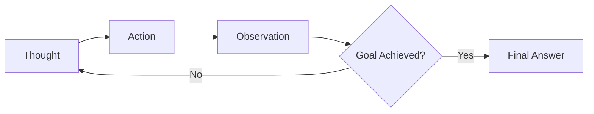
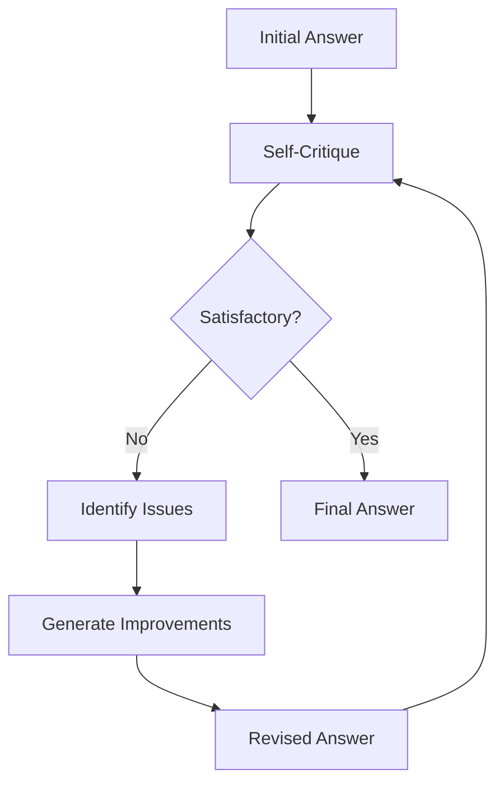

# 🧠 AI Agent Planning Patterns

Understanding how AI agents reason, plan, and act is crucial for building effective multimodal systems. This section covers the key planning patterns that power modern AI agents.

<InstructorNotes 
  timing="Agent Planning Patterns (20-25 minutes)"
  notes={[
    "This bridges the gap between simple prompting and true agent behavior",
    "ReAct pattern is the foundation for our tool-calling implementation",
    "Show concrete examples of each pattern in action",
    "Emphasize that these patterns can be combined",
    "Connect back to the n8n visual workflows they've built"
  ]}
  tips={[
    "Start with simple examples and build complexity",
    "Use the workshop's PDF agent as a running example",
    "Show how n8n's AI Agent node implements these patterns",
    "Demonstrate failures when patterns aren't used correctly",
    "Have attendees identify which pattern fits their use case"
  ]}
/>

<SlideRecap 
  title="From Theory to Implementation"
  items={[
    {
      icon: "🎯",
      title: "AI Agents vs Simple LLMs",
      description: "Agents reason, plan, and act using tools and memory - not just respond"
    },
    {
      icon: "🔄", 
      title: "Planning Patterns",
      description: "Zero-shot, Few-shot, Chain-of-Thought, ReAct, and Reflection patterns"
    },
    {
      icon: "🛠️",
      title: "Practical Implementation",
      description: "How these patterns map to n8n nodes and workflows"
    }
  ]}
  nextSection="Let's explore each planning pattern with real examples!"
/>

## 🎯 What Makes an AI Agent?

Before diving into patterns, let's clarify what distinguishes an AI agent from simpler approaches:

| Approach | Capabilities | Example |
|----------|-------------|---------|
| **Simple Prompting** | Single response, no context | "What is MongoDB?" |
| **RAG (Retrieval)** | Retrieves context, then responds | "Search docs, then answer about MongoDB" |
| **AI Agent** | Reasons, plans, acts, remembers | "Research MongoDB, create examples, test them, refine" |

AI agents are characterized by:
- **Reasoning** about how to approach a task
- **Planning** multi-step solutions
- **Acting** by calling tools and APIs
- **Learning** from results and feedback
- **Remembering** context across interactions

## 📋 Planning Pattern Overview

```mermaid
graph TD
    A[User Query] --> B{Planning Pattern}
    B --> C[Zero-Shot]
    B --> D[Few-Shot]
    B --> E[Chain-of-Thought]
    B --> F[ReAct]
    B --> G[Reflection]
    
    C --> H[Direct Answer]
    D --> I[Example-Based Answer]
    E --> J[Step-by-Step Reasoning]
    F --> K[Reason → Act → Observe]
    G --> L[Answer → Critique → Refine]
```



## 🎲 Pattern 1: Zero-Shot Planning

The agent attempts to solve a problem without any examples, relying purely on its training.

### When to Use
- Simple, well-defined tasks
- When speed is critical
- Clear, unambiguous queries

### Implementation in n8n

```javascript
{
  "systemPrompt": "You are a helpful AI assistant that answers questions directly.",
  "userPrompt": "{{$json.query}}",
  "temperature": 0.3
}
```

### Example
**Query**: "What is the capital of France?"
**Response**: "The capital of France is Paris."

### Limitations
- May miss nuanced requirements
- No guarantee of format compliance
- Limited for complex multi-step tasks

## 🎯 Pattern 2: Few-Shot Planning

Provide examples to guide the agent's behavior and output format.

### When to Use
- Need specific output formats
- Complex domain-specific tasks
- Ensuring consistent behavior

### Implementation in n8n

```javascript
{
  "systemPrompt": `You extract key information from documents.
  
  Example 1:
  Input: "MongoDB Atlas is a cloud database service."
  Output: {"service": "MongoDB Atlas", "type": "cloud database"}
  
  Example 2:
  Input: "Voyage AI provides multimodal embeddings."
  Output: {"service": "Voyage AI", "type": "multimodal embeddings"}`,
  
  "userPrompt": "Extract: {{$json.text}}",
  "temperature": 0.2
}
```

### Workshop Example
```javascript
// Few-shot for PDF metadata extraction
const examples = [
  {
    input: "Invoice #12345 dated 2024-01-15",
    output: {
      documentType: "invoice",
      documentId: "12345",
      date: "2024-01-15"
    }
  },
  {
    input: "Contract Agreement between Company A and Company B",
    output: {
      documentType: "contract",
      parties: ["Company A", "Company B"]
    }
  }
];
```

## 🧠 Pattern 3: Chain-of-Thought (CoT)

Guide the agent to show its reasoning process step-by-step.

### When to Use
- Complex reasoning tasks
- Mathematical or logical problems
- When transparency is important
- Debugging agent decisions

### Implementation Approaches

#### Basic CoT
```javascript
{
  "systemPrompt": "Think through problems step by step before answering.",
  "userPrompt": "{{$json.query}}\n\nLet's think about this step by step:"
}
```

#### Structured CoT
```javascript
{
  "systemPrompt": `When answering questions:
  1. First, identify what information is needed
  2. Then, break down the problem into steps
  3. Work through each step methodically
  4. Finally, synthesize the answer
  
  Show your reasoning at each step.`,
  "userPrompt": "{{$json.query}}"
}
```

### Workshop Example: PDF Analysis CoT

```javascript
// Chain-of-Thought for document analysis
const cotPrompt = `
Analyze this PDF content step by step:

Step 1: Identify document type
- Look for keywords like "invoice", "contract", "report"
- Check formatting and structure

Step 2: Extract key entities
- Find names, dates, amounts
- Identify relationships between entities

Step 3: Determine document purpose
- What action does this document require?
- Who are the stakeholders?

Step 4: Summarize findings
- Combine insights from previous steps
- Highlight critical information

Document content: {{$json.pdfText}}
`;
```

## 🔄 Pattern 4: ReAct (Reasoning + Acting)

The cornerstone pattern for tool-using agents. Combines reasoning with action in a loop.

### The ReAct Loop



### When to Use
- Tasks requiring external tools
- Multi-step problem solving
- When agent needs to gather information
- Interactive workflows

### ReAct Format

```
Thought: I need to find information about MongoDB vector search
Action: search_documents
Action Input: {"query": "MongoDB Atlas vector search setup"}
Observation: Found 3 documents about vector search configuration...

Thought: Now I need to extract the specific index configuration
Action: extract_content
Action Input: {"document_id": "doc_123", "section": "index_config"}
Observation: Vector index requires fields specification...

Thought: I have enough information to answer the question
Action: generate_answer
Action Input: {"context": "...", "query": "..."}
Final Answer: To set up MongoDB Atlas vector search...
```

### Implementation in n8n AI Agent

<WorkshopExercise 
  title="Implement ReAct Pattern in n8n" 
  difficulty="intermediate"
  timeEstimate="15 minutes"
  objectives={[
    "Configure AI Agent node with ReAct pattern",
    "Define tools for the agent to use",
    "Test the reasoning loop with a real query"
  ]}
>

<ExerciseStep stepNumber="1" title="Configure AI Agent Node">

In your n8n workflow:

1. Add **AI Agent** node
2. Configure with Gemini model
3. Set system message:

```javascript
You are a helpful AI assistant that uses the ReAct pattern.
For each user query:
1. Think about what you need to do
2. Use available tools to gather information
3. Observe the results
4. Repeat until you can answer fully
5. Provide a comprehensive final answer

Always show your reasoning process.
```

</ExerciseStep>

<ExerciseStep stepNumber="2" title="Define Agent Tools">

Configure these tools for your agent:

```javascript
// Tool 1: Vector Search
{
  name: "search_documents",
  description: "Search for relevant documents using vector similarity",
  properties: {
    query: {
      type: "string",
      description: "Search query"
    },
    limit: {
      type: "number",
      description: "Number of results",
      default: 5
    }
  }
}

// Tool 2: Extract PDF Content
{
  name: "extract_pdf_section",
  description: "Extract specific section from a PDF document",
  properties: {
    document_id: {
      type: "string",
      description: "Document ID from search results"
    },
    page_number: {
      type: "number",
      description: "Page to extract"
    }
  }
}

// Tool 3: Analyze Image
{
  name: "analyze_image",
  description: "Analyze image content from PDF",
  properties: {
    image_url: {
      type: "string",
      description: "URL of image to analyze"
    },
    question: {
      type: "string",
      description: "What to look for in the image"
    }
  }
}
```

</ExerciseStep>

<ExerciseStep stepNumber="3" title="Test the ReAct Loop">

Test with this query:
```
"Find the MongoDB vector index configuration in our documentation 
and explain how to set it up for 1024-dimensional embeddings"
```

Expected ReAct behavior:
1. **Thought**: Need to search for vector index documentation
2. **Action**: search_documents with "MongoDB vector index configuration"
3. **Observation**: Found relevant documents
4. **Thought**: Extract specific configuration details
5. **Action**: extract_pdf_section for detailed setup
6. **Final Answer**: Complete setup instructions

</ExerciseStep>

</WorkshopExercise>

### ReAct Best Practices

1. **Clear Tool Descriptions**: Agents rely on descriptions to choose tools
2. **Observation Formatting**: Structure tool outputs for easy parsing
3. **Loop Limits**: Set maximum iterations to prevent infinite loops
4. **Error Handling**: Gracefully handle tool failures

## 🔍 Pattern 5: Reflection

The agent critiques and improves its own outputs through self-evaluation.

### When to Use
- Quality-critical outputs
- Complex document generation
- Learning from mistakes
- Iterative improvement needed

### Reflection Process



### Implementation Example

```javascript
const reflectionPrompt = `
Task: {{$json.task}}

My initial answer: {{$json.initial_answer}}

Now, let me critically evaluate this answer:
1. Is it complete and accurate?
2. Does it address all aspects of the question?
3. Is the reasoning sound?
4. Are there any errors or omissions?

Based on this reflection, here's my improved answer:
`;
```

### Workshop Example: PDF Summary Reflection

```javascript
// Two-stage reflection for document summarization
const stage1 = {
  prompt: "Summarize this PDF document",
  output: "Initial summary..."
};

const stage2 = {
  prompt: `Review this summary for:
    - Completeness: Are all key points covered?
    - Accuracy: Any misinterpretations?
    - Clarity: Is it easy to understand?
    - Relevance: Focus on what matters?
    
    Original: {{pdfContent}}
    Summary: {{stage1.output}}
    
    Provide an improved summary:`,
  output: "Refined summary..."
};
```

## 🎨 Combining Patterns

Real-world agents often combine multiple patterns:

### ReAct + CoT
```javascript
{
  systemPrompt: `Use ReAct pattern with chain-of-thought reasoning.
  
  For each step:
  Thought: [Explain your reasoning step by step]
  Action: [What tool to use and why]
  Observation: [What you learned]
  
  Continue until you can provide a complete answer.`
}
```

### Few-Shot + Reflection
```javascript
{
  systemPrompt: `Here are examples of good document analyses:
  [Examples...]
  
  After generating your analysis:
  1. Compare it to the examples
  2. Identify improvements
  3. Provide refined version`
}
```

## 🚀 Practical Implementation Tips

### 1. Pattern Selection Guide

<Quiz 
  title="Which Planning Pattern Should You Use?"
  passingScore={80}
  questions={[
    {
      question: "You need to extract specific fields from invoices in a consistent format. Which pattern?",
      options: [
        "Zero-shot - It's straightforward",
        "Few-shot - Provide format examples", 
        "ReAct - Need to search for fields",
        "Reflection - Improve extraction quality"
      ],
      correctAnswer: 1,
      explanation: "Few-shot is ideal when you need consistent output formats. Provide examples of correctly extracted invoices."
    },
    {
      question: "Your agent needs to research a topic across multiple PDFs and synthesize findings. Which pattern?",
      options: [
        "Zero-shot - Let it figure out the approach",
        "Chain-of-Thought - Show reasoning",
        "ReAct - Search, read, synthesize iteratively",
        "Few-shot - Show research examples"
      ],
      correctAnswer: 2,
      explanation: "ReAct is perfect for multi-step research tasks requiring tool use for searching and reading documents."
    },
    {
      question: "You want to ensure high-quality document summaries. Which pattern?",
      options: [
        "Zero-shot with high temperature",
        "Few-shot with summary examples",
        "Chain-of-Thought for transparency",
        "Reflection for iterative improvement"
      ],
      correctAnswer: 3,
      explanation: "Reflection pattern allows the agent to critique and improve its summaries iteratively."
    }
  ]}
/>

### 2. n8n Workflow Patterns

Map planning patterns to n8n nodes:

| Pattern | n8n Implementation |
|---------|-------------------|
| Zero-shot | Basic AI node with simple prompt |
| Few-shot | AI node with examples in system prompt |
| CoT | AI node with reasoning instructions |
| ReAct | AI Agent node with tools |
| Reflection | Sequential AI nodes with critique loop |

### 3. Performance Considerations

- **Zero-shot**: Fastest, least reliable
- **Few-shot**: Fast, more reliable
- **CoT**: Slower, transparent
- **ReAct**: Variable (depends on tool calls)
- **Reflection**: Slowest, highest quality

## 🎯 Workshop Challenge

<WorkshopExercise 
  title="Implement Multi-Pattern PDF Agent" 
  difficulty="advanced"
  timeEstimate="20 minutes"
  objectives={[
    "Combine multiple planning patterns",
    "Create a sophisticated PDF analysis workflow",
    "Compare results with single-pattern approaches"
  ]}
>

Create an n8n workflow that:
1. Uses **Few-shot** for document type classification
2. Applies **ReAct** for information extraction
3. Employs **CoT** for complex analysis
4. Implements **Reflection** for summary quality

Compare the results with your original simple workflow!

</WorkshopExercise>

## 📚 Next Steps

Now that you understand planning patterns:
- [Implement Memory Patterns →](./memory-context-patterns)
- [Define Custom Tools →](./tool-definition-primer)
- **Advanced Agent Techniques** - Coming soon!

These patterns are the building blocks of sophisticated AI agents. Master them, and you'll be able to create agents that truly reason, plan, and act intelligently! 🚀