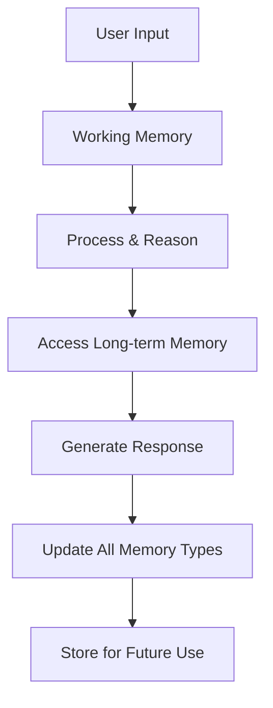
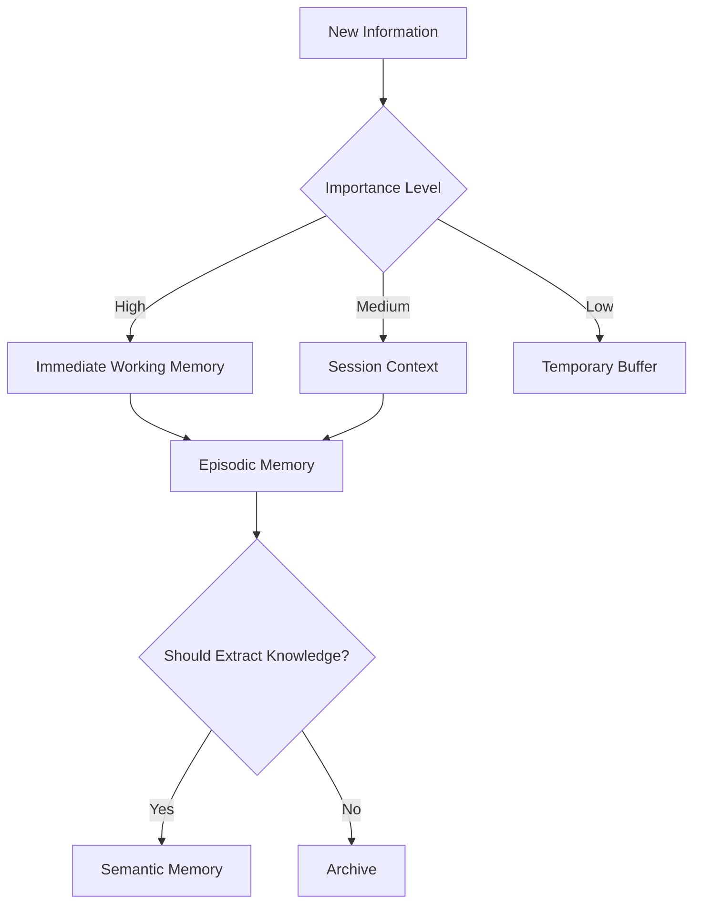

# 🧠 Memory & Context Patterns

Real AI agents need memory to maintain context across conversations and learn from interactions. This section shows how to implement different memory patterns using MongoDB and n8n workflows.

<InstructorNotes 
  timing="Memory & Context Patterns (20-25 minutes)"
  notes={[
    "Memory is what separates true agents from simple chatbots",
    "MongoDB collections work perfectly for different memory types",
    "Show how to balance memory size vs performance",
    "Explain when to summarize vs store full context",
    "Connect to the agent patterns from previous section"
  ]}
  tips={[
    "Start with simple session memory, then build complexity",
    "Show real examples of memory retrieval and updates",
    "Demonstrate how memory affects agent behavior",
    "Use the workshop's PDF agent to show memory in action",
    "Address memory privacy and data retention concerns"
  ]}
/>

<SlideRecap 
  title="Memory Makes Agents Smart"
  items={[
    {
      icon: "🧠",
      title: "Short-term Memory",
      description: "Current conversation context and working memory for multi-step tasks"
    },
    {
      icon: "💾", 
      title: "Long-term Memory",
      description: "User preferences, learned patterns, and historical interactions"
    },
    {
      icon: "⚡",
      title: "Implementation Patterns",
      description: "MongoDB collections, summarization, and context management strategies"
    }
  ]}
  nextSection="Let's build memory systems that make agents truly intelligent!"
/>

## 🎯 Types of AI Agent Memory

Understanding different memory types helps you choose the right implementation pattern:

| Memory Type | Purpose | Storage Duration | MongoDB Implementation |
|-------------|---------|------------------|----------------------|
| **Working Memory** | Current task context | Minutes to hours | Session collection with TTL |
| **Episodic Memory** | Conversation history | Days to weeks | Conversation collection |
| **Semantic Memory** | Learned facts/patterns | Permanent | Knowledge collection |
| **Procedural Memory** | Learned skills/procedures | Permanent | Workflow templates |



## 💭 Working Memory (Short-term)

Working memory maintains context for the current conversation or task.

### MongoDB Schema

```javascript
// Collection: agent_working_memory
{
  "_id": ObjectId("..."),
  "session_id": "user_123_session_456",
  "user_id": "user_123",
  "context": {
    "current_task": "pdf_analysis",
    "documents_processed": ["doc_1", "doc_2"],
    "last_query": "What are the key findings?",
    "reasoning_state": {
      "step": 3,
      "thoughts": ["Analyzed first document", "Found key metrics"],
      "next_actions": ["Compare with second document"]
    }
  },
  "created_at": ISODate("2024-01-20T10:30:00Z"),
  "expires_at": ISODate("2024-01-20T14:30:00Z") // 4-hour TTL
}
```

### n8n Implementation

<WorkshopExercise 
  title="Implement Working Memory" 
  difficulty="intermediate"
  timeEstimate="15 minutes"
  objectives={[
    "Create working memory storage workflow",
    "Implement context retrieval and updates",
    "Test memory persistence across interactions"
  ]}
>

<ExerciseStep stepNumber="1" title="Create Memory Storage Workflow">

Add these nodes to your agent workflow:

**1. Retrieve Working Memory:**
```javascript
// MongoDB node - Find working memory
{
  "operation": "Find",
  "collection": "agent_working_memory",
  "query": {
    "session_id": "{{$json.session_id}}",
    "expires_at": {"$gt": new Date()}
  },
  "limit": 1,
  "sort": {"created_at": -1}
}
```

**2. Initialize if Empty:**
```javascript
// If node - Check if memory exists
{
  "conditions": {
    "boolean": [
      {
        "value1": "{{$json.length}}",
        "operation": "equal",
        "value2": 0
      }
    ]
  }
}

// MongoDB node - Create new memory
{
  "operation": "Insert One",
  "collection": "agent_working_memory",
  "document": {
    "session_id": "{{$json.session_id}}",
    "user_id": "{{$json.user_id}}",
    "context": {
      "current_task": null,
      "conversation_history": [],
      "reasoning_state": {}
    },
    "created_at": new Date(),
    "expires_at": new Date(Date.now() + 4*60*60*1000) // 4 hours
  }
}
```

</ExerciseStep>

<ExerciseStep stepNumber="2" title="Context-Aware Agent Processing">

Modify your AI Agent node to use working memory:

```javascript
// System prompt with memory context
const systemPrompt = `
You are an AI assistant with access to your working memory.

Current Context:
{{#if $json.memory.context.current_task}}
Task: {{$json.memory.context.current_task}}
{{/if}}

{{#if $json.memory.context.conversation_history}}
Recent conversation:
{{#each $json.memory.context.conversation_history}}
- {{this.role}}: {{this.message}}
{{/each}}
{{/if}}

{{#if $json.memory.context.reasoning_state}}
Previous reasoning:
{{#each $json.memory.context.reasoning_state.thoughts}}
- {{this}}
{{/each}}
{{/if}}

Use this context to provide coherent, consistent responses.
`;
```

</ExerciseStep>

<ExerciseStep stepNumber="3" title="Update Memory After Processing">

Add memory update after agent response:

```javascript
// MongoDB node - Update working memory
{
  "operation": "Update One",
  "collection": "agent_working_memory",
  "query": {"session_id": "{{$json.session_id}}"},
  "updateDocument": {
    "$push": {
      "context.conversation_history": {
        "$each": [
          {
            "role": "user",
            "message": "{{$json.user_query}}",
            "timestamp": new Date()
          },
          {
            "role": "assistant", 
            "message": "{{$json.agent_response}}",
            "timestamp": new Date()
          }
        ],
        "$slice": -10 // Keep only last 10 exchanges
      }
    },
    "$set": {
      "context.last_interaction": new Date(),
      "expires_at": new Date(Date.now() + 4*60*60*1000)
    }
  }
}
```

</ExerciseStep>

</WorkshopExercise>

## 📚 Episodic Memory (Conversation History)

Episodic memory stores complete conversation histories for learning and reference.

### Advanced Schema Design

```javascript
// Collection: agent_episodic_memory
{
  "_id": ObjectId("..."),
  "user_id": "user_123",
  "conversation_id": "conv_456",
  "episode": {
    "title": "PDF Analysis Discussion",
    "summary": "User asked about extracting financial data from quarterly reports",
    "tags": ["pdf_analysis", "financial_data", "quarterly_reports"],
    "outcome": "successful_extraction",
    "satisfaction_score": 4.5
  },
  "interactions": [
    {
      "timestamp": ISODate("2024-01-20T10:00:00Z"),
      "role": "user",
      "content": "Can you help me extract revenue data from these PDFs?",
      "attachments": ["doc_123.pdf", "doc_124.pdf"]
    },
    {
      "timestamp": ISODate("2024-01-20T10:02:00Z"),
      "role": "assistant",
      "content": "I'll analyze these PDFs for revenue data...",
      "reasoning": ["Identified financial documents", "Located revenue sections"],
      "tools_used": ["pdf_extract", "financial_parser"],
      "confidence": 0.92
    }
  ],
  "created_at": ISODate("2024-01-20T10:00:00Z"),
  "last_updated": ISODate("2024-01-20T10:30:00Z")
}
```

### Implementation Pattern

```javascript
// Smart conversation summarization
const summarizeConversation = {
  systemPrompt: `Summarize this conversation in a structured way:

  Title: Brief descriptive title
  Summary: 2-3 sentence overview
  Key Topics: List of main topics discussed
  Outcome: What was accomplished
  Learning: What the agent learned for future use
  
  Conversation:
  {{$json.conversation_history}}`,
  
  temperature: 0.3
};
```

## 🧠 Semantic Memory (Knowledge Base)

Semantic memory stores learned facts, patterns, and domain knowledge.

### Knowledge Extraction Pattern

```javascript
// Collection: agent_semantic_memory
{
  "_id": ObjectId("..."),
  "knowledge_type": "document_pattern",
  "domain": "financial_documents",
  "pattern": {
    "trigger_conditions": ["document_type:invoice", "has_tables:true"],
    "extraction_strategy": "table_parsing",
    "success_rate": 0.87,
    "learned_from": ["conv_123", "conv_456", "conv_789"]
  },
  "knowledge": {
    "fact": "Financial documents with tables require different parsing",
    "procedure": "Use table detection before text extraction",
    "examples": ["invoice_table_parse.json"],
    "confidence": 0.89
  },
  "embeddings": [0.123, -0.456, ...], // For semantic search
  "created_at": ISODate("2024-01-20T08:00:00Z"),
  "last_reinforced": ISODate("2024-01-22T14:30:00Z"),
  "usage_count": 15
}
```

### Learning Workflow

<WorkshopExercise 
  title="Implement Semantic Learning" 
  difficulty="advanced"
  timeEstimate="20 minutes"
  objectives={[
    "Extract knowledge from successful interactions",
    "Store learnings in semantic memory",
    "Retrieve relevant knowledge for new tasks"
  ]}
>

<ExerciseStep stepNumber="1" title="Knowledge Extraction">

Create a workflow that runs after successful interactions:

```javascript
// AI node - Extract learnings
{
  systemPrompt: `Analyze this successful interaction and extract learnable knowledge:

  1. What pattern or strategy worked well?
  2. What conditions made this approach successful?
  3. How could this knowledge help with future similar tasks?
  4. What procedure should be documented?

  Format as structured knowledge for future reference.
  
  Interaction: {{$json.successful_interaction}}`,
  
  temperature: 0.2
}
```

</ExerciseStep>

<ExerciseStep stepNumber="2" title="Knowledge Storage">

Store extracted knowledge with embeddings:

```javascript
// Generate embeddings for semantic search
{
  "url": "https://workshop-embedding-api.vercel.app/api/embed",
  "method": "POST",
  "body": {
    "text": "{{$json.extracted_knowledge}}",
    "model": "voyage-3"
  }
}

// Store in semantic memory
{
  "operation": "Insert One",
  "collection": "agent_semantic_memory",
  "document": {
    "knowledge_type": "{{$json.knowledge_type}}",
    "domain": "{{$json.domain}}",
    "knowledge": "{{$json.extracted_knowledge}}",
    "embeddings": "{{$json.embedding_vector}}",
    "learned_from": "{{$json.conversation_id}}",
    "confidence": "{{$json.confidence_score}}",
    "created_at": new Date()
  }
}
```

</ExerciseStep>

<ExerciseStep stepNumber="3" title="Knowledge Retrieval">

Before processing new requests, search for relevant knowledge:

```javascript
// Vector search for relevant knowledge
{
  "operation": "Aggregate",
  "collection": "agent_semantic_memory",
  "pipeline": [
    {
      "$vectorSearch": {
        "index": "semantic_knowledge_index",
        "path": "embeddings",
        "queryVector": "{{$json.query_embedding}}",
        "numCandidates": 50,
        "limit": 5,
        "filter": {
          "domain": "{{$json.task_domain}}",
          "confidence": {"$gte": 0.7}
        }
      }
    },
    {
      "$project": {
        "knowledge": 1,
        "confidence": 1,
        "score": {"$meta": "vectorSearchScore"}
      }
    }
  ]
}
```

</ExerciseStep>

</WorkshopExercise>

## 🔄 Memory Management Patterns

### 1. Memory Hierarchy



### 2. Context Window Management

```javascript
// Smart context truncation
const manageContextWindow = {
  systemPrompt: `You have limited context window. Prioritize:
  1. Current user query (highest priority)
  2. Recent conversation (last 3 exchanges)
  3. Relevant semantic knowledge
  4. Working memory state
  5. Historical context (summarized)
  
  Summarize older context to fit within limits.`,
  
  maxTokens: 4000 // Adjust based on model limits
};
```

### 3. Memory Consolidation

```javascript
// Periodic memory consolidation workflow
const consolidateMemory = {
  schedule: "0 2 * * *", // Daily at 2 AM
  
  operations: [
    // Summarize old conversations
    {
      collection: "agent_episodic_memory",
      operation: "summarize_old_conversations",
      criteria: {"created_at": {"$lt": new Date(Date.now() - 7*24*60*60*1000)}}
    },
    
    // Extract patterns from recent interactions
    {
      collection: "agent_semantic_memory", 
      operation: "extract_new_patterns",
      criteria: {"usage_count": {"$gte": 3}}
    },
    
    // Clean up expired working memory
    {
      collection: "agent_working_memory",
      operation: "deleteMany",
      criteria: {"expires_at": {"$lt": new Date()}}
    }
  ]
};
```

## 🎯 Memory-Driven Agent Behavior

### Personalization Through Memory

```javascript
// Retrieve user preferences and history
const personalizedSystemPrompt = `
You are an AI assistant with memory of this user.

User Profile:
- Preferred communication style: {{$json.user_profile.communication_style}}
- Domain expertise: {{$json.user_profile.expertise_level}}
- Common tasks: {{$json.user_profile.frequent_tasks}}

Recent successful interactions:
{{#each $json.successful_patterns}}
- {{this.description}}: {{this.success_rate}}% success rate
{{/each}}

User preferences learned:
{{#each $json.learned_preferences}}
- {{this.preference}}: {{this.confidence}} confidence
{{/each}}

Adapt your response style and approach accordingly.
`;
```

### Adaptive Learning

```javascript
// Update knowledge based on feedback
const adaptiveLearning = {
  onUserFeedback: {
    positive: {
      operation: "increment",
      fields: ["confidence", "usage_count", "success_rate"]
    },
    negative: {
      operation: "decrement", 
      fields: ["confidence", "success_rate"],
      action: "require_validation"
    }
  }
};
```

## 📊 Memory Performance Optimization

### 1. Indexing Strategy

```javascript
// MongoDB indexes for memory collections
db.agent_working_memory.createIndex(
  {"session_id": 1, "expires_at": 1}
);

db.agent_episodic_memory.createIndex(
  {"user_id": 1, "created_at": -1}
);

db.agent_semantic_memory.createIndex([
  {"domain": 1},
  {"knowledge_type": 1},
  {"confidence": -1}
]);

// Vector search index for semantic memory
db.agent_semantic_memory.createSearchIndex(
  "semantic_knowledge_index",
  {
    "fields": [
      {
        "type": "vector",
        "path": "embeddings",
        "numDimensions": 1024,
        "similarity": "cosine"
      }
    ]
  }
);
```

### 2. Memory Size Limits

```javascript
// Implement memory size limits
const memoryLimits = {
  working_memory: {
    max_context_length: 10000, // tokens
    max_conversation_history: 10, // exchanges
    ttl_hours: 4
  },
  episodic_memory: {
    max_conversations_per_user: 100,
    auto_summarize_after_days: 7,
    archive_after_months: 6
  },
  semantic_memory: {
    max_knowledge_items: 1000,
    min_confidence_threshold: 0.6,
    cleanup_unused_after_days: 30
  }
};
```

## 🔒 Memory Privacy & Security

### Data Retention Policies

```javascript
// Privacy-compliant memory management
const privacyRules = {
  user_data_retention: {
    working_memory: "4 hours",
    episodic_memory: "90 days", 
    semantic_memory: "anonymized, permanent"
  },
  
  anonymization: {
    remove_fields: ["user_id", "personal_identifiers"],
    hash_fields: ["session_id"],
    generalize_content: true
  },
  
  user_deletion: {
    on_user_request: "delete_all_memories",
    cascade_delete: true,
    backup_semantic_knowledge: "anonymized_only"
  }
};
```

## 🚀 Advanced Memory Patterns

### Multi-Agent Memory Sharing

```javascript
// Shared knowledge between agent instances
{
  "_id": ObjectId("..."),
  "knowledge_type": "shared_pattern",
  "sharing_scope": "all_agents", // or "domain_specific"
  "access_level": "read_only",
  "knowledge": {
    "pattern": "PDF table extraction technique",
    "success_conditions": ["table_detected", "structured_data"],
    "failure_modes": ["rotated_tables", "merged_cells"]
  },
  "contributed_by": ["agent_instance_1", "agent_instance_2"],
  "validated_by": 5, // Number of agents that confirmed
  "global_confidence": 0.91
}
```

### Temporal Memory Patterns

```javascript
// Time-aware memory retrieval
const temporalMemory = {
  recent_context: {
    weight: 1.0,
    decay_factor: 0.9, // Daily decay
    max_age_hours: 24
  },
  
  seasonal_patterns: {
    weight: 0.7,
    match_timeframe: "same_month_previous_years",
    relevance_boost: 0.3
  },
  
  trending_topics: {
    weight: 0.8,
    recency_boost: 0.5,
    popularity_threshold: 0.6
  }
};
```

## 🎯 Testing Memory Systems

<Quiz 
  title="Memory Pattern Selection"
  passingScore={75}  
  questions={[
    {
      question: "Your agent needs to remember user preferences across multiple sessions. Which memory type?",
      options: [
        "Working memory - stores current context",
        "Episodic memory - stores conversation history", 
        "Semantic memory - stores learned knowledge",
        "All types working together"
      ],
      correctAnswer: 2,
      explanation: "User preferences are learned knowledge that should persist across sessions, making semantic memory the primary choice."
    },
    {
      question: "What's the best strategy for managing context window limits?",
      options: [
        "Truncate oldest messages first",
        "Keep only the last user message",
        "Prioritize: current query, recent context, relevant knowledge, summarized history",
        "Use only working memory"
      ],
      correctAnswer: 2,
      explanation: "Intelligent prioritization maintains the most relevant context while respecting model limits."
    },
    {
      question: "When should you consolidate memory?",
      options: [
        "After every interaction",
        "When memory collections get too large",
        "Periodically (daily/weekly) during low usage",
        "Only when users complain about performance"
      ],
      correctAnswer: 2,
      explanation: "Scheduled consolidation during low usage periods maintains performance without impacting user experience."
    }
  ]}
/>

Memory transforms simple AI models into intelligent agents that learn, adapt, and provide increasingly personalized experiences. Master these patterns, and your agents will truly understand and remember their users! 🧠✨

## 📚 Next Steps

- [Define Custom Tools →](./tool-definition-primer)  
- [Build Multimodal Workflows →](./multimodal-image-queries)
- **Agent Reflection** - Coming soon!