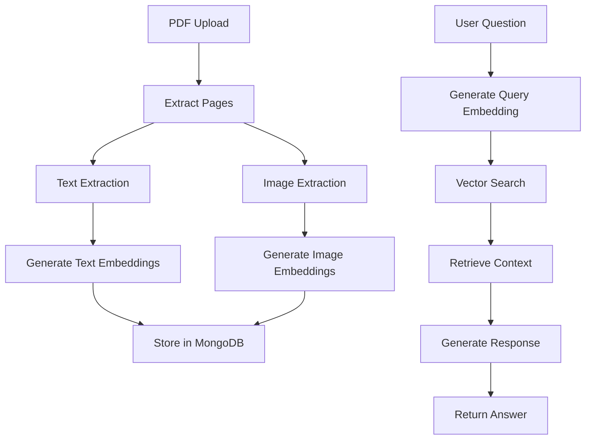

# 🧠 Complete Multimodal PDF Agent

Build a complete multimodal AI agent that can process PDFs, understand both text and images, and answer questions using MongoDB Vector Search and Voyage AI.

## Agent Capabilities

Your finished agent will:
- ✅ **Accept PDF uploads** via web interface
- ✅ **Extract text and images** from PDF pages
- ✅ **Generate multimodal embeddings** using Voyage AI
- ✅ **Store in MongoDB** with vector search index
- ✅ **Answer questions** about PDF content
- ✅ **Understand images** and visual content
- ✅ **Maintain conversation** context

## Architecture Overview



## Complete Workflow Implementation

### 1. PDF Processing Pipeline

**Workflow Name**: `Multimodal PDF Processor`

#### Trigger: File Upload Webhook
```json
{
  "path": "/upload-pdf",
  "method": "POST",
  "response_mode": "lastNode"
}
```

#### Node 1: Validate Upload
```javascript
// JavaScript node to validate PDF
const files = $input.all();
if (!files.length || !files[0].binary) {
  throw new Error('No PDF file uploaded');
}

const filename = files[0].binary.data.fileName;
if (!filename.toLowerCase().endsWith('.pdf')) {
  throw new Error('Only PDF files are supported');
}

return [{
  json: {
    filename: filename,
    fileSize: files[0].binary.data.fileSize,
    timestamp: new Date().toISOString()
  },
  binary: files[0].binary
}];
```

#### Node 2: Convert PDF to Images
```javascript
// Using PDF-lib or similar
// This extracts each page as an image for multimodal processing
const pdfBuffer = Buffer.from($binary.data, 'base64');
const pages = await extractPagesAsImages(pdfBuffer);

return pages.map((page, index) => ({
  json: {
    filename: $json.filename,
    pageNumber: index + 1,
    totalPages: pages.length
  },
  binary: {
    data: page.buffer,
    mimeType: 'image/png',
    fileName: `${$json.filename}_page_${index + 1}.png`
  }
}));
```

#### Node 3: Extract Text Content
```javascript
// Extract text from each page
const textContent = await extractTextFromPDF($binary.data);
return [{
  json: {
    filename: $json.filename,
    textContent: textContent,
    wordCount: textContent.split(' ').length
  }
}];
```

#### Node 4: Generate Multimodal Embeddings
**HTTP Request Node** to your embedding API:
```json
{
  "url": "https://workshop-embedding-api.vercel.app/api/embed",
  "method": "POST",
  "headers": {
    "Content-Type": "application/json"
  },
  "body": {
    "text": "={{ $json.textContent }}",
    "model": "voyage-3"
  }
}
```

#### Node 5: Store in MongoDB
```javascript
// MongoDB node configuration
{
  "collection": "pdf_documents",
  "operation": "insertOne",
  "document": {
    "filename": "={{ $json.filename }}",
    "pageNumber": "={{ $json.pageNumber }}",
    "textContent": "={{ $json.textContent }}",
    "embedding": "={{ $json.embeddings[0] }}",
    "metadata": {
      "uploadedAt": "={{ $json.timestamp }}",
      "wordCount": "={{ $json.wordCount }}",
      "fileSize": "={{ $json.fileSize }}"
    }
  }
}
```

### 2. Conversational Agent Interface

**Workflow Name**: `Multimodal PDF Agent`

#### Trigger: Chat Webhook
```json
{
  "path": "/chat",
  "method": "POST",
  "response_mode": "lastNode"
}
```

Expected input:
```json
{
  "message": "What is discussed about AI in the uploaded document?",
  "filename": "research_paper.pdf",
  "conversation_id": "unique-id"
}
```

#### Node 1: Generate Query Embedding
**HTTP Request** to embedding API:
```json
{
  "url": "https://workshop-embedding-api.vercel.app/api/embed",
  "method": "POST",
  "body": {
    "text": "={{ $json.message }}",
    "model": "voyage-3"
  }
}
```

#### Node 2: Vector Search in MongoDB
```javascript
// MongoDB Aggregate operation
[
  {
    $vectorSearch: {
      index: "vector_index",
      path: "embedding",
      queryVector: $json.embeddings[0],
      numCandidates: 50,
      limit: 5,
      filter: {
        filename: $json.filename
      }
    }
  },
  {
    $project: {
      textContent: 1,
      pageNumber: 1,
      score: { $meta: "vectorSearchScore" },
      filename: 1
    }
  }
]
```

#### Node 3: Build Context
```javascript
// Combine search results into context
const searchResults = $input.all();
const context = searchResults
  .map(result => `Page ${result.json.pageNumber}: ${result.json.textContent}`)
  .join('\n\n');

return [{
  json: {
    query: $('Node 1').first().json.message,
    context: context,
    relevantPages: searchResults.map(r => r.json.pageNumber),
    filename: $json.filename
  }
}];
```

#### Node 4: Generate AI Response
**HTTP Request** to AI service (Gemini/OpenAI):
```json
{
  "url": "https://api.openai.com/v1/chat/completions",
  "method": "POST",
  "headers": {
    "Authorization": "Bearer YOUR_API_KEY",
    "Content-Type": "application/json"
  },
  "body": {
    "model": "gpt-4",
    "messages": [
      {
        "role": "system",
        "content": "You are a helpful AI assistant that answers questions about PDF documents. Use the provided context to answer questions accurately. If the context doesn't contain relevant information, say so."
      },
      {
        "role": "user",
        "content": "Question: {{ $json.query }}\n\nContext from {{ $json.filename }}:\n{{ $json.context }}\n\nPlease answer the question based on the context provided."
      }
    ]
  }
}
```

#### Node 5: Format Response
```javascript
return [{
  json: {
    response: $json.choices[0].message.content,
    sources: {
      filename: $json.filename,
      relevantPages: $json.relevantPages
    },
    timestamp: new Date().toISOString(),
    conversationId: $json.conversation_id
  }
}];
```

## Testing Your Agent

### 1. Upload a PDF
```bash
curl -X POST http://localhost:5678/webhook/upload-pdf \
  -F "file=@sample.pdf"
```

### 2. Ask Questions
```bash
curl -X POST http://localhost:5678/webhook/chat \
  -H "Content-Type: application/json" \
  -d '{
    "message": "What are the main findings in this research?",
    "filename": "sample.pdf",
    "conversation_id": "test-123"
  }'
```

## Advanced Features

### Image Understanding
For multimodal capabilities, enhance the embedding generation:

```javascript
// Process images with Voyage AI multimodal
const imageEmbedding = await generateEmbedding({
  image: $binary.data, // Base64 image
  text: `Image from page ${$json.pageNumber} of ${$json.filename}`,
  model: "voyage-multimodal-3"
});
```

### Conversation Memory
Store conversation history in MongoDB:

```javascript
{
  "collection": "conversations",
  "operation": "updateOne",
  "filter": { "conversationId": "={{ $json.conversation_id }}" },
  "update": {
    "$push": {
      "messages": {
        "timestamp": "={{ $json.timestamp }}",
        "question": "={{ $json.query }}",
        "response": "={{ $json.response }}",
        "sources": "={{ $json.sources }}"
      }
    }
  },
  "upsert": true
}
```

## Web Interface (Optional)

Create a simple HTML interface:

```html
<!DOCTYPE html>
<html>
<head>
    <title>Multimodal PDF Agent</title>
</head>
<body>
    <div id="upload-section">
        <h2>Upload PDF</h2>
        <input type="file" id="pdfFile" accept=".pdf">
        <button onclick="uploadPDF()">Upload</button>
    </div>
    
    <div id="chat-section">
        <h2>Ask Questions</h2>
        <input type="text" id="question" placeholder="Ask about your PDF...">
        <button onclick="askQuestion()">Ask</button>
        <div id="response"></div>
    </div>

    <script>
        async function uploadPDF() {
            const file = document.getElementById('pdfFile').files[0];
            const formData = new FormData();
            formData.append('file', file);
            
            const response = await fetch('/webhook/upload-pdf', {
                method: 'POST',
                body: formData
            });
            
            const result = await response.json();
            console.log('Upload result:', result);
        }
        
        async function askQuestion() {
            const question = document.getElementById('question').value;
            const response = await fetch('/webhook/chat', {
                method: 'POST',
                headers: { 'Content-Type': 'application/json' },
                body: JSON.stringify({
                    message: question,
                    filename: 'uploaded.pdf',
                    conversation_id: 'web-session'
                })
            });
            
            const result = await response.json();
            document.getElementById('response').innerHTML = result.response;
        }
    </script>
</body>
</html>
```

## Success Metrics

Your agent is working when you can:
- ✅ Upload a PDF and see it processed
- ✅ Ask questions about the content
- ✅ Get relevant answers with page references
- ✅ Handle both text and visual content
- ✅ Maintain conversation context

## Next Steps

1. **Enhance with function calling** for complex queries
2. **Add support for multiple file formats**
3. **Implement user authentication**
4. **Add real-time chat interface**
5. **Deploy to production**

Your multimodal PDF agent is now complete and ready for real-world use!