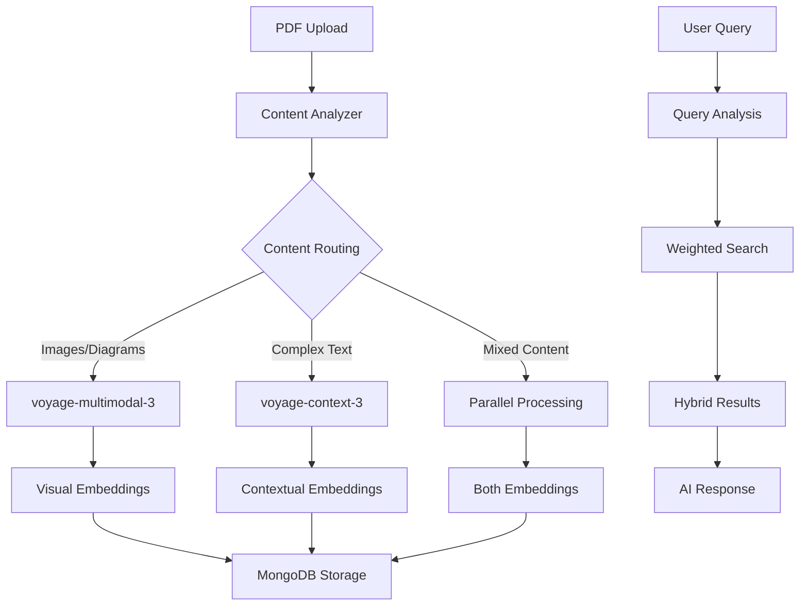

# 🚀 Workflow 09: Hybrid Multimodal Context Agent Guide

The ultimate workshop workflow! This expert-level implementation combines voyage-multimodal-3 and voyage-context-3 for comprehensive document understanding.

## 📥 Download & Import

1. **Download**: [09-hybrid-multimodal-context-agent.json](/multimodal-pdf-agent-n8n/workflows/09-hybrid-multimodal-context-agent.json)
2. **Prerequisites**: Complete workflows 01-08 first
3. **Import**: In n8n → Workflows → Import → Select file
4. **Configure**: Update MongoDB credentials and test endpoints

## 🎯 Learning Objectives

Master these advanced concepts:
- **Intelligent model routing** based on content analysis
- **Parallel processing** with multiple embedding models
- **Hybrid search strategies** across different vector types
- **Performance optimization** for complex workflows
- **Production-ready error handling**

## 🏗️ Workflow Architecture



## 🔧 Key Components

### 1. Content Analysis Engine
```javascript
// Intelligent content routing
function analyzeContent(pageData) {
  return {
    hasImages: detectVisualContent(pageData),
    hasComplexText: analyzeTextComplexity(pageData),
    documentType: classifyDocument(pageData),
    recommendedStrategy: determineOptimalStrategy(pageData)
  };
}
```

### 2. Parallel Model Processing
- **Route 1**: Visual content → voyage-multimodal-3
- **Route 2**: Complex text → voyage-context-3
- **Route 3**: Simple text → voyage-3
- **Merge**: Combine results intelligently

### 3. Hybrid Vector Search
```javascript
// Multi-embedding search strategy
{
  "compound": {
    "should": [
      {
        "$vectorSearch": {
          "path": "multimodal_embedding",
          "queryVector": visualQuery,
          "boost": visualWeight
        }
      },
      {
        "$vectorSearch": {
          "path": "context_embedding", 
          "queryVector": textQuery,
          "boost": textWeight
        }
      }
    ]
  }
}
```

## 🎨 Advanced Features

### Dynamic Model Selection
The workflow automatically chooses the best model(s) based on:
- **Content type** (text, images, mixed)
- **Text complexity** (sentence length, vocabulary)
- **Document category** (legal, technical, general)
- **Processing requirements** (speed vs. accuracy)

### Weighted Search Strategies
```javascript
const searchWeights = {
  visual_query: { multimodal: 0.8, context: 0.2 },
  text_query: { multimodal: 0.3, context: 0.7 },
  mixed_query: { multimodal: 0.5, context: 0.5 }
};
```

### Performance Optimizations
- **Batch processing** for multiple documents
- **Caching** for frequently accessed embeddings
- **Parallel execution** where possible
- **Smart fallbacks** for API failures

## 🧪 Testing the Workflow

### Test Cases to Try

1. **Visual Document**: PDF with charts, diagrams, screenshots
2. **Legal Document**: Contract with complex legal language
3. **Technical Manual**: Mixed content with code and images
4. **Research Paper**: Academic content with figures and tables

### Expected Behavior
- **Images** processed with multimodal-3
- **Complex text** processed with context-3
- **Simple text** processed with voyage-3
- **Mixed content** processed with multiple models

## 📊 Monitoring & Analytics

### Key Metrics to Track
- **Model selection accuracy**
- **Processing time per document**
- **Search result relevance**
- **Cost per embedding**
- **Error rates by content type**

### Performance Dashboard
```javascript
// Workflow analytics
{
  "total_documents": 1247,
  "model_usage": {
    "voyage-3": 423,
    "voyage-multimodal-3": 512,
    "voyage-context-3": 312
  },
  "avg_processing_time": "2.3s",
  "cost_efficiency": "+23% vs single-model"
}
```

## 🚨 Troubleshooting

### Common Issues

<details>
<summary>Model Selection Not Working</summary>

Check these components:
- Content analysis function syntax
- Model routing logic
- Default fallback behavior
- Error handling in selection code

</details>

<details>
<summary>Parallel Processing Failures</summary>

Verify:
- Both API endpoints are accessible
- Credential configuration is correct
- Network timeouts are appropriate
- Error handling covers all scenarios

</details>

<details>
<summary>Search Results Poor Quality</summary>

Tune these parameters:
- Search weights for query type
- Number of candidates
- Similarity thresholds
- Result combination logic

</details>

## 🔧 Customization Guide

### Adjust Model Selection Logic
```javascript
// Modify content analysis rules
const customRules = {
  useContextModel: (text) => {
    return text.length > 1000 && 
           (containsLegalTerms(text) || containsTechnicalJargon(text));
  },
  
  useMultimodalModel: (content) => {
    return content.images.length > 0 || 
           containsVisualReferences(content.text);
  }
};
```

### Configure Search Weights
```javascript
// Fine-tune for your use case
const domainWeights = {
  legal: { context: 0.9, multimodal: 0.1 },
  technical: { context: 0.7, multimodal: 0.3 },
  marketing: { context: 0.3, multimodal: 0.7 }
};
```

## 💰 Cost Optimization

### Strategies to Reduce Costs
1. **Smart caching** - Avoid re-processing identical content
2. **Batch processing** - Group similar documents
3. **Selective processing** - Only use advanced models when needed
4. **Result reuse** - Cache embeddings for repeated queries

### Cost Monitoring
```javascript
// Track embedding costs
const costTracking = {
  voyageMultimodal: requests * 0.00002,
  voyageContext: requests * 0.00002,
  totalCost: calculateTotalCost(),
  savingsVsSingleModel: compareCosts()
};
```

## ✅ Success Criteria

You've mastered this workflow when:
- [ ] Content routing works correctly for different document types
- [ ] Both embedding models process content appropriately
- [ ] Search results show improved relevance
- [ ] Performance meets your requirements
- [ ] Error handling works for all failure scenarios
- [ ] Cost tracking shows optimization benefits

## 🎓 What You've Learned

This advanced workflow demonstrates:
- **Multi-model orchestration** for optimal results
- **Intelligent routing** based on content analysis
- **Production-ready patterns** for complex AI systems
- **Performance optimization** techniques
- **Cost management** strategies

## 🚀 Production Deployment

Ready for production? Consider these additions:
- **Authentication** and user management
- **Rate limiting** and quota management
- **Monitoring** and alerting systems
- **A/B testing** for model selection
- **Backup strategies** for API failures

## 🏆 Congratulations!

You've completed the most advanced workflow in the workshop! This hybrid approach represents the cutting edge of multimodal document processing. You now have the skills to build production-ready AI systems that can handle any document type with optimal efficiency and accuracy.

### Next Steps
- Deploy to production environment
- Implement monitoring and analytics
- Experiment with your own content types
- Share your results with the community!

Welcome to the ranks of expert AI system builders! 🎉🚀