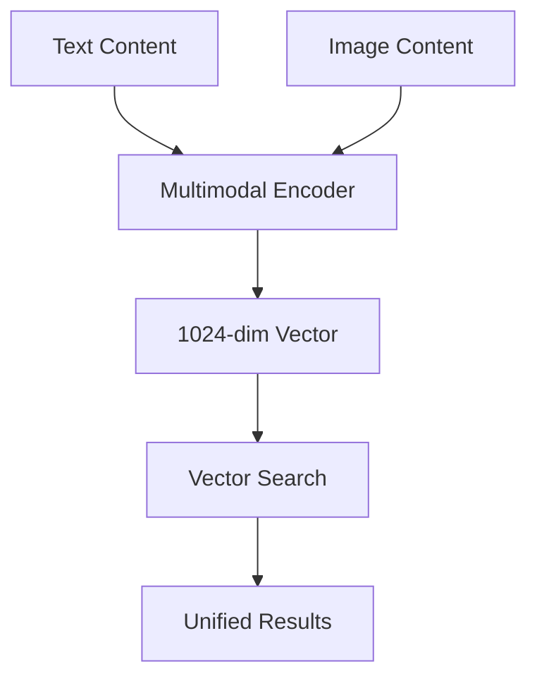

# 🖼️ Multimodal Image Queries & Visual Understanding

"Screenshots are all you need" - this powerful concept from multimodal AI means agents can understand and analyze visual content just as well as text. Let's build workflows that handle image queries and visual document analysis.

<InstructorNotes 
  timing="Multimodal Image Queries (25-30 minutes)"
  notes={[
    "This is where the 'multimodal' aspect really shines",
    "Screenshots of interfaces, diagrams, charts are common use cases",
    "Voyage AI's multimodal model handles both text and images in unified vector space",
    "Visual question answering often surprises attendees with accuracy",
    "Common issue: image quality affects analysis results significantly"
  ]}
  tips={[
    "Use clear, high-resolution example images for demonstrations",
    "Show both simple image questions and complex visual analysis",
    "Emphasize that this works with any image content, not just PDFs",
    "Demonstrate combining text and image queries for better results",
    "Address privacy considerations when processing visual content"
  ]}
/>

<SlideRecap 
  title="Visual Intelligence in Action"
  items={[
    {
      icon: "👁️",
      title: "Visual Understanding", 
      description: "How AI models process and comprehend visual content like humans"
    },
    {
      icon: "🔗", 
      title: "Multimodal Fusion",
      description: "Combining text and image understanding in a unified approach"
    },
    {
      icon: "📊",
      title: "Practical Applications",
      description: "Real-world use cases from document analysis to interface understanding"
    }
  ]}
  nextSection="Let's build workflows that see and understand visual content!"
/>

## 🎯 Multimodal Understanding Fundamentals

### What Makes Content "Multimodal"?

Modern AI agents can process multiple modalities simultaneously:

| Modality | Examples | Use Cases |
|----------|----------|-----------|
| **Text** | Documents, emails, code | Traditional NLP tasks |
| **Images** | Photos, diagrams, charts | Visual analysis, OCR |
| **Combined** | PDFs with images, web pages | Document understanding |
| **Structured** | Tables, forms, layouts | Data extraction |

### Voyage AI Multimodal Model

The `voyage-multimodal-3` model creates unified embeddings for both text and images:



## 🖼️ Image Processing Workflow

### Basic Image Analysis Setup

<WorkshopExercise 
  title="Build Image Analysis Workflow" 
  difficulty="intermediate"
  timeEstimate="20 minutes"
  objectives={[
    "Create image upload and processing workflow",
    "Implement multimodal embedding generation",
    "Build image-based question answering system"
  ]}
>

<ExerciseStep stepNumber="1" title="Image Upload Handler">

Create a webhook to handle image uploads:

```javascript
// Webhook node configuration
{
  "httpMethod": "POST",
  "path": "/analyze-image",
  "responseMode": "lastNode",
  "options": {}
}

// Expected request format:
{
  "image_url": "https://example.com/image.jpg",
  "question": "What does this chart show?",
  "context": "This is from a financial report"
}
```

</ExerciseStep>

<ExerciseStep stepNumber="2" title="Image Processing Pipeline">

Build the processing workflow:

**1. Download and Validate Image:**
```javascript
// HTTP Request node - Download image
{
  "method": "GET", 
  "url": "{{ $json.image_url }}",
  "responseFormat": "file",
  "options": {
    "timeout": 30000,
    "followRedirects": true
  }
}

// Function node - Validate image
{
  "code": `
    const supportedFormats = ['image/jpeg', 'image/png', 'image/gif', 'image/webp'];
    const contentType = $input.first().binary.mimeType;
    
    if (!supportedFormats.includes(contentType)) {
      throw new Error(\`Unsupported image format: \${contentType}\`);
    }
    
    // Check file size (max 10MB)
    const fileSize = $input.first().binary.data.length;
    if (fileSize > 10 * 1024 * 1024) {
      throw new Error('Image too large. Maximum size: 10MB');
    }
    
    return {
      image_data: $input.first().binary.data,
      content_type: contentType,
      file_size: fileSize,
      question: $('Webhook').first().json.question,
      context: $('Webhook').first().json.context || ''
    };
  `
}
```

**2. Generate Multimodal Embedding:**
```javascript
// HTTP Request node - Voyage AI multimodal embedding
{
  "method": "POST",
  "url": "https://workshop-embedding-api.vercel.app/api/embed",
  "headers": {
    "Content-Type": "application/json"
  },
  "body": {
    "content": {
      "image": "{{ $json.image_data }}", // Base64 encoded
      "text": "{{ $json.question }}{{ $json.context ? ' Context: ' + $json.context : '' }}"
    },
    "model": "voyage-multimodal-3",
    "input_type": "multimodal"
  }
}
```

</ExerciseStep>

<ExerciseStep stepNumber="3" title="Visual Question Answering">

Implement the Q&A system:

**Search Similar Visual Content:**
```javascript
// MongoDB node - Vector search for similar images/content
{
  "operation": "Aggregate",
  "collection": "multimodal_content",
  "pipeline": [
    {
      "$vectorSearch": {
        "index": "multimodal_vector_index",
        "path": "embedding",
        "queryVector": "{{ $json.embedding }}",
        "numCandidates": 50,  
        "limit": 5,
        "filter": {
          "content_type": {"$in": ["image", "multimodal"]}
        }
      }
    },
    {
      "$project": {
        "content": 1,
        "metadata": 1,
        "image_analysis": 1,
        "score": {"$meta": "vectorSearchScore"}
      }
    }
  ]
}
```

**AI Agent for Visual Analysis:**
```javascript
// AI Agent node configuration
{
  "model": "gemini-2.0-flash-exp",
  "systemMessage": `You are a visual analysis expert. Analyze images and answer questions about their content.

Available context from similar images:
{{ #each $json.similar_content }}
- {{ this.metadata.description }}: {{ this.image_analysis.summary }}
{{ /each }}

When analyzing images, consider:
1. Visual elements (objects, text, colors, layout)
2. Charts/graphs (data, trends, relationships)  
3. Documents (structure, content, formatting)
4. Interface elements (buttons, menus, forms)
5. Context clues and relationships

Provide detailed, accurate analysis based on what you can see.`,
  
  "tools": [
    {
      "name": "extract_text_from_image",
      "description": "Extract and transcribe text visible in the image using OCR",
      "parameters": {
        "type": "object",
        "properties": {
          "image_region": {
            "type": "string",
            "description": "Specific region to focus OCR on (optional)"
          }
        }
      }
    },
    {
      "name": "analyze_chart_data", 
      "description": "Analyze charts, graphs, or data visualizations in the image",
      "parameters": {
        "type": "object",
        "properties": {
          "chart_type": {
            "type": "string",
            "enum": ["bar", "line", "pie", "scatter", "table", "other"]
          },
          "extract_data": {
            "type": "boolean",
            "description": "Whether to extract numerical data points"
          }
        }
      }
    },
    {
      "name": "identify_ui_elements",
      "description": "Identify and describe user interface elements in screenshots",
      "parameters": {
        "type": "object", 
        "properties": {
          "element_types": {
            "type": "array",
            "items": {
              "type": "string",
              "enum": ["buttons", "forms", "menus", "text", "images"]
            }
          }
        }
      }
    }
  ]
}
```

</ExerciseStep>

</WorkshopExercise>

## 📊 Visual Content Analysis Patterns

### 1. Chart and Graph Analysis

```javascript
// Specialized chart analysis workflow
const chartAnalysisPrompt = `
Analyze this chart/graph systematically:

1. **Chart Type**: Identify the type (bar, line, pie, scatter, etc.)
2. **Axes & Labels**: Read axis labels, titles, and units
3. **Data Points**: Extract key data points and values
4. **Trends**: Identify patterns, trends, or anomalies
5. **Context**: Relate findings to the user's question

User Question: {{ $json.question }}
Additional Context: {{ $json.context }}

Provide both a summary and detailed data extraction.
`;

// Example responses for different chart types
const chartResponses = {
  bar_chart: {
    summary: "Revenue comparison across quarters showing 15% growth",
    data_points: [
      {"quarter": "Q1", "revenue": 2.3, "unit": "million"},
      {"quarter": "Q2", "revenue": 2.7, "unit": "million"}
    ],
    trends: ["Consistent upward trend", "Q2 shows acceleration"]
  },
  
  pie_chart: {
    summary: "Budget allocation across departments",
    data_points: [
      {"category": "Engineering", "percentage": 45, "amount": "1.8M"},
      {"category": "Marketing", "percentage": 30, "amount": "1.2M"}
    ],
    insights: ["Engineering dominates budget", "Marketing is second priority"]
  }
};
```

### 2. Document Layout Analysis

```javascript
// Document structure recognition
const documentAnalysisPrompt = `
Analyze this document image for:

1. **Document Type**: Invoice, contract, report, form, etc.
2. **Layout Structure**: Headers, sections, tables, signatures
3. **Key Information**: Important fields, values, dates
4. **Text Quality**: Readability, scan quality, completeness
5. **Processing Recommendations**: Best extraction approach

Focus on: {{ $json.analysis_focus }}
Question: {{ $json.question }}
`;

// MongoDB schema for document layout analysis
const documentLayoutSchema = {
  document_id: "doc_456",
  analysis_type: "layout_structure",
  visual_elements: {
    headers: [
      {
        text: "INVOICE #12345",
        position: {x: 100, y: 50},
        confidence: 0.95
      }
    ],
    tables: [
      {
        rows: 5,
        columns: 4,
        position: {x: 50, y: 200, width: 500, height: 200},  
        content_type: "itemized_charges"
      }
    ],
    signatures: [
      {
        position: {x: 400, y: 600},
        type: "handwritten",
        confidence: 0.87
      }
    ]
  },
  extraction_recommendations: [
    "Use table parsing for itemized charges",
    "OCR quality sufficient for text extraction",
    "Signature detection successful"
  ]
};
```

### 3. Interface Screenshot Analysis

```javascript
// UI/UX analysis for screenshots
const interfaceAnalysisPrompt = `
Analyze this interface screenshot:

1. **Interface Type**: Web page, mobile app, desktop application, etc.
2. **Navigation Elements**: Menus, buttons, links, breadcrumbs
3. **Content Areas**: Main content, sidebars, headers, footers
4. **Interactive Elements**: Forms, buttons, input fields
5. **Visual Hierarchy**: Layout, typography, color usage
6. **User Experience**: Clarity, accessibility, usability

Question: {{ $json.question }}
Focus Area: {{ $json.focus_area }}
`;

// Example UI element detection
const uiElementsDetected = {
  navigation: {
    primary_menu: ["Home", "Products", "About", "Contact"],
    breadcrumb: "Home > Products > Category",
    search_bar: {present: true, placeholder: "Search products..."}
  },
  content: {
    main_heading: "Product Catalog",
    product_grid: {
      items_visible: 12,
      layout: "3x4 grid",
      pagination: true
    }
  },
  interactive: {
    buttons: ["Add to Cart", "View Details", "Compare"],
    forms: ["Newsletter signup", "Product filter"],
    calls_to_action: 3
  }
};
```

## 🔄 Multimodal Search Implementation

### Enhanced Vector Search with Image Context

<WorkshopExercise 
  title="Build Multimodal Search System" 
  difficulty="advanced"
  timeEstimate="25 minutes"
  objectives={[
    "Implement combined text + image search",
    "Create weighted multimodal queries",
    "Build visual similarity clustering"
  ]}
>

<ExerciseStep stepNumber="1" title="Multimodal Index Creation">

Create a comprehensive vector index:

```javascript
// MongoDB vector search index for multimodal content
{
  "fields": [
    {
      "type": "vector",
      "path": "text_embedding",
      "numDimensions": 1024,
      "similarity": "cosine"
    },
    {
      "type": "vector", 
      "path": "image_embedding",
      "numDimensions": 1024,
      "similarity": "cosine"
    },
    {
      "type": "vector",
      "path": "multimodal_embedding", 
      "numDimensions": 1024,
      "similarity": "cosine"
    },
    {
      "type": "filter",
      "path": "content_type"
    },
    {
      "type": "filter",
      "path": "visual_features.has_charts"
    },
    {
      "type": "filter", 
      "path": "visual_features.has_tables"
    }
  ]
}
```

</ExerciseStep>

<ExerciseStep stepNumber="2" title="Weighted Multimodal Search">

Implement search that combines multiple modalities:

```javascript
// Function node - Calculate weighted search
{
  "code": `
    const query = $input.first().json;
    const weights = {
      text: query.text_weight || 0.6,
      image: query.image_weight || 0.4,
      multimodal: query.multimodal_weight || 1.0
    };
    
    // Generate embeddings for each modality
    const searches = [];
    
    if (query.text_query && weights.text > 0) {
      searches.push({
        type: 'text',
        weight: weights.text,
        embedding_path: 'text_embedding',
        query: query.text_query
      });
    }
    
    if (query.image_query && weights.image > 0) {
      searches.push({
        type: 'image', 
        weight: weights.image,
        embedding_path: 'image_embedding',
        query: query.image_query
      });
    }
    
    if (query.combined_query && weights.multimodal > 0) {
      searches.push({
        type: 'multimodal',
        weight: weights.multimodal,
        embedding_path: 'multimodal_embedding', 
        query: query.combined_query
      });
    }
    
    return { searches, query };
  `
}

// MongoDB aggregation for combined search
{
  "operation": "Aggregate",
  "collection": "multimodal_content", 
  "pipeline": [
    {
      "$search": {
        "compound": {
          "should": [
            {
              "$vectorSearch": {
                "index": "multimodal_index",
                "path": "text_embedding",
                "queryVector": "{{ $json.text_embedding }}",
                "numCandidates": 50,
                "boost": "{{ $json.searches[0].weight }}"
              }
            },
            {
              "$vectorSearch": {
                "index": "multimodal_index", 
                "path": "image_embedding",
                "queryVector": "{{ $json.image_embedding }}",
                "numCandidates": 50,
                "boost": "{{ $json.searches[1].weight }}"
              }
            }
          ]
        }
      }
    },
    {
      "$limit": 10
    },
    {
      "$project": {
        "content": 1,
        "metadata": 1,
        "visual_features": 1,
        "combined_score": {"$meta": "searchScore"}
      }
    }
  ]
}
```

</ExerciseStep>

<ExerciseStep stepNumber="3" title="Visual Similarity Clustering">

Group similar visual content:

```javascript
// Function node - Cluster similar images
{
  "code": `
    const results = $input.first().json.results;
    const clusters = [];
    const threshold = 0.85; // Similarity threshold
    
    results.forEach((item, index) => {
      let assigned = false;
      
      // Check if item belongs to existing cluster
      for (let cluster of clusters) {
        const similarity = calculateCosineSimilarity(
          item.image_embedding, 
          cluster.centroid_embedding
        );
        
        if (similarity > threshold) {
          cluster.items.push(item);
          cluster.centroid_embedding = updateCentroid(cluster.items);
          assigned = true;
          break;
        }
      }
      
      // Create new cluster if not assigned
      if (!assigned) {
        clusters.push({
          id: clusters.length,
          items: [item],
          centroid_embedding: item.image_embedding,
          representative_item: item
        });
      }
    });
    
    return { clusters, total_items: results.length };
  `
}
```

</ExerciseStep>

</WorkshopExercise>

## 🎨 Advanced Visual Analysis Patterns

### 1. Multi-Image Comparison

```javascript
// Compare multiple images in a single query
const multiImageComparison = {
  prompt: `Compare these images and identify:
  
  1. **Similarities**: What do they have in common?
  2. **Differences**: How do they differ?
  3. **Patterns**: Any recurring themes or elements?
  4. **Quality**: Which image is clearer/more informative?
  5. **Context**: How do they relate to each other?
  
  Images: {{ $json.image_urls }}
  Question: {{ $json.comparison_question }}`,
  
  implementation: {
    process_images: "parallel",
    generate_embeddings: "batch", 
    compare_vectors: "pairwise",
    synthesize_results: "llm_analysis"
  }
};
```

### 2. Progressive Visual Analysis

```javascript
// Multi-step visual analysis workflow
const progressiveAnalysis = {
  steps: [
    {
      name: "initial_scan",
      prompt: "What type of visual content is this? Provide a brief overview.",
      confidence_threshold: 0.8
    },
    {
      name: "detailed_analysis", 
      prompt: "Based on the content type, perform detailed analysis of key elements.",
      depends_on: "initial_scan"
    },
    {
      name: "data_extraction",
      prompt: "Extract specific data points, text, or measurements as requested.",
      depends_on: "detailed_analysis",
      tools: ["ocr_extraction", "chart_parser"]
    },
    {
      name: "synthesis",
      prompt: "Combine all findings to answer the user's question comprehensively.",
      depends_on: ["initial_scan", "detailed_analysis", "data_extraction"]
    }
  ]
};
```

### 3. Visual Context Enhancement

```javascript
// Enhance image understanding with metadata context
const contextEnhancement = {
  image_metadata: {
    source: "financial_report_q3_2024.pdf",
    page: 15,
    section: "revenue_analysis",
    surrounding_text: "The following chart shows quarterly revenue trends...",
    document_type: "financial_report"
  },
  
  enhanced_prompt: `Analyze this image with additional context:
  
  Source: {{ metadata.source }}
  Document Section: {{ metadata.section }}
  Surrounding Text: "{{ metadata.surrounding_text }}"
  
  Use this context to provide more accurate and relevant analysis.
  
  User Question: {{ $json.question }}`
};
```

## 📱 Real-World Use Cases

### 1. Technical Documentation Analysis

```javascript
// Analyze software documentation screenshots
const techDocAnalysis = {
  use_cases: [
    "API documentation with code examples",
    "Software interface tutorials", 
    "Configuration screenshots",
    "Error message analysis",
    "Installation step verification"
  ],
  
  specialized_prompts: {
    api_docs: "Extract API endpoints, parameters, and example responses from this documentation screenshot.",
    ui_tutorial: "Describe the UI elements and steps shown in this tutorial screenshot.",
    error_analysis: "Identify the error message and suggest potential solutions based on the screenshot."
  }
};
```

### 2. Business Process Documentation

```javascript
// Analyze workflow diagrams and process charts
const processDocAnalysis = {
  diagram_types: [
    "flowcharts",
    "organizational_charts", 
    "process_diagrams",
    "network_diagrams",
    "architecture_diagrams"
  ],
  
  analysis_framework: {
    structure: "Identify main components and their relationships",
    flow: "Trace the process flow and decision points",
    bottlenecks: "Identify potential bottlenecks or inefficiencies",
    compliance: "Check for regulatory or best practice compliance"
  }
};
```

### 3. Educational Content Analysis

```javascript
// Analyze educational materials and presentations
const educationalAnalysis = {
  content_types: [
    "presentation_slides",
    "textbook_diagrams",
    "lab_procedures",
    "exam_questions",
    "interactive_exercises"
  ],
  
  learning_objectives: {
    comprehension: "Assess understanding of key concepts",
    application: "Identify practical applications",
    analysis: "Break down complex information",
    synthesis: "Combine information from multiple sources"
  }
};
```

## 🔍 Visual Search Optimization

### Image Quality Preprocessing

```javascript
// Optimize images for better analysis
const imagePreprocessing = {
  quality_checks: [
    {
      metric: "resolution",
      minimum: "800x600",
      recommendation: "Resize if too small, compress if too large"
    },
    {
      metric: "contrast",
      threshold: 0.7,
      enhancement: "Auto-contrast adjustment"
    },
    {
      metric: "text_clarity",
      ocr_confidence: 0.8,
      action: "Sharpen text regions"
    }
  ],
  
  preprocessing_pipeline: [
    "noise_reduction",
    "contrast_enhancement", 
    "text_region_detection",
    "orientation_correction",
    "format_standardization"
  ]
};
```

## 🎯 Testing Visual Understanding

<Quiz 
  title="Multimodal AI Concepts"
  passingScore={80}
  questions={[
    {
      question: "What makes an embedding 'multimodal'?",
      options: [
        "It processes multiple files at once",
        "It combines different types of content (text, images) in a unified vector space",
        "It runs on multiple servers simultaneously", 
        "It supports multiple languages"
      ],
      correctAnswer: 1,
      explanation: "Multimodal embeddings create unified representations where text and images exist in the same vector space, enabling cross-modal search and understanding."
    },
    {
      question: "When should you use weighted multimodal search?",
      options: [
        "When you have both text and visual queries with different importance",
        "When your database is very large",
        "When you need faster search results",
        "When you have multiple users searching simultaneously"
      ],
      correctAnswer: 0,
      explanation: "Weighted search allows you to emphasize different modalities based on your query - prioritizing text for factual questions or images for visual similarity."
    },
    {
      question: "What's the key advantage of progressive visual analysis?",
      options: [
        "It's faster than single-step analysis",
        "It builds understanding incrementally, allowing for more accurate and detailed results",
        "It uses less computational resources",
        "It works with lower quality images"
      ],
      correctAnswer: 1,
      explanation: "Progressive analysis mimics human visual understanding - starting with general recognition and building to detailed analysis based on what's discovered."
    }
  ]}
/>

## 🚀 Advanced Challenge

<WorkshopExercise 
  title="Build a Complete Visual Document Assistant" 
  difficulty="expert"
  timeEstimate="30 minutes"
  objectives={[
    "Create end-to-end visual document processing",
    "Implement multi-step visual analysis", 
    "Build intelligent visual question answering"
  ]}
>

Create a system that can:
1. **Accept** various image inputs (photos, screenshots, scanned docs)
2. **Analyze** content type and quality automatically
3. **Extract** relevant information based on content type
4. **Answer** complex questions about visual content
5. **Learn** from interactions to improve future analysis

Test with:
- Financial charts and graphs
- Software interface screenshots  
- Scanned legal documents
- Technical diagrams
- Mixed content presentations

</WorkshopExercise>

Visual understanding transforms AI agents from text-only systems into comprehensive intelligent assistants. With multimodal capabilities, your agents can truly see and understand the world as humans do! 👁️🧠

## 📚 Next Steps

- **Advanced Agent Techniques** - Coming soon!
- **Production Visual Systems** - Coming soon!
- **Computer Vision Integration** - Coming soon!