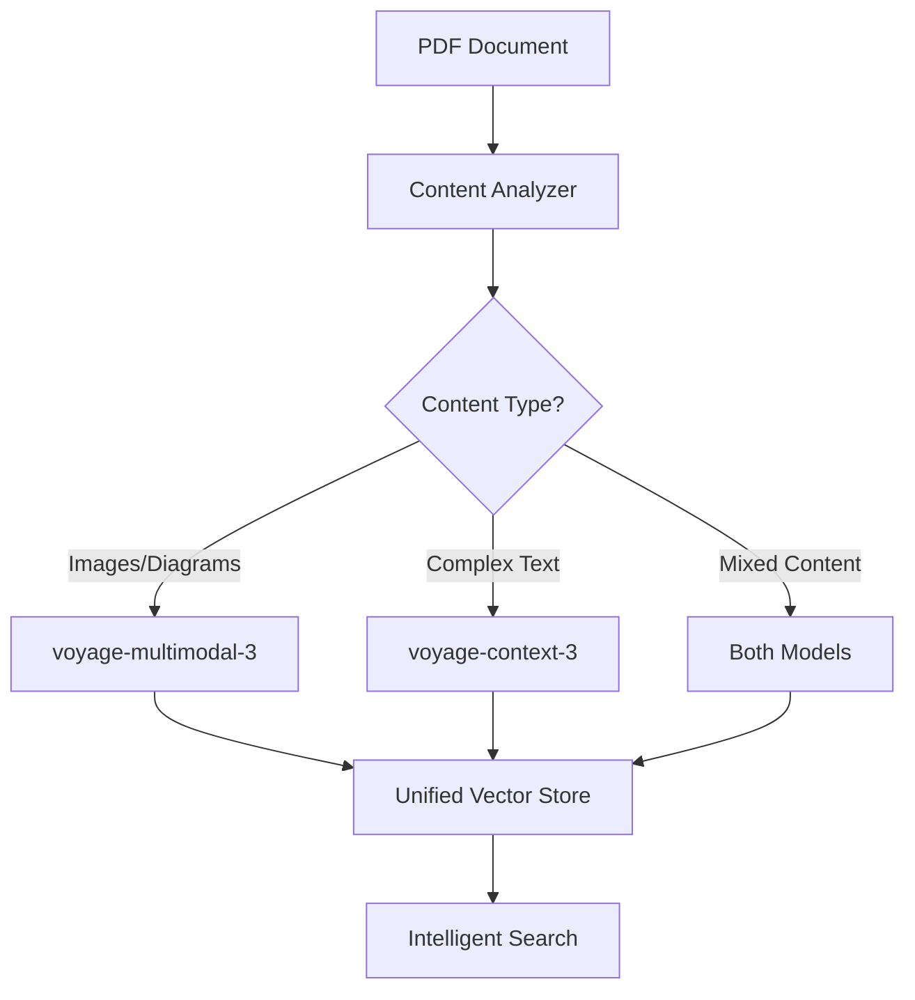

# 📚 Enhanced Text Understanding with Context-3

While multimodal embeddings excel at processing images and general text, complex textual content often requires deeper semantic understanding. Voyage AI's `context-3` model provides state-of-the-art text comprehension, perfect for legal documents, technical specifications, and narrative content.

:::tip Ready-to-Use Workflows
- Context-3 implementation: [08-voyage-context-3-embeddings.json](/workflows/08-voyage-context-3-embeddings.json)
- Hybrid approach: [09-hybrid-multimodal-context-agent.json](/workflows/09-hybrid-multimodal-context-agent.json)
:::

<InstructorNotes 
  timing="Enhanced Text Understanding (20-25 minutes)"
  notes={[
    "Context-3 is TEXT-ONLY but provides superior semantic understanding",
    "Complements (not replaces) multimodal capabilities",
    "Ideal for complex documents: contracts, research papers, technical docs",
    "Can include surrounding context for better understanding",
    "Works alongside multimodal-3 in hybrid workflows"
  ]}
  tips={[
    "Emphasize this ENHANCES the multimodal approach, not replaces it",
    "Show concrete examples of where context-3 excels",
    "Demonstrate the hybrid approach with both models",
    "Explain when to use each model based on content type",
    "Show how context parameter improves results"
  ]}
/>

<SlideRecap 
  title="Context-3: Advanced Text Intelligence"
  items={[
    {
      icon: "🧠",
      title: "Superior Text Comprehension", 
      description: "State-of-the-art understanding of complex textual content"
    },
    {
      icon: "🔗", 
      title: "Contextual Awareness",
      description: "Incorporates surrounding text for deeper semantic understanding"
    },
    {
      icon: "🚀",
      title: "Hybrid Workflows",
      description: "Combines with multimodal-3 for comprehensive document processing"
    }
  ]}
  nextSection="Let's build intelligent text processing with Context-3!"
/>

## 🎯 Understanding Context-3 Capabilities

### Model Comparison: Multimodal-3 vs Context-3

| Feature | voyage-multimodal-3 | voyage-context-3 |
|---------|-------------------|-----------------|
| **Input Types** | Text + Images | Text Only |
| **Strengths** | Visual content, general text | Complex text, narratives |
| **Use Cases** | PDFs with images, diagrams | Legal docs, research papers |
| **Context Support** | No | Yes (surrounding text) |
| **Vector Dimensions** | 1024 | 1024 |
| **Best For** | Mixed content | Pure text analysis |

### When to Use Context-3

Context-3 excels with:
- **Legal Documents**: Contracts, agreements, terms of service
- **Technical Content**: API docs, specifications, manuals  
- **Research Papers**: Academic papers, whitepapers, reports
- **Narrative Text**: Stories, articles, long-form content
- **Complex Instructions**: Multi-step procedures, regulations

## 🔧 Implementing Context-3 Embeddings

### Basic Context-3 Integration

<WorkshopExercise 
  title="Add Context-3 to Your Workflow" 
  difficulty="intermediate"
  timeEstimate="15 minutes"
  objectives={[
    "Configure Context-3 embedding generation",
    "Implement contextual text processing",
    "Compare results with standard embeddings"
  ]}
>

<ExerciseStep stepNumber="1" title="Context-3 Embedding Generation">

Create embeddings with contextual understanding:

```javascript
// HTTP Request node - Voyage AI Context-3
{
  "method": "POST",
  "url": "https://workshop-embedding-api.vercel.app/api/embed",
  "headers": {
    "Content-Type": "application/json"
  },
  "body": {
    "text": "{{ $json.text_content }}",
    "model": "voyage-context-3",  // Enhanced text model
    "input_type": "document",
    "context": "{{ $json.surrounding_text }}"  // Optional context
  }
}

// Function node - Prepare text with context
{
  "code": `
    const document = $input.first().json;
    const pageText = document.page_content;
    const pageNumber = document.metadata.page;
    
    // Extract surrounding context (previous/next paragraphs)
    const context = {
      previous: document.previous_page_summary || '',
      section: document.metadata.section || '',
      document_type: document.metadata.document_type || 'general'
    };
    
    // Format context string
    const contextString = \`
      Document Type: \${context.document_type}
      Section: \${context.section}
      Previous Content: \${context.previous}
    \`.trim();
    
    return {
      text_content: pageText,
      surrounding_text: contextString,
      metadata: document.metadata
    };
  `
}
```

</ExerciseStep>

<ExerciseStep stepNumber="2" title="Intelligent Text Classification">

Use Context-3 for document categorization:

```javascript
// Function node - Document classifier
{
  "code": `
    const categories = {
      legal: {
        keywords: ['agreement', 'whereas', 'liability', 'indemnify'],
        patterns: /\\b(shall|hereby|party|parties)\\b/gi,
        context_hints: 'legal document formatting'
      },
      technical: {
        keywords: ['API', 'function', 'parameter', 'implementation'],
        patterns: /\\b(class|method|interface|module)\\b/gi,
        context_hints: 'technical documentation'
      },
      research: {
        keywords: ['abstract', 'methodology', 'results', 'conclusion'],
        patterns: /\\b(hypothesis|analysis|findings|study)\\b/gi,
        context_hints: 'academic paper structure'
      },
      narrative: {
        keywords: ['chapter', 'story', 'character', 'plot'],
        patterns: /\\b(said|told|happened|once)\\b/gi,
        context_hints: 'narrative prose'
      }
    };
    
    const text = $input.first().json.text;
    const scores = {};
    
    // Analyze text for each category
    for (const [category, criteria] of Object.entries(categories)) {
      let score = 0;
      
      // Check keywords
      criteria.keywords.forEach(keyword => {
        if (text.toLowerCase().includes(keyword)) score += 2;
      });
      
      // Check patterns
      const matches = text.match(criteria.patterns);
      if (matches) score += matches.length;
      
      scores[category] = score;
    }
    
    // Determine best category
    const bestCategory = Object.entries(scores)
      .sort(([,a], [,b]) => b - a)[0][0];
    
    return {
      category: bestCategory,
      confidence: scores[bestCategory] / Math.max(...Object.values(scores)),
      use_context_3: ['legal', 'technical', 'research'].includes(bestCategory),
      context_hint: categories[bestCategory].context_hints
    };
  `
}
```

</ExerciseStep>

<ExerciseStep stepNumber="3" title="Context-Enhanced Search">

Implement smarter text search:

```javascript
// MongoDB aggregation - Context-aware search
{
  "operation": "Aggregate",
  "collection": "documents",
  "pipeline": [
    {
      "$vectorSearch": {
        "index": "context_vector_index",
        "path": "context_embedding",  // Context-3 embeddings
        "queryVector": "{{ $json.query_embedding }}",
        "numCandidates": 100,
        "limit": 10,
        "filter": {
          "document_type": "{{ $json.document_category }}"
        }
      }
    },
    {
      "$lookup": {
        "from": "document_sections",
        "localField": "document_id",
        "foreignField": "document_id",
        "as": "related_sections"
      }
    },
    {
      "$project": {
        "content": 1,
        "metadata": 1,
        "context": 1,
        "related_sections": {
          "$slice": ["$related_sections", 3]
        },
        "score": {"$meta": "vectorSearchScore"}
      }
    }
  ]
}
```

</ExerciseStep>

</WorkshopExercise>

## 🚀 Hybrid Multimodal + Context Workflows

### The Power of Combining Models

The real magic happens when you use BOTH models strategically:



### Implementing Hybrid Processing

<WorkshopExercise 
  title="Build Hybrid Document Processor" 
  difficulty="advanced"
  timeEstimate="20 minutes"
  objectives={[
    "Create workflow using both embedding models",
    "Implement intelligent model selection",
    "Build unified search across both embeddings"
  ]}
>

<ExerciseStep stepNumber="1" title="Content Analysis & Routing">

Analyze content and route to appropriate model:

```javascript
// Function node - Content analyzer and router
{
  "code": `
    const pages = $input.first().json.pages;
    const processedPages = [];
    
    for (const page of pages) {
      const analysis = {
        has_images: page.images && page.images.length > 0,
        has_tables: page.tables && page.tables.length > 0,
        has_diagrams: /\\b(figure|diagram|chart|graph)\\b/i.test(page.text),
        text_complexity: calculateTextComplexity(page.text),
        text_length: page.text.length,
        document_type: page.metadata.document_type
      };
      
      // Determine processing strategy
      let strategy = {
        use_multimodal: false,
        use_context: false,
        priority: 'balanced'
      };
      
      if (analysis.has_images || analysis.has_diagrams) {
        strategy.use_multimodal = true;
        strategy.priority = 'visual';
      }
      
      if (analysis.text_complexity > 0.7 || 
          ['legal', 'technical', 'research'].includes(analysis.document_type)) {
        strategy.use_context = true;
        strategy.priority = strategy.use_multimodal ? 'hybrid' : 'textual';
      }
      
      // Default to multimodal for general content
      if (!strategy.use_multimodal && !strategy.use_context) {
        strategy.use_multimodal = true;
      }
      
      processedPages.push({
        ...page,
        analysis,
        strategy,
        routing: determineRouting(strategy)
      });
    }
    
    return { pages: processedPages };
    
    function calculateTextComplexity(text) {
      // Simple complexity score based on sentence length and vocabulary
      const sentences = text.split(/[.!?]+/);
      const avgSentenceLength = sentences.reduce((sum, s) => sum + s.split(' ').length, 0) / sentences.length;
      const complexWords = text.match(/\\b\\w{10,}\\b/g) || [];
      
      return Math.min(1, (avgSentenceLength / 30) + (complexWords.length / 100));
    }
    
    function determineRouting(strategy) {
      if (strategy.priority === 'hybrid') return 'both';
      if (strategy.use_context) return 'context';
      return 'multimodal';
    }
  `
}
```

</ExerciseStep>

<ExerciseStep stepNumber="2" title="Parallel Model Processing">

Process content with both models when needed:

```javascript
// Split node - Route to appropriate embedding service
{
  "conditions": [
    {
      "when": "{{ $json.routing }}",
      "equals": "multimodal",
      "output": 0  // Route to multimodal-3
    },
    {
      "when": "{{ $json.routing }}",
      "equals": "context",
      "output": 1  // Route to context-3
    },
    {
      "when": "{{ $json.routing }}",
      "equals": "both",
      "output": 2  // Route to parallel processing
    }
  ]
}

// Parallel processing branch - HTTP Request nodes
// Branch 1: Multimodal-3 for visual content
{
  "method": "POST",
  "url": "https://workshop-embedding-api.vercel.app/api/embed",
  "body": {
    "text": "{{ $json.visual_description }} {{ $json.text_summary }}",
    "model": "voyage-multimodal-3",
    "input_type": "document",
    "images": "{{ $json.images }}"  // Base64 encoded images
  }
}

// Branch 2: Context-3 for textual content
{
  "method": "POST", 
  "url": "https://workshop-embedding-api.vercel.app/api/embed",
  "body": {
    "text": "{{ $json.full_text }}",
    "model": "voyage-context-3",
    "input_type": "document",
    "context": "{{ $json.document_context }}"
  }
}

// Merge node - Combine embeddings
{
  "mode": "multiplex",
  "options": {
    "combineMatches": [
      {
        "field1": "page_id",
        "field2": "page_id"
      }
    ]
  }
}
```

</ExerciseStep>

<ExerciseStep stepNumber="3" title="Unified Storage & Search">

Store and search across both embedding types:

```javascript
// Function node - Prepare unified document
{
  "code": `
    const mergedData = $input.first().json;
    
    return {
      document_id: mergedData.document_id,
      page_id: mergedData.page_id,
      content: {
        text: mergedData.full_text,
        summary: mergedData.text_summary,
        visual_elements: mergedData.visual_description
      },
      embeddings: {
        multimodal: mergedData.multimodal_embedding || null,
        context: mergedData.context_embedding || null,
        combined: mergedData.multimodal_embedding && mergedData.context_embedding
          ? averageVectors(mergedData.multimodal_embedding, mergedData.context_embedding)
          : mergedData.multimodal_embedding || mergedData.context_embedding
      },
      metadata: {
        ...mergedData.metadata,
        processing_strategy: mergedData.strategy,
        has_visual_content: !!mergedData.multimodal_embedding,
        has_context_embedding: !!mergedData.context_embedding
      }
    };
    
    function averageVectors(v1, v2) {
      return v1.map((val, idx) => (val + v2[idx]) / 2);
    }
  `
}

// MongoDB insert with multiple embeddings
{
  "operation": "Insert Document",
  "collection": "hybrid_documents",
  "fields": {
    "document_id": "{{ $json.document_id }}",
    "page_id": "{{ $json.page_id }}",
    "content": "{{ $json.content }}",
    "multimodal_embedding": "{{ $json.embeddings.multimodal }}",
    "context_embedding": "{{ $json.embeddings.context }}",
    "combined_embedding": "{{ $json.embeddings.combined }}",
    "metadata": "{{ $json.metadata }}",
    "created_at": "{{ $now }}"
  }
}
```

</ExerciseStep>

</WorkshopExercise>

## 🎨 Best Practices: Choosing the Right Model

### Model Selection Guide

```javascript
// Decision tree for model selection
const modelSelector = {
  analyzeContent: (content) => {
    const features = {
      hasImages: content.images?.length > 0,
      hasCode: /```[\s\S]*?```/.test(content.text),
      hasLegalTerms: /\b(whereas|hereby|liability|indemnify)\b/i.test(content.text),
      hasTechnicalTerms: /\b(API|function|parameter|implementation)\b/i.test(content.text),
      hasNarrative: /\b(chapter|story|once upon|the end)\b/i.test(content.text),
      textLength: content.text.length,
      avgSentenceLength: calculateAvgSentenceLength(content.text)
    };
    
    // Decision logic
    if (features.hasImages) {
      return {
        primary: 'voyage-multimodal-3',
        secondary: features.hasLegalTerms || features.hasTechnicalTerms ? 'voyage-context-3' : null,
        reason: 'Visual content requires multimodal processing'
      };
    }
    
    if (features.hasLegalTerms || features.avgSentenceLength > 25) {
      return {
        primary: 'voyage-context-3',
        secondary: null,
        reason: 'Complex legal language benefits from contextual understanding'
      };
    }
    
    if (features.hasTechnicalTerms && features.hasCode) {
      return {
        primary: 'voyage-context-3',
        secondary: null,
        reason: 'Technical documentation with code requires deep comprehension'
      };
    }
    
    if (features.textLength > 5000 && features.hasNarrative) {
      return {
        primary: 'voyage-context-3',
        secondary: null,
        reason: 'Long narrative content benefits from contextual embeddings'
      };
    }
    
    // Default to multimodal for general content
    return {
      primary: 'voyage-multimodal-3',
      secondary: null,
      reason: 'General content works well with multimodal embeddings'
    };
  }
};
```

### Content-Specific Recommendations

| Content Type | Recommended Model | Why? |
|--------------|------------------|------|
| **Screenshots** | multimodal-3 | Visual UI elements need image understanding |
| **Legal Contracts** | context-3 | Complex language, cross-references |
| **Technical Diagrams** | Both | Visual + detailed explanations |
| **Research Papers** | context-3 | Academic language, citations |
| **Marketing PDFs** | multimodal-3 | Mixed visual/text content |
| **API Documentation** | context-3 | Code examples, technical details |
| **Financial Reports** | Both | Charts/graphs + detailed analysis |

## 📊 Performance Optimization

### Efficient Hybrid Processing

```javascript
// Optimize processing based on content
const hybridOptimization = {
  strategies: {
    // Quick scan first
    quickScan: {
      sample_size: 1000,  // First 1000 chars
      determine_strategy: true,
      skip_if_simple: true
    },
    
    // Batch processing
    batchProcessing: {
      multimodal_batch_size: 5,
      context_batch_size: 10,
      parallel_processing: true
    },
    
    // Caching strategy
    caching: {
      cache_embeddings: true,
      cache_duration: 3600,  // 1 hour
      cache_key: (content) => {
        return crypto.createHash('md5')
          .update(content.text + content.model)
          .digest('hex');
      }
    }
  }
};
```

## 🧪 Testing Your Hybrid System

<Quiz 
  title="Context-3 and Hybrid Processing"
  passingScore={80}
  questions={[
    {
      question: "When should you use voyage-context-3 instead of voyage-multimodal-3?",
      options: [
        "When processing images with text",
        "When dealing with complex textual content that requires deep understanding",
        "When you need faster processing",
        "When working with multiple languages"
      ],
      correctAnswer: 1,
      explanation: "Context-3 excels at understanding complex text like legal documents, technical specs, and narrative content where contextual understanding is crucial."
    },
    {
      question: "What's the main advantage of using both models in a hybrid approach?",
      options: [
        "It's always faster than using one model",
        "It reduces costs",
        "It leverages the strengths of each model for different content types",
        "It uses less memory"
      ],
      correctAnswer: 2,
      explanation: "Hybrid approaches use multimodal-3 for visual content and context-3 for complex text, providing optimal understanding for mixed documents."
    },
    {
      question: "What does the 'context' parameter in voyage-context-3 do?",
      options: [
        "It speeds up processing",
        "It provides surrounding text to improve embedding quality",
        "It translates the content",
        "It compresses the embeddings"
      ],
      correctAnswer: 1,
      explanation: "The context parameter allows you to provide surrounding text, helping the model better understand the meaning of the content being embedded."
    }
  ]}
/>

## 🚀 Advanced Challenge

<WorkshopExercise 
  title="Build an Intelligent Document Classifier" 
  difficulty="expert"
  timeEstimate="25 minutes"
  objectives={[
    "Create automatic model selection based on content",
    "Implement fallback strategies for edge cases",
    "Build performance monitoring and optimization"
  ]}
>

Build a system that:
1. **Analyzes** incoming documents automatically
2. **Selects** the optimal embedding model(s)
3. **Processes** content with the chosen approach
4. **Monitors** performance and adjusts strategy
5. **Learns** from results to improve selection

Test with diverse content:
- Mixed legal documents with diagrams
- Technical manuals with code and images
- Research papers with charts
- Marketing materials with infographics
- Narrative content with illustrations

</WorkshopExercise>

## 🎯 Key Takeaways

- **Context-3 complements, not replaces** multimodal capabilities
- **Use Context-3 for** legal docs, technical content, narratives
- **Use Multimodal-3 for** images, diagrams, general text
- **Hybrid approaches** provide the best of both worlds
- **Smart routing** optimizes performance and accuracy

Context-3 adds another powerful tool to your multimodal toolkit, enabling truly intelligent document understanding! 🚀

## 📚 Next Steps

Ready to put it all together? Continue to:
- [Complete Multimodal Agent](./complete-multimodal-agent) - Build a full production system
- [Production Vector Search](./mongodb-vector-setup) - Deploy scalable vector search
- [Upload Interface](./upload-interface) - Create a web interface for your agent