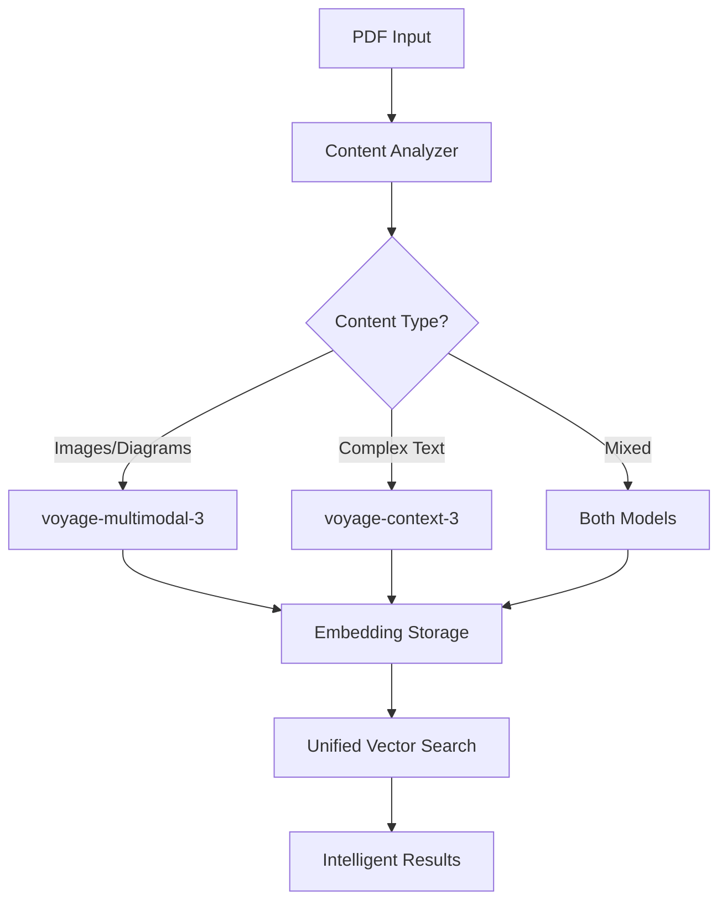

# 📋 Workflow Reference Guide

This guide provides a comprehensive overview of all workshop workflows, including the new Context-3 and hybrid implementations.

<InstructorNotes 
  timing="Workflow Reference (10 minutes)"
  notes={[
    "This reference helps participants understand workflow progression",
    "Each workflow builds on previous concepts",
    "New workflows 08 and 09 introduce advanced embedding strategies",
    "Participants can import these directly into n8n"
  ]}
  tips={[
    "Show how workflows evolve from simple to complex",
    "Emphasize that participants can mix and match components",
    "Point out the new hybrid approach as the most comprehensive"
  ]}
/>

## 📂 Available Workflows

### Core Workflows (01-07)

| Workflow | Name | Description | Key Features |
|----------|------|-------------|--------------|
| **01** | Basic PDF Upload | Simple PDF file handling | File validation, basic extraction |
| **02** | PDF to Text | Extract text content from PDFs | Text extraction, page separation |
| **03** | PDF to Images | Convert PDF pages to images | Image extraction, format conversion |
| **04** | MongoDB Storage | Store extracted content | Database integration, document structure |
| **05** | Real Multimodal Agent | Complete multimodal processing | Text + image embeddings, vector search |
| **06** | Real Voyage Multimodal | Production Voyage AI integration | Multimodal-3 embeddings, batch processing |
| **07** | Vector Search API | Query interface for embeddings | Similarity search, result ranking |

### Enhanced Workflows (08-09) 🆕

| Workflow | Name | Description | Key Features |
|----------|------|-------------|--------------|
| **08** | Voyage Context-3 Embeddings | Enhanced text understanding | Context-3 model, contextual embeddings |
| **09** | Hybrid Multimodal Context Agent | Combined approach | Both models, intelligent routing |

## 🎯 Workflow 08: Enhanced Text Embeddings with Voyage Context-3

### Overview
This workflow introduces Voyage AI's `context-3` model for superior text comprehension, particularly useful for complex documents.

### When to Use
- Legal documents with complex language
- Technical specifications and documentation
- Research papers and academic content
- Long-form narrative content
- Documents requiring contextual understanding

### Key Components

```json
{
  "name": "08-voyage-context-3-embeddings",
  "description": "Enhanced text processing with contextual understanding",
  "nodes": [
    {
      "name": "Document Classifier",
      "type": "code",
      "description": "Analyzes text to determine optimal model"
    },
    {
      "name": "Context-3 Embedder",
      "type": "http",
      "description": "Generates context-aware embeddings"
    },
    {
      "name": "Context Enhancer",
      "type": "code", 
      "description": "Adds surrounding context to improve embeddings"
    },
    {
      "name": "MongoDB Storage",
      "type": "mongodb",
      "description": "Stores embeddings with metadata"
    }
  ]
}
```

### Implementation Details

**1. Document Analysis Node:**
```javascript
// Determine if content needs Context-3
const requiresContext = 
  hasLegalTerms(text) || 
  avgSentenceLength > 25 ||
  documentType === 'technical' ||
  textComplexity > 0.7;
```

**2. Context-3 API Call:**
```javascript
{
  "url": "https://workshop-embedding-api.vercel.app/api/embed",
  "body": {
    "text": "{{ $json.content }}",
    "model": "voyage-context-3",
    "input_type": "document",
    "context": "{{ $json.surrounding_context }}"
  }
}
```

**3. Storage Schema:**
```javascript
{
  "document_id": "doc_123",
  "content": "text content",
  "context_embedding": [/* 1024 dimensions */],
  "model_used": "voyage-context-3",
  "metadata": {
    "document_type": "legal",
    "complexity_score": 0.85
  }
}
```

## 🚀 Workflow 09: Hybrid Multimodal PDF Agent with Context-3 Enhancement

### Overview
The most advanced workflow combining both `voyage-multimodal-3` and `voyage-context-3` for comprehensive document understanding.

### When to Use
- Mixed content PDFs (text + images + diagrams)
- Technical manuals with illustrations
- Research papers with charts and complex text
- Legal documents with exhibits
- Any document requiring maximum understanding

### Architecture



### Key Components

```json
{
  "name": "09-hybrid-multimodal-context-agent",
  "description": "Intelligent routing between multimodal and context models",
  "nodes": [
    {
      "name": "Content Router",
      "type": "switch",
      "description": "Routes content to appropriate model"
    },
    {
      "name": "Multimodal Branch",
      "type": "http",
      "description": "Processes visual content"
    },
    {
      "name": "Context Branch",
      "type": "http",
      "description": "Processes complex text"
    },
    {
      "name": "Embedding Merger",
      "type": "code",
      "description": "Combines embeddings intelligently"
    },
    {
      "name": "Hybrid Search",
      "type": "mongodb",
      "description": "Searches across both embedding types"
    }
  ]
}
```

### Implementation Strategy

**1. Smart Content Routing:**
```javascript
const routingDecision = {
  useMultimodal: hasImages || hasDiagrams,
  useContext: isComplexText || needsContext,
  strategy: determineOptimalStrategy(content)
};
```

**2. Parallel Processing:**
- Process visual content with multimodal-3
- Process text content with context-3
- Merge results for comprehensive understanding

**3. Weighted Search:**
```javascript
// Adjust weights based on query type
const searchWeights = {
  visual_query: { multimodal: 0.8, context: 0.2 },
  text_query: { multimodal: 0.3, context: 0.7 },
  mixed_query: { multimodal: 0.5, context: 0.5 }
};
```

## 📊 Workflow Comparison

| Feature | Workflow 05-06 | Workflow 08 | Workflow 09 |
|---------|----------------|-------------|-------------|
| **Text Processing** | Basic | Advanced | Advanced |
| **Image Processing** | ✅ | ❌ | ✅ |
| **Context Understanding** | Limited | ✅ | ✅ |
| **Best For** | General PDFs | Text-heavy docs | All content types |
| **Complexity** | Medium | Medium | High |
| **Performance** | Fast | Fast | Moderate |

## 🔧 Importing Workflows

### In n8n Interface:
1. Navigate to Workflows → Import
2. Select the workflow JSON file:
   - `/workspaces/multimodal-pdf-agent-n8n/init/workflows/08-voyage-context-3-embeddings.json`
   - `/workspaces/multimodal-pdf-agent-n8n/init/workflows/09-hybrid-multimodal-context-agent.json`
3. Configure credentials (Voyage AI API key)
4. Test with sample documents

### Via CLI:
```bash
# Import Context-3 workflow
n8n import:workflow --input=./workflows/08-voyage-context-3-embeddings.json

# Import Hybrid workflow  
n8n import:workflow --input=./workflows/09-hybrid-multimodal-context-agent.json
```

## 🎯 Choosing the Right Workflow

### Decision Tree:
```
Start → Does your PDF have images?
  ├─ Yes → Are there complex text sections?
  │   ├─ Yes → Use Workflow 09 (Hybrid)
  │   └─ No → Use Workflow 05/06 (Multimodal)
  └─ No → Is the text complex/technical?
      ├─ Yes → Use Workflow 08 (Context-3)
      └─ No → Use Workflow 05/06 (Multimodal)
```

## 📚 Next Steps

After implementing these workflows:
1. Test with various document types
2. Monitor performance and accuracy
3. Fine-tune routing logic based on your content
4. Consider implementing caching for frequently accessed documents
5. Build custom UI for workflow selection

The hybrid approach (Workflow 09) provides the most comprehensive solution but requires more resources. Start with the workflow that best matches your primary use case and expand as needed.