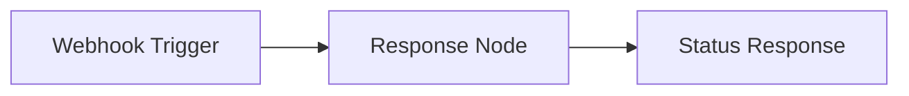

# 🎓 Workflow 01: Getting Started Guide

Your first n8n workflow! This simple workflow helps verify your environment setup and introduces basic n8n concepts.

## 📥 Download & Import

1. **Download**: [01-getting-started.json](/workflows/01-getting-started.json)
2. **Import**: In n8n → Workflows → Import → Select file
3. **Test**: Execute the workflow to verify everything works

## 🎯 Learning Objectives

After completing this workflow, you'll understand:
- How to create and configure webhooks
- Basic n8n node connections
- How to test workflows
- Response handling patterns

## 🏗️ Workflow Architecture



## 🔧 Node Configuration

### 1. Webhook Node
- **Path**: `workshop-status`
- **Method**: GET
- **Purpose**: Entry point for testing the workflow

### 2. Response Node
- **Type**: JSON response
- **Content**: Workshop status information
- **Purpose**: Returns confirmation that n8n is working

## 🧪 Testing the Workflow

1. **Activate** the workflow
2. **Copy** the webhook URL
3. **Open** the URL in your browser
4. **Expect** a JSON response with workshop status

### Expected Response
```json
{
  "status": "Workshop Ready! 🚀",
  "message": "Your n8n environment is working correctly",
  "next_steps": [
    "Connect MongoDB Atlas",
    "Import sample workflows",
    "Start building!"
  ],
  "timestamp": "2024-01-20T10:30:00.000Z"
}
```

## 🎨 Customization Ideas

### Add Health Checks
```javascript
// Add to response node
{
  "status": "ready",
  "services": {
    "n8n": "✅ Running",
    "mongodb": await testMongoConnection() ? "✅ Connected" : "❌ Not connected",
    "api": await testWorkshopAPI() ? "✅ Available" : "❌ Unavailable"
  }
}
```

### Add User Information
```javascript
// Include user context
{
  "user": {
    "ip": "{{ $json.headers['x-forwarded-for'] }}",
    "user_agent": "{{ $json.headers['user-agent'] }}"
  }
}
```

## 🚨 Troubleshooting

### Webhook Not Responding
- Check if workflow is **activated**
- Verify webhook URL is correct
- Look for error messages in execution log

### JSON Response Issues
- Ensure response node is configured for JSON
- Check for JSON syntax errors
- Verify all template expressions are valid

## ✅ Success Criteria

You've successfully completed this workflow when:
- [ ] Workflow imports without errors
- [ ] Webhook responds with status JSON
- [ ] Response includes timestamp
- [ ] No errors in execution log

## 🚀 Next Steps

Ready for more? Try these workflows next:
- [02 - PDF Processor](/workflows/02-pdf-processor.json) - Process your first PDF
- [03 - Multimodal Agent](/workflows/03-multimodal-agent.json) - Create an AI agent

## 💡 Key Takeaways

This simple workflow teaches fundamental n8n concepts:
- **Webhooks** are the primary way to trigger workflows
- **Nodes** can be configured with static or dynamic content
- **JSON responses** are essential for API-like workflows
- **Testing** workflows early and often prevents issues later

Congratulations! You've taken your first step into the world of n8n automation! 🎉