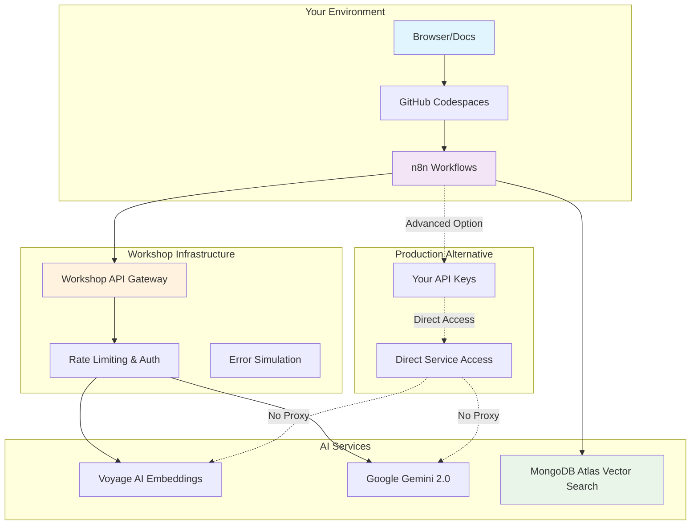
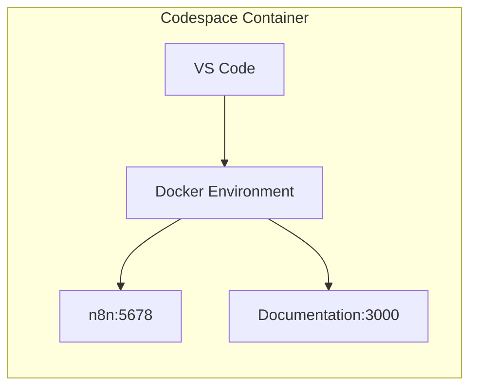
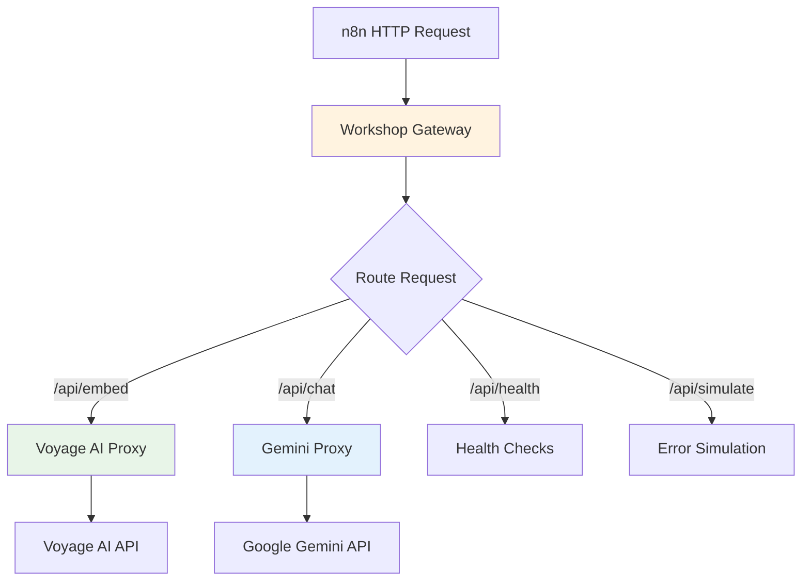
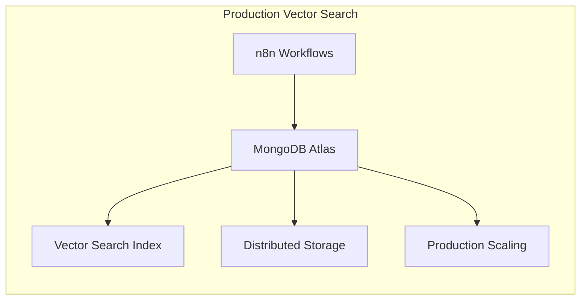
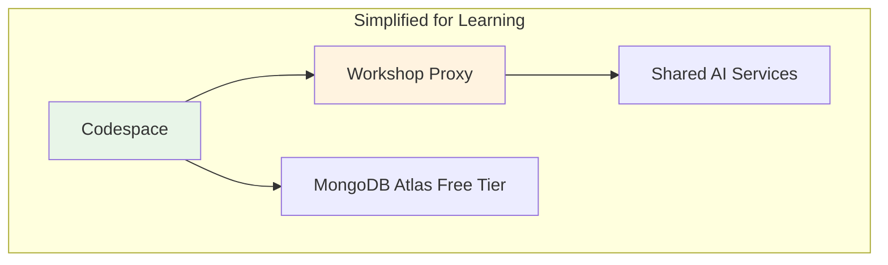
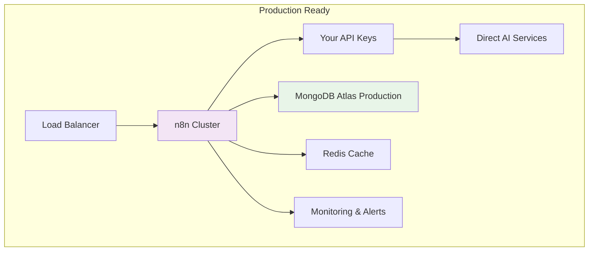
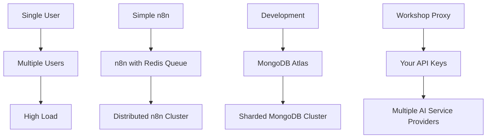

# 🏗️ Architecture Overview: Multimodal AI Agent Workshop

Understanding the complete system architecture helps you see how all components work together to create intelligent, multimodal AI agents. Let's explore the full stack from your browser to the AI models.

<InstructorNotes 
  timing="Architecture Overview (15-20 minutes)"
  notes={[
    "This is foundational - spend time here to prevent confusion later",
    "Use the visual diagrams to show data flow clearly",
    "Emphasize the workshop proxy vs production architecture differences",
    "Many attendees get confused about local vs cloud components",
    "Address security questions about API keys and data flow early"
  ]}
  tips={[
    "Start with the big picture, then zoom into each component",
    "Use the live status badges to show real-time system health",
    "Explain why we chose each technology (n8n, MongoDB, Voyage AI)",
    "Show how this architecture scales to production systems",
    "Have attendees identify which components run where"
  ]}
/>

<LiveStatusBadge showDetails={true} />

## 🎯 Complete System Architecture



## 🧩 Component Breakdown

### 1. **Frontend Layer: Browser & Documentation**

| Component | Purpose | Technology |
|-----------|---------|------------|
| **Docusaurus Site** | Interactive workshop guide | React, MDX |
| **Live Status Badges** | Real-time system health | Custom React components |
| **Interactive Exercises** | Hands-on learning | Workshop components |

**What runs here:**
- This documentation you're reading
- Status monitoring and health checks
- Progress tracking and validation

### 2. **Development Environment: GitHub Codespaces**



**Why Codespaces?**
- ✅ **Zero setup** - Everything pre-configured
- ✅ **Consistent environment** - Same setup for all attendees
- ✅ **Resource isolation** - Each attendee gets their own instance
- ✅ **Automatic port forwarding** - Access services through secure URLs

**Container Configuration:**
```dockerfile
# Simplified .devcontainer setup
FROM node:18

# Install Docker and Docker Compose
RUN apt-get update && apt-get install -y docker.io docker-compose

# Setup n8n and documentation services
COPY docker-compose.yml .
COPY .env.example .env

# Start all services automatically
CMD ["docker-compose", "up", "-d"]
```

### 3. **Workflow Engine: n8n Visual Automation**

<WorkshopExercise 
  title="Understanding n8n in the Architecture" 
  difficulty="beginner"
  timeEstimate="10 minutes"
  objectives={[
    "Identify n8n's role as the orchestration layer",
    "Understand how n8n connects different services",
    "See the visual workflow representation of agent logic"
  ]}
>

n8n serves as the **orchestration layer** where:

**Visual Workflows = Agent Logic**
```javascript
// Traditional code approach
async function processDocument(pdfUrl) {
  const pdf = await downloadPdf(pdfUrl);
  const pages = await extractPages(pdf);
  const embeddings = await generateEmbeddings(pages);
  const result = await storeInMongoDB(embeddings);
  return result;
}

// n8n visual approach
[Webhook] → [HTTP Download] → [PDF Extract] → [Voyage AI] → [MongoDB] → [Response]
```

**Key Advantages:**
- **Visual debugging** - See data flow in real-time
- **Non-technical accessibility** - Business users can modify workflows
- **Built-in integrations** - 400+ pre-built connectors
- **Error handling** - Visual representation of failure paths

</WorkshopExercise>

### 4. **Workshop API Gateway: Simplifying Access**

The workshop includes a **custom API gateway** that acts as a proxy and educational tool:



**Why Use a Proxy?**

| Benefit | Workshop | Production |
|---------|----------|------------|
| **API Key Management** | Hidden from attendees | Your keys, your control |
| **Rate Limiting** | Shared limits managed | Your limits, your rules |
| **Error Simulation** | Teaching tool for resilience | Real errors only |
| **Cost Control** | Workshop covers costs | You control spending |
| **Security** | No key exposure risk | Full security control |

### 5. **Data Layer: MongoDB Atlas**

**Cloud-First Database Strategy:**



**MongoDB Atlas (Cloud):**
- ✅ **Vector search** - Native multimodal embeddings (1024-dimensional)
- ✅ **Production ready** - Managed, scalable, secure
- ✅ **Advanced features** - Full-text search, analytics, real-time sync
- ✅ **Free tier available** - M0 Sandbox perfect for workshop learning
- ⚠️ **Network dependent** - Requires internet connection

### 6. **AI Services: The Intelligence Layer**

**Voyage AI: Multimodal Embeddings**
```javascript
// Single API call handles both text and images
{
  "input": {
    "text": "Financial report summary",
    "image": "base64_encoded_chart_image"
  },
  "model": "voyage-multimodal-3",
  "output_dimensions": 1024
}

// Returns unified vector representation
{
  "embeddings": [0.123, -0.456, 0.789, ...], // 1024 dimensions
  "usage": {"input_tokens": 15, "total_tokens": 15}
}
```

**Google Gemini 2.0: Agent Intelligence**
```javascript
// Function calling configuration
{
  "model": "gemini-2.0-flash-exp",
  "tools": [
    {
      "function": {
        "name": "search_documents",
        "description": "Search PDF documents using vector similarity",
        "parameters": {
          "type": "object",
          "properties": {
            "query": {"type": "string"},
            "limit": {"type": "integer"}
          }
        }
      }
    }
  ],
  "messages": [
    {"role": "user", "content": "What does the financial report say about Q3 revenue?"}
  ]
}
```

## 🔄 Data Flow: Request to Response

Let's trace a complete request through the system:

<WorkshopExercise 
  title="Trace a Complete Request" 
  difficulty="intermediate"
  timeEstimate="15 minutes"
  objectives={[
    "Follow data flow from user input to AI response",
    "Understand each transformation step",
    "Identify potential failure points and optimizations"
  ]}
>

### Example: "What are the key findings in document.pdf?"

**Step 1: User Input**
```
Browser → Codespace n8n → Webhook Trigger
Data: {"query": "What are the key findings in document.pdf?"}
```

**Step 2: Document Search**
```
n8n → MongoDB Atlas Vector Search
Query: Generate embedding for "key findings" → Search similar content
Result: [doc1, doc2, doc3] with similarity scores
```

**Step 3: Context Preparation**
```
n8n → Function Node
Process: Combine search results into context
Data: "Context: [Document excerpts...] Question: What are the key findings?"
```

**Step 4: AI Agent Processing**
```
n8n → Workshop API Gateway → Google Gemini
Tools Available: [search_documents, extract_text, analyze_chart]
Processing: ReAct pattern - Reason → Act → Observe → Respond
```

**Step 5: Response Generation**
```
Gemini → Workshop Gateway → n8n → User
Response: "Based on the documents, the key findings are: 1) Revenue increased 15%, 2) New market expansion successful, 3) Cost optimization saved $2M"
```

**Performance Metrics:**
- **Total Time**: ~3-8 seconds
- **Bottlenecks**: Vector search (1-2s), AI processing (2-5s)
- **Optimization Opportunities**: Caching, batch processing, parallel requests

</WorkshopExercise>

## 🏭 Workshop vs Production Architecture

### Workshop Architecture (What You're Using)



**Characteristics:**
- **Shared resources** - All attendees use same proxy
- **Simplified auth** - No API key management
- **Rate limiting** - Shared quotas across workshop
- **Error simulation** - Intentional failures for learning
- **Cost optimization** - Workshop covers all AI service costs

### Production Architecture (What You'd Deploy)



**Characteristics:**
- **Dedicated resources** - Your infrastructure, your control
- **Direct API access** - Your keys, full rate limits
- **Advanced monitoring** - Custom alerts and dashboards
- **High availability** - Multi-region deployment
- **Security hardening** - VPCs, encryption, access controls

## 🛡️ Security & Privacy Considerations

### Workshop Security Model

| Component | Security Approach | Why |
|-----------|------------------|-----|
| **API Gateway** | Proxy with hidden keys | Protects real credentials |
| **Codespaces** | Isolated containers | Each user gets private environment |
| **MongoDB** | Atlas with network restrictions | Limited access to workshop data only |
| **Data Processing** | Ephemeral processing | No persistent storage of sensitive data |

### Production Security Checklist

```javascript
// Production security considerations
const productionSecurity = {
  authentication: {
    api_keys: "Rotate regularly, use key management service",
    user_auth: "Implement OAuth 2.0 or similar", 
    service_auth: "mTLS between services"
  },
  
  data_protection: {
    encryption_at_rest: "MongoDB encryption enabled",
    encryption_in_transit: "TLS 1.3 for all connections",
    data_classification: "Classify and handle PII appropriately"
  },
  
  network_security: {
    vpc_isolation: "Private networks for internal communication",
    firewall_rules: "Whitelist only necessary ports and IPs",
    ddos_protection: "Rate limiting and DDoS mitigation"
  },
  
  monitoring: {
    audit_logs: "Track all API calls and data access",
    anomaly_detection: "Monitor for unusual patterns",
    incident_response: "Automated alerts and response procedures"
  }
};
```

## 📊 Performance & Scalability

### Current Workshop Performance

| Metric | Typical Range | Factors |
|--------|---------------|---------|
| **PDF Processing** | 10-30 seconds | File size, page count, complexity |
| **Vector Search** | 100-500ms | Collection size, query complexity |
| **AI Response** | 2-8 seconds | Model complexity, context length |
| **Total Request** | 5-15 seconds | Network latency, queue time |

### Scaling Strategies



**Scaling Bottlenecks:**
1. **AI Service Rate Limits** - Upgrade tiers or multiple providers
2. **Vector Search Performance** - Index optimization, sharding
3. **n8n Throughput** - Queue systems, horizontal scaling
4. **Memory Usage** - Optimize embeddings, implement caching

## 🎯 Architecture Decision Records

### Why n8n Over Traditional Code?

| Decision Factor | n8n | Traditional Code | Winner |
|----------------|-----|------------------|--------|
| **Learning Curve** | Visual, intuitive | Requires programming skills | n8n |
| **Rapid Prototyping** | Drag-and-drop fast | Longer development cycle | n8n |
| **Team Collaboration** | Non-technical can contribute | Developer-only | n8n |
| **Debugging** | Visual execution flow | Code debugging tools | Tie |
| **Production Scale** | Good for most use cases | Maximum flexibility | Code |
| **Maintenance** | Visual workflows self-document | Requires documentation | n8n |

### Why MongoDB Atlas for Vector Search?

| Decision Factor | MongoDB Atlas | Alternatives | Winner |
|----------------|---------------|--------------|--------|
| **Developer Experience** | Unified document + vector DB | Separate systems | MongoDB |
| **Query Flexibility** | Rich filtering + vector search | Vector-only search | MongoDB |
| **Scaling** | Managed, automatic | Manual configuration | MongoDB |
| **Ecosystem** | Integrated with existing tools | New toolchain needed | MongoDB |
| **Cost** | Pay for what you use | Complex pricing models | MongoDB |

### Why Workshop Proxy?

| Decision Factor | Workshop Proxy | Direct API Access | Winner |
|----------------|----------------|-------------------|--------|
| **Workshop Setup Time** | Zero configuration | API key setup required | Proxy |
| **Security** | No key exposure | Keys in environment | Proxy |
| **Cost Control** | Workshop covers costs | Individual responsibility | Proxy |
| **Learning Focus** | Focus on concepts | Focus on configuration | Proxy |
| **Production Readiness** | Teaching only | Real-world experience | Direct |

## 🚀 Next Steps

Understanding this architecture prepares you for:

1. **[Setting Up Your Environment →](./github-codespaces)** - Get everything running
2. **[n8n Workflow Basics →](./n8n-first-run)** - Master the orchestration layer  
3. **[API Gateway Deep Dive →](./api-architecture)** - Understand the proxy system
4. **[Building Your First Agent →](./exercise-pdf-rag-agent)** - Put it all together

The architecture you've learned here scales from workshop prototype to production system. Every component has a clear purpose, and every design decision optimizes for learning while maintaining production relevance.

Ready to start building? Let's launch your development environment! 🛠️