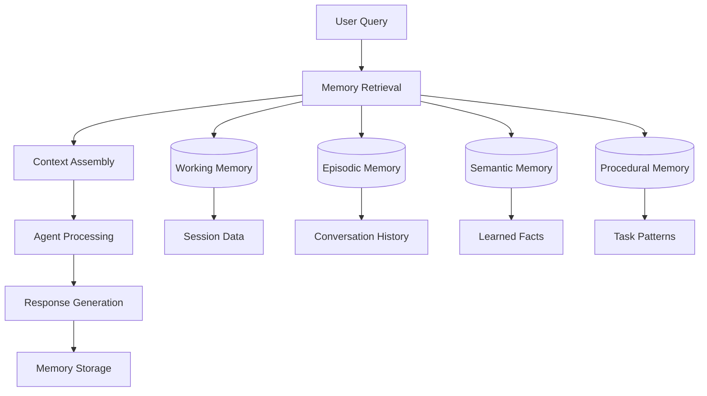

# 🧪 Exercise: Memory & Context Management

<InstructorNotes 
  timing="Memory & Context Exercise (30-40 minutes)"
  notes={[
    "This builds on the RAG agent - ensure attendees completed Exercise 30 first",
    "Focus on different memory types and when to use each",
    "Show how memory improves agent responses over time",
    "Demonstrate the difference between stateless and stateful agents",
    "Address privacy concerns around storing conversation data",
    "Show MongoDB TTL indexes for automatic cleanup"
  ]}
  tips={[
    "Start with working memory (easiest to understand)",
    "Use concrete examples: 'Remember my name is John'",
    "Show the MongoDB collections filling up with memory data",
    "Demonstrate memory retrieval in action during conversations",
    "Explain when to clear vs persist different memory types"
  ]}
/>

## 🧪 Objective

Enhance your PDF RAG agent with sophisticated memory capabilities, enabling it to remember conversations, learn from interactions, and maintain context across multiple queries.

<LiveStatusBadge />

## 🛠️ Setup

### Prerequisites
1. **Complete Exercise 30** - Your PDF RAG agent should be working
2. **MongoDB Collections** - Ensure you have write access to create new collections
3. **Session Management** - We'll add user session tracking to your workflows

### Memory Architecture Overview


## 🧠 Key Concepts

### Memory Types in AI Agents

| Memory Type | Purpose | Duration | Example |
|-------------|---------|----------|---------|
| **Working Memory** | Current session context | Session only | "User's name is Sarah, working on Q3 report" |
| **Episodic Memory** | Conversation history | Days/weeks | "Last week asked about revenue trends" |
| **Semantic Memory** | Learned knowledge | Permanent | "Company fiscal year ends in March" |
| **Procedural Memory** | Task patterns | Permanent | "When user asks for summary, include key metrics" |

### Memory Storage Strategy
- **MongoDB Collections** - Separate collections for each memory type
- **TTL Indexes** - Automatic cleanup for temporary memories
- **Vector Embeddings** - Enable semantic memory search
- **Session Tracking** - Link memories to user sessions

## ✅ Success Criteria

Your memory-enhanced agent should:

### Core Memory Functions
- [ ] **Session Persistence** - Remember context within a conversation
- [ ] **Cross-Session Learning** - Recall information from previous sessions
- [ ] **Context Assembly** - Combine relevant memories for better responses
- [ ] **Memory Updates** - Learn new facts and preferences from interactions
- [ ] **Selective Recall** - Retrieve only relevant memories for each query

### Quality Indicators
- [ ] **Consistency** - Maintains consistent information across conversations
- [ ] **Personalization** - Adapts responses based on user history
- [ ] **Efficiency** - Fast memory retrieval doesn't slow responses
- [ ] **Privacy** - Respects data retention and cleanup policies

## 🏗️ Implementation Steps

### Phase 1: Working Memory (Session Context)

<WorkshopExercise 
  title="Implement Session-Based Working Memory" 
  difficulty="intermediate"
  timeEstimate="15 minutes"
  objectives={[
    "Track user sessions across multiple queries",
    "Store and retrieve session context",
    "Handle session expiration automatically"
  ]}
>

**Build session management:**

1. **Session Initialization**
   ```javascript
   // Function node: Generate or retrieve session ID
   const sessionId = $input.first().json.session_id || 
                    `session_${Date.now()}_${Math.random().toString(36).substr(2, 9)}`;
   
   return {
     session_id: sessionId,
     timestamp: new Date(),
     user_query: $input.first().json.query,
     context: {}
   };
   ```

2. **Working Memory Storage**
   ```javascript
   // MongoDB node: Store session context
   {
     "operation": "findOneAndUpdate",
     "collection": "working_memory",
     "filter": {
       "session_id": "{{$json.session_id}}"
     },
     "update": {
       "$set": {
         "session_id": "{{$json.session_id}}",
         "last_activity": "{{$now}}",
         "context": "{{$json.context}}",
         "query_count": {"$inc": 1}
       }
     },
     "options": {
       "upsert": true,
       "returnDocument": "after"
     }
   }
   ```

3. **TTL Index Setup** (MongoDB Atlas):
   ```javascript
   // Create TTL index for automatic cleanup
   db.working_memory.createIndex(
     { "last_activity": 1 }, 
     { expireAfterSeconds: 3600 } // 1 hour session timeout
   );
   ```

4. **Context Retrieval**
   ```javascript
   // Function node: Load session context
   const session = await $input.first().json;
   
   // Combine current query with session context
   const enrichedContext = {
     current_query: session.user_query,
     session_history: session.context.previous_queries || [],
     user_preferences: session.context.preferences || {},
     document_context: session.context.current_document || null
   };
   
   return { enriched_context: enrichedContext };
   ```

</WorkshopExercise>

### Phase 2: Episodic Memory (Conversation History)

<WorkshopExercise 
  title="Build Conversational Memory" 
  difficulty="intermediate"
  timeEstimate="15 minutes"
  objectives={[
    "Store conversation turns with context",
    "Retrieve relevant conversation history",
    "Enable multi-turn dialogue understanding"
  ]}
>

**Create conversation tracking:**

1. **Conversation Storage Schema**
   ```javascript
   // MongoDB document structure
   {
     "conversation_id": "conv_12345",
     "session_id": "session_67890", 
     "user_id": "user_abc", // Optional for personalization
     "turns": [
       {
         "turn_number": 1,
         "timestamp": "2024-01-20T10:30:00Z",
         "user_query": "What are the main findings in the Q3 report?",
         "agent_response": "The Q3 report shows...",
         "context_used": ["page_5", "page_12"],
         "confidence": 0.89
       }
     ],
     "topics": ["financial_report", "q3_analysis"],
     "document_references": ["q3_report.pdf"],
     "created_at": "2024-01-20T10:30:00Z",
     "updated_at": "2024-01-20T10:45:00Z"
   }
   ```

2. **Conversation Update Node**
   ```javascript
   // Function node: Add conversation turn
   const currentTurn = {
     turn_number: ($json.conversation?.turns?.length || 0) + 1,
     timestamp: new Date(),
     user_query: $json.user_query,
     agent_response: $json.agent_response,
     context_used: $json.context_pages || [],
     confidence: $json.confidence_score || 0.8
   };
   
   return {
     conversation_id: $json.conversation_id,
     new_turn: currentTurn,
     topics: extractTopics($json.user_query), // Extract key topics
     document_refs: $json.document_references || []
   };
   ```

3. **History Retrieval with Relevance**
   ```javascript
   // MongoDB aggregation: Find relevant conversation history
   [
     {
       "$match": {
         "session_id": "{{$json.session_id}}",
         "topics": {"$in": ["{{$json.current_topics}}"]}
       }
     },
     {
       "$unwind": "$turns"
     },
     {
       "$match": {
         "turns.timestamp": {
           "$gte": "{{$json.time_window_start}}"
         }
       }
     },
     {
       "$sort": {"turns.timestamp": -1}
     },
     {
       "$limit": 5
     },
     {
       "$project": {
         "query": "$turns.user_query",
         "response": "$turns.agent_response", 
         "timestamp": "$turns.timestamp",
         "relevance_score": 1
       }
     }
   ]
   ```

</WorkshopExercise>

### Phase 3: Semantic Memory (Learned Knowledge)

<WorkshopExercise 
  title="Implement Knowledge Learning" 
  difficulty="advanced"
  timeEstimate="20 minutes"
  objectives={[
    "Extract and store factual information from conversations",
    "Build a knowledge base from user interactions",
    "Enable semantic search across learned facts"
  ]}
>

**Build knowledge extraction:**

1. **Fact Extraction with Gemini**
   ```javascript
   // HTTP Request: Extract facts from conversation
   {
     "method": "POST",
     "url": "https://workshop-embedding-api.vercel.app/api/chat",
     "body": {
       "model": "gemini-2.0-flash-exp",
       "messages": [
         {
           "role": "system",
           "content": "Extract factual information and user preferences from this conversation. Return as structured JSON."
         },
         {
           "role": "user",
           "content": "Conversation: {{$json.conversation_text}}"
         }
       ],
       "tools": [
         {
           "function": {
             "name": "store_fact",
             "description": "Store a learned fact or preference",
             "parameters": {
               "type": "object",
               "properties": {
                 "fact_type": {"type": "string", "enum": ["user_preference", "domain_knowledge", "process_info"]},
                 "subject": {"type": "string"},
                 "predicate": {"type": "string"},
                 "object": {"type": "string"},
                 "confidence": {"type": "number"},
                 "source": {"type": "string"}
               }
             }
           }
         }
       ]
     }
   }
   ```

2. **Semantic Memory Storage**
   ```javascript
   // MongoDB node: Store extracted facts
   {
     "operation": "insertMany",
     "collection": "semantic_memory",
     "documents": [
       {
         "fact_id": "{{$json.fact_id}}",
         "type": "{{$json.fact_type}}",
         "subject": "{{$json.subject}}",
         "predicate": "{{$json.predicate}}", 
         "object": "{{$json.object}}",
         "confidence": "{{$json.confidence}}",
         "source_conversation": "{{$json.conversation_id}}",
         "embedding": "{{$json.fact_embedding}}", // For semantic search
         "created_at": "{{$now}}",
         "verified": false,
         "usage_count": 0
       }
     ]
   }
   ```

3. **Knowledge Retrieval Pipeline**
   ```javascript
   // Function node: Query semantic memory
   const queryEmbedding = await generateEmbedding($json.user_query);
   
   // Vector search for relevant facts
   const relevantFacts = await mongodbVectorSearch({
     collection: "semantic_memory",
     index: "semantic_vector_index",
     queryVector: queryEmbedding,
     filter: {
       confidence: {$gte: 0.7},
       verified: true
     },
     limit: 10
   });
   
   return {
     relevant_knowledge: relevantFacts,
     knowledge_context: relevantFacts.map(f => 
       `${f.subject} ${f.predicate} ${f.object}`
     ).join('. ')
   };
   ```

</WorkshopExercise>

### Phase 4: Procedural Memory (Task Patterns)

<WorkshopExercise 
  title="Learn User Task Patterns" 
  difficulty="advanced"
  timeEstimate="15 minutes"
  objectives={[
    "Identify recurring user task patterns",
    "Optimize workflows based on usage patterns",
    "Provide proactive suggestions"
  ]}
>

**Implement pattern learning:**

1. **Task Pattern Recognition**
   ```javascript
   // Function node: Analyze user behavior patterns
   const userSessions = $input.all();
   const patterns = {};
   
   userSessions.forEach(session => {
     const queryTypes = session.queries.map(q => classifyQuery(q));
     const sequence = queryTypes.join(' -> ');
     
     patterns[sequence] = (patterns[sequence] || 0) + 1;
   });
   
   // Find common patterns
   const commonPatterns = Object.entries(patterns)
     .filter(([_, count]) => count >= 3)
     .sort(([_, a], [__, b]) => b - a)
     .slice(0, 10);
   
   return { 
     task_patterns: commonPatterns,
     recommendations: generateRecommendations(commonPatterns)
   };
   ```

2. **Pattern-Based Suggestions**
   ```javascript
   // HTTP Request: Generate proactive suggestions
   {
     "method": "POST",
     "url": "https://workshop-embedding-api.vercel.app/api/chat",
     "body": {
       "model": "gemini-2.0-flash-exp",
       "messages": [
         {
           "role": "system",
           "content": "Based on user patterns, suggest helpful follow-up questions or actions."
         },
         {
           "role": "user",
           "content": "User query: {{$json.current_query}}\nCommon patterns: {{$json.user_patterns}}\nCurrent context: {{$json.context}}"
         }
       ]
     }
   }
   ```

</WorkshopExercise>

## 🧩 Advanced Memory Features

### Memory Consolidation
- **Batch Processing** - Periodically consolidate short-term to long-term memory
- **Conflict Resolution** - Handle contradictory information gracefully
- **Memory Pruning** - Remove outdated or irrelevant memories

### Privacy & Compliance
- **Data Retention Policies** - Automatic cleanup based on regulations
- **User Consent** - Allow users to control memory collection
- **Anonymization** - Remove personally identifiable information

### Performance Optimization
- **Memory Indexing** - Optimize retrieval with proper database indexes
- **Caching Strategy** - Cache frequently accessed memories
- **Batch Operations** - Minimize database round trips

## 🔧 Testing Your Memory System

### Memory Persistence Tests
1. **Session Continuity** - Ask follow-up questions in same session
2. **Cross-Session Recall** - Return later and reference previous conversations  
3. **Learning Verification** - Confirm agent learned new information
4. **Context Assembly** - Check if multiple memory types combine properly

### Example Test Conversation
```
User: "Hi, I'm Sarah and I work in finance."
Agent: "Hello Sarah! Nice to meet you. I'll remember that you work in finance."

User: "Can you analyze the Q3 revenue report?"
Agent: "I'll analyze the Q3 revenue report for you, Sarah. Since you work in finance, I'll focus on the key financial metrics that would be most relevant to your role."

[Later session]
User: "Remember me?"
Agent: "Of course! You're Sarah from finance. Last time we discussed the Q3 revenue report. How can I help you today?"
```

## 📋 Memory Quality Checklist

- [ ] **Working Memory** - Maintains context during session
- [ ] **Episodic Memory** - Recalls previous conversations  
- [ ] **Semantic Memory** - Learns and applies new facts
- [ ] **Procedural Memory** - Adapts to user patterns
- [ ] **Memory Integration** - Combines different memory types effectively
- [ ] **Privacy Compliance** - Respects data retention policies
- [ ] **Performance** - Memory operations don't slow responses

## 🎯 Key Takeaways

This exercise demonstrates:

1. **Memory Architecture** - Different types serve different purposes
2. **Context Assembly** - Combining memories improves response quality
3. **Learning Systems** - Agents can improve through interaction
4. **Privacy Balance** - Useful memory vs data protection considerations

## 📚 Next Steps

Ready for advanced tool integration?

- [**Exercise: Advanced Tool Calling →**](./exercise-advanced-tools)
- **Production Memory Systems** - Coming soon!
- **Privacy & Compliance** - Coming soon!

You've built an agent that learns and remembers - the foundation of truly intelligent systems! 🧠