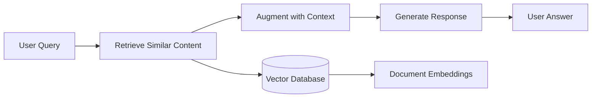

# 🧪 Exercise: Build a PDF RAG Agent

<InstructorNotes 
  timing="PDF RAG Agent Exercise (45-60 minutes)"
  notes={[
    "This is the core hands-on exercise - most time should be spent here",
    "Walk through each step slowly, showing the visual workflow",
    "Have attendees test with their own PDFs if possible",
    "Address common issues: file upload errors, embedding failures",
    "Show debugging techniques in n8n when things go wrong",
    "Emphasize the RAG pattern: Retrieve → Augment → Generate"
  ]}
  tips={[
    "Start with a simple PDF (2-3 pages) for faster testing",
    "Show the MongoDB collection filling up with embeddings",
    "Demonstrate different query types: factual, analytical, summarization",
    "Use the live status badges to verify all services are working",
    "Have backup PDFs ready in case upload issues occur"
  ]}
/>

## 🧪 Objective

Build a multimodal RAG (Retrieval-Augmented Generation) agent that answers questions about uploaded PDF documents using visual and textual understanding.

<LiveStatusBadge />

## 🛠️ Setup

### Step 1: Environment Check
1. **Open your Codespace** - Ensure all services are running
2. **Verify n8n access** - Navigate to your n8n instance (port 5678)
3. **Check MongoDB connection** - Confirm Atlas connection is active
4. **Test API gateway** - Verify the workshop proxy is responding

### Step 2: Import Base Workflow
```javascript
// Download the starter workflow
{
  "name": "PDF RAG Agent Starter",
  "nodes": [
    {
      "name": "Webhook",
      "type": "n8n-nodes-base.webhook",
      "parameters": {
        "path": "pdf-rag",
        "httpMethod": "POST"
      }
    },
    // Additional starter nodes...
  ]
}
```

## 🧠 Key Concepts

Before building, understand these foundational concepts:

### RAG Architecture Pattern


**You'll implement:**
- **Voyage AI** to create image + text embeddings from PDF pages
- **MongoDB Atlas Vector Search** for intelligent document retrieval  
- **Google Gemini 2.0** with function calling to generate contextual answers
- **n8n workflows** to orchestrate the entire agent pipeline

### Multimodal Understanding
Your agent will process both:
- **Text content** - Extracted paragraphs, headings, captions
- **Visual elements** - Charts, diagrams, images, document layout
- **Unified embeddings** - Single vector space for text + images

## ✅ Success Criteria

Your completed agent should demonstrate:

### Core Functionality
- [ ] **PDF Upload** - Accept PDF files through webhook interface  
- [ ] **Page Processing** - Extract both text and images from each page
- [ ] **Embedding Generation** - Create multimodal embeddings using Voyage AI
- [ ] **Vector Storage** - Store embeddings in MongoDB Atlas with metadata
- [ ] **Question Answering** - Respond to user queries with relevant context
- [ ] **Source Attribution** - Reference specific pages/sections in responses

### Quality Indicators
- [ ] **Accuracy** - Answers reflect actual document content
- [ ] **Relevance** - Responses focus on most relevant document sections
- [ ] **Context** - Includes page numbers and section references
- [ ] **Multimodal** - Incorporates both text and visual information

## 🏗️ Implementation Steps

### Phase 1: PDF Processing Pipeline

<WorkshopExercise 
  title="Build PDF Processing Workflow" 
  difficulty="intermediate"
  timeEstimate="20 minutes"
  objectives={[
    "Extract text and images from PDF pages",
    "Prepare content for embedding generation",
    "Handle various PDF formats and structures"
  ]}
>

**Create the processing chain:**

1. **HTTP Request Receiver**
   ```javascript
   // Webhook configuration
   {
     "path": "pdf-upload",
     "httpMethod": "POST",
     "responseMode": "responseNode"
   }
   ```

2. **PDF Text Extraction**
   ```javascript
   // Function node: Extract text content
   const pdfParse = require('pdf-parse');
   
   const pdfBuffer = Buffer.from($input.first().binary.data, 'base64');
   const pdfData = await pdfParse(pdfBuffer);
   
   return {
     text: pdfData.text,
     numPages: pdfData.numpages,
     info: pdfData.info
   };
   ```

3. **Image Extraction Node**
   ```javascript
   // Extract images from PDF pages
   const pdf2pic = require('pdf2pic');
   
   const convert = pdf2pic.fromBuffer(pdfBuffer, {
     density: 150,
     saveFilename: "page",
     savePath: "/tmp/",
     format: "png",
     width: 1024,
     height: 1024
   });
   
   const pages = await convert.bulk(-1);
   return pages.map(page => ({
     pageNumber: page.page,
     imagePath: page.path,
     imageBase64: fs.readFileSync(page.path, 'base64')
   }));
   ```

</WorkshopExercise>

### Phase 2: Embedding Generation

<WorkshopExercise 
  title="Generate Multimodal Embeddings" 
  difficulty="intermediate"
  timeEstimate="15 minutes"
  objectives={[
    "Use Voyage AI for unified text+image embeddings",
    "Handle batch processing efficiently",
    "Prepare vectors for storage"
  ]}
>

**Configure Voyage AI integration:**

1. **Multimodal Embedding Node**
   ```javascript
   // HTTP Request to workshop gateway
   {
     "method": "POST",
     "url": "https://workshop-embedding-api.vercel.app/api/embed",
     "body": {
       "input": {
         "text": "{{$json.text}}",
         "image": "{{$json.imageBase64}}"
       },
       "model": "voyage-multimodal-3",
       "input_type": "document"
     }
   }
   ```

2. **Batch Processing Logic**
   ```javascript
   // Function node: Prepare batches
   const batchSize = 5; // Process 5 pages at a time
   const pages = $input.all();
   const batches = [];
   
   for (let i = 0; i < pages.length; i += batchSize) {
     batches.push(pages.slice(i, i + batchSize));
   }
   
   return batches.map(batch => ({ batch }));
   ```

</WorkshopExercise>

### Phase 3: Vector Storage

<WorkshopExercise 
  title="Store in MongoDB Atlas" 
  difficulty="beginner"
  timeEstimate="10 minutes"
  objectives={[
    "Configure MongoDB Atlas connection",
    "Design document schema for retrieval",
    "Create vector search index"
  ]}
>

**Setup vector storage:**

1. **MongoDB Insert Node**
   ```javascript
   // MongoDB node configuration
   {
     "operation": "insertMany",
     "collection": "pdf_embeddings",
     "documents": [
       {
         "document_id": "{{$json.docId}}",
         "page_number": "{{$json.pageNum}}",
         "text_content": "{{$json.text}}",
         "embedding": "{{$json.embedding}}",
         "metadata": {
           "created_at": "{{$now}}",
           "file_name": "{{$json.fileName}}",
           "page_type": "{{$json.pageType}}"
         }
       }
     ]
   }
   ```

2. **Vector Search Index** (Atlas UI):
   ```json
   {
     "type": "vectorSearch",
     "fields": [
       {
         "type": "vector",
         "path": "embedding",
         "numDimensions": 1024,
         "similarity": "cosine"
       },
       {
         "type": "filter",
         "path": "document_id"
       }
     ]
   }
   ```

</WorkshopExercise>

### Phase 4: Query Processing & Response

<WorkshopExercise 
  title="Implement Question Answering" 
  difficulty="advanced"
  timeEstimate="20 minutes"
  objectives={[
    "Build vector similarity search",
    "Configure Gemini with function calling",
    "Generate contextual responses"
  ]}
>

**Create the QA pipeline:**

1. **Query Vector Search**
   ```javascript
   // MongoDB Vector Search Aggregation
   [
     {
       "$vectorSearch": {
         "index": "pdf_vector_index",
         "path": "embedding", 
         "queryVector": "{{$json.queryEmbedding}}",
         "numCandidates": 50,
         "limit": 5
       }
     },
     {
       "$project": {
         "text_content": 1,
         "page_number": 1,
         "metadata": 1,
         "score": { "$meta": "vectorSearchScore" }
       }
     }
   ]
   ```

2. **Gemini Function Calling**
   ```javascript
   // HTTP Request to Gemini via gateway
   {
     "method": "POST",
     "url": "https://workshop-embedding-api.vercel.app/api/chat",
     "body": {
       "model": "gemini-2.0-flash-exp",
       "messages": [
         {
           "role": "system",
           "content": "You are a helpful AI assistant that answers questions about documents. Use the provided context to give accurate, detailed responses."
         },
         {
           "role": "user", 
           "content": "Context: {{$json.context}}\n\nQuestion: {{$json.question}}"
         }
       ],
       "tools": [
         {
           "function": {
             "name": "search_document",
             "description": "Search for additional information in the document",
             "parameters": {
               "type": "object",
               "properties": {
                 "query": {"type": "string"},
                 "page_filter": {"type": "array"}
               }
             }
           }
         }
       ]
     }
   }
   ```

</WorkshopExercise>

## 🧩 Extensions & Improvements

Once your basic RAG agent works, try these enhancements:

### Memory & Context
- **Conversation History** - Remember previous questions in the session
- **Document Memory** - Learn from user interactions to improve responses
- **Multi-turn Dialogue** - Handle follow-up questions naturally

### Advanced Features  
- **Source Highlighting** - Show exact text/image sections referenced
- **Confidence Scoring** - Indicate how certain the AI is about answers
- **Multilingual Support** - Process documents in different languages
- **Batch Queries** - Handle multiple questions efficiently

### Production Enhancements
- **Error Recovery** - Graceful handling of processing failures
- **Progress Tracking** - Show upload and processing status
- **Rate Limiting** - Manage concurrent document processing
- **Caching** - Store frequently accessed embeddings

## 🔧 Troubleshooting

### Common Issues & Solutions

| Problem | Symptoms | Solution |
|---------|----------|----------|
| **PDF Upload Fails** | Webhook times out | Check file size limits, try smaller PDF |
| **Embedding Errors** | 429/500 from Voyage API | Verify API gateway status, check rate limits |
| **Vector Search Empty** | No results returned | Confirm index exists, check embedding dimensions |
| **Gemini Timeouts** | Response generation fails | Reduce context length, simplify query |

### Debug Workflow
1. **Check Service Status** - Use the live status badges
2. **Inspect Node Outputs** - Click nodes to see data flow
3. **Test Components** - Isolate each step individually  
4. **Monitor Logs** - Check n8n execution logs for errors

## 📋 Testing Checklist

Before moving to the next exercise, verify:

- [ ] **File Upload** - Can successfully upload various PDF types
- [ ] **Text Extraction** - Extracts readable text from PDF pages
- [ ] **Image Processing** - Converts PDF pages to images properly
- [ ] **Embedding Generation** - Creates 1024-dimensional vectors
- [ ] **Vector Storage** - Documents appear in MongoDB collection
- [ ] **Search Functionality** - Finds relevant content for queries
- [ ] **Answer Quality** - Responses are accurate and well-sourced
- [ ] **Error Handling** - Gracefully handles invalid inputs

## 🎯 Key Takeaways

This exercise demonstrates:

1. **RAG Architecture** - How retrieval enhances generation quality
2. **Multimodal Processing** - Unified handling of text and images  
3. **Vector Databases** - Efficient similarity search at scale
4. **Agent Orchestration** - Complex workflows made visual and manageable

## 📚 Next Steps

Ready for more advanced patterns?

- [**Exercise: Memory & Context Patterns →**](./exercise-memory-context)
- [**Exercise: Advanced Tool Calling →**](./exercise-advanced-tools)
- **Production Deployment** - Coming soon!

You've built a sophisticated AI agent that can understand and answer questions about any PDF document. This foundation scales to handle enterprise document processing, research assistance, and knowledge management systems! 🚀