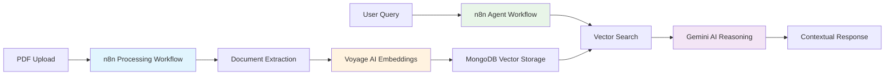

# 🎨 Path A: Visual No-Code Development

**Build multimodal PDF agents using n8n's powerful visual workflow platform**

Welcome to the no-code path! You're about to learn how to build sophisticated AI agents without writing a single line of traditional code. Instead, you'll create beautiful, visual workflows that are easy to understand, modify, and deploy.

---

## 🎯 What You'll Achieve

By the end of this path, you'll have built:

### 🤖 **Production-Ready AI Agent**
- Processes PDFs with text and visual content
- Answers natural language questions intelligently  
- Remembers conversation context and learns
- Deployed with webhook APIs for integration

### 🔧 **Technical Mastery**
- Visual workflow design patterns
- No-code AI integration techniques
- Production deployment strategies
- Advanced error handling and monitoring

### 📈 **Real-World Skills**
- Rapid prototyping with visual tools
- Enterprise workflow automation
- API-first development approach
- Collaborative development practices

---

## 🗺️ Your Learning Journey

### **Phase 1: Foundation Setup** *(30 minutes)*
- [Environment Setup](./github-codespaces) - GitHub Codespaces quickstart
- [n8n First Run](./n8n-first-run) - Your first workflow
- [Prerequisites](./prerequisites) - API keys and accounts
- [MongoDB Atlas Setup](./mongodb-atlas-setup) - Database configuration

### **Phase 2: Core Development** *(90 minutes)*
- [PDF Processing Workflow](./pdf-processing-workflow) - Document ingestion pipeline
- [Vector Search Workflow](./vector-search-workflow) - Semantic search engine  
- [AI Agent Workflow](./ai-agent-workflow) - Intelligent reasoning and responses

### **Phase 3: Advanced Features** *(60 minutes)*
- [Agent Patterns](./agent-patterns) - Advanced workflow patterns
- [Memory & Context](./memory-context-patterns) - Conversation memory systems
- [Multimodal Queries](./multimodal-image-queries) - Image understanding capabilities

### **Phase 4: Production & Beyond** *(30 minutes)*
- [Complete Integration](./complete-multimodal-agent) - Full system assembly
- [Production Security](./production-security) - Security best practices
- [Monitoring & Optimization](./monitoring-observability) - Performance tuning

---

## 🚀 Quick Start Checklist

Ready to dive in? Here's your launch sequence:

### ✅ **Pre-Flight Check**
- [ ] GitHub account with Codespaces access
- [ ] MongoDB Atlas account (free tier)
- [ ] Voyage AI API key
- [ ] Google AI Studio API key
- [ ] 2-3 hours of focused time

### 🛠️ **Setup Sequence**
1. **[Launch Your Environment](./github-codespaces)** - One-click development setup
2. **[Start n8n](./n8n-first-run)** - Access your visual workflow editor
3. **[Configure APIs](./prerequisites)** - Connect your AI services
4. **[Test Connection](./mongodb-atlas-setup)** - Verify database connectivity

### 🎯 **Build Sequence**
1. **[Process Documents](./pdf-processing-workflow)** - Your first AI workflow
2. **[Enable Search](./vector-search-workflow)** - Semantic document retrieval
3. **[Add Intelligence](./ai-agent-workflow)** - Conversational AI capabilities
4. **[Enhance & Deploy](./complete-multimodal-agent)** - Production-ready system

---

## 🎨 Why Choose the Visual Path?

### **🔍 Immediate Understanding**
See your entire AI pipeline at a glance. Every component, connection, and data flow is visually represented, making complex AI systems comprehensible.

### **⚡ Rapid Development**
Drag-and-drop components instead of writing boilerplate code. Focus on logic and integration rather than syntax and setup.

### **🛠️ Production-Ready**
Built-in error handling, monitoring, and deployment capabilities. Your workflows are ready for real-world use from day one.

### **🤝 Team Collaboration**
Visual workflows are self-documenting and easy to share. Non-developers can understand and contribute to the development process.

### **🔧 Easy Maintenance**
Modify workflows by updating visual components. No need to dig through code files or worry about breaking dependencies.

---

## 🧠 Learning Philosophy

### **Learn by Building**
Each tutorial builds upon the previous one, creating a complete system step by step. You'll understand not just the "how" but the "why" behind each decision.

### **Visual First, Code Second**
While you won't write traditional code, you'll learn powerful programming concepts through visual workflows. These patterns transfer to any development environment.

### **Production Mindset**
Every workflow includes real-world considerations: error handling, monitoring, security, and scalability. You're building production systems, not just prototypes.

---

## 🔧 Technical Architecture Preview

Here's what your final system will look like:

### **Key Components You'll Build:**

🔄 **Document Processing Pipeline**
- PDF upload and parsing workflows
- Image extraction and analysis
- Intelligent embedding generation
- MongoDB storage with vector indexing

🧠 **AI Agent System**
- Natural language query processing
- Function calling and tool selection
- Vector search integration
- Response generation and formatting

💾 **Memory & Context Management**
- Conversation history storage
- Context-aware responses
- Learning from interactions
- Session management

🚀 **Production Features**
- API endpoints and webhooks
- Error handling and recovery
- Performance monitoring
- Security and authentication

---

## 💡 Success Tips

### **🎯 Start Simple, Build Complexity**
Begin with basic workflows and gradually add sophisticated features. Each step builds upon the previous one.

### **🔍 Use Visual Debugging**
n8n's visual debugger lets you see data flowing through your workflows in real-time. Use this superpower to understand and troubleshoot your systems.

### **📚 Reference the Docs**
Each tutorial includes detailed explanations and links to relevant documentation. Don't skip the "why" - it'll help you build better systems.

### **🧪 Experiment Freely**
Visual workflows are easy to modify and test. Try different approaches and see what works best for your use case.

### **🤝 Ask Questions**
Use the workshop discussion channels to ask questions and share insights with other participants.

---

## 🎪 Ready to Start Building?

**Your AI adventure begins now!**

### **🚀 Next Step: Environment Setup**

Click below to launch your development environment and start building your first multimodal AI agent:

  <a 
    href="github-codespaces"
    style={{
      display: 'inline-block',
      padding: '1rem 2rem',
      background: 'linear-gradient(135deg, #00684A 0%, #26a69a 100%)',
      color: 'white',
      textDecoration: 'none',
      borderRadius: '8px',
      fontWeight: 'bold',
      fontSize: '1.2rem',
      boxShadow: '0 4px 8px rgba(0, 0, 0, 0.2)'
    }}
  >
    🚀 Start Building with n8n →
  </a>

**Estimated completion time**: 2-3 hours  
**Difficulty level**: Beginner to Intermediate  
**Prerequisites**: Basic API understanding  

---

## 📚 Path Resources

### 🔗 **Quick Navigation**
- [Workshop Slides](/slides) - Presentation materials
- [Pre-built Workflows](/workflows) - Ready-to-import n8n flows
- [Troubleshooting Guide](./troubleshooting-guide) - Common issues and solutions

### 📖 **External Resources**
- [n8n Documentation](https://docs.n8n.io/) - Complete n8n reference
- [MongoDB Vector Search Guide](https://www.mongodb.com/docs/atlas/atlas-vector-search/) - Database setup
- [Voyage AI Models](https://docs.voyageai.com/docs/embeddings) - Embedding options

### 🎯 **Learning Outcomes**
By completing this path, you'll be able to:
- Design and deploy visual AI workflows
- Integrate multiple AI services seamlessly  
- Build production-ready agent systems
- Understand no-code development patterns
- Create collaborative development processes

**Let's build something amazing together!** 🎨✨