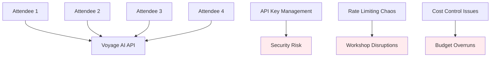
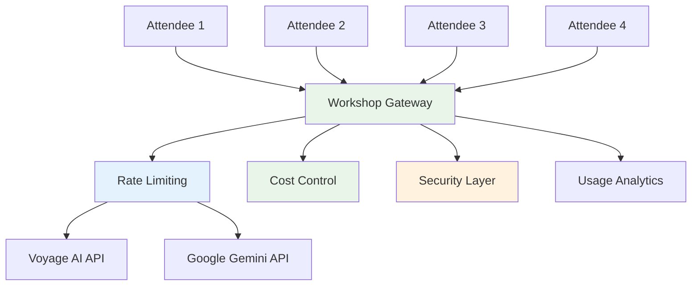
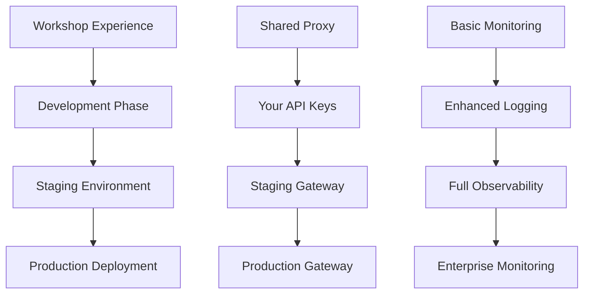

# 🌐 API Gateway Architecture: The Workshop Proxy System

The workshop API gateway serves as both an educational tool and practical infrastructure. Let's explore why it exists, how it works, and how it compares to production systems.

<InstructorNotes 
  timing="API Gateway Architecture (15-20 minutes)"
  notes={[
    "This demystifies the 'black box' proxy for attendees",
    "Many developers want to understand what's happening behind the scenes",
    "Address security concerns about data privacy early",
    "Explain the educational value of controlled failure scenarios",
    "Show the GitHub source code to build trust and transparency"
  ]}
  tips={[
    "Start with why the proxy exists before explaining how it works",
    "Use the live API endpoints to demonstrate concepts",
    "Show both successful calls and simulated failures",
    "Explain rate limiting with concrete examples",
    "Address the workshop vs production architecture differences clearly"
  ]}
/>

<LiveStatusBadge />

## 🎯 Why Does the Workshop Use a Proxy?

Before diving into the technical details, let's understand the educational and practical reasons for the API gateway approach:

### The Problem Without a Proxy



**Common Workshop Problems:**
- 🔑 **API Key Distribution** - Sharing keys in chat/email (security risk)
- 💰 **Cost Explosions** - Uncontrolled usage across many attendees
- 🚫 **Rate Limit Chaos** - Some attendees get blocked while others work fine
- 🐛 **Configuration Issues** - Time spent on setup vs learning concepts
- 📊 **No Usage Analytics** - Can't optimize workshop experience

### The Solution: Workshop API Gateway



**Workshop Benefits:**
- ✅ **Zero Setup** - No API keys needed
- ✅ **Fair Resource Sharing** - Intelligent rate limiting across all attendees
- ✅ **Cost Predictability** - Workshop organizer controls spending
- ✅ **Educational Features** - Simulated failures, monitoring, analytics
- ✅ **Focus on Learning** - Time spent on concepts, not configuration

## 🏗️ Gateway Architecture Deep Dive

### Core Components

<StatusDot system="Workshop Gateway" endpoint="https://workshop-embedding-api.vercel.app/api/health" />

```javascript
// Simplified gateway architecture
const gatewayComponents = {
  proxy_layer: {
    purpose: "Route requests to appropriate AI services",
    technology: "Node.js + Express",
    deployment: "Vercel serverless functions"
  },
  
  rate_limiting: {
    purpose: "Fair usage across workshop attendees", 
    strategy: "Token bucket with attendee identification",
    limits: "100 requests/hour per IP, 1000/hour total"
  },
  
  authentication: {
    purpose: "Secure access without exposing real API keys",
    approach: "IP-based + referrer checking",
    production_difference: "Would use JWT tokens or API keys"
  },
  
  monitoring: {
    purpose: "Track usage and optimize workshop experience",
    metrics: ["request_count", "response_time", "error_rate", "cost_per_attendee"],
    alerts: "Slack notifications for rate limit breaches"
  }
};
```

### Request Flow Analysis

<WorkshopExercise 
  title="Trace an API Request Through the Gateway" 
  difficulty="intermediate"
  timeEstimate="15 minutes"
  objectives={[
    "Understand each step in request processing",
    "See how rate limiting and security work",
    "Compare workshop vs production approaches"
  ]}
>

<ExerciseStep stepNumber="1" title="Initial Request Processing">

**n8n HTTP Request → Workshop Gateway:**

```javascript
// What your n8n sends
POST https://workshop-embedding-api.vercel.app/api/embed
Content-Type: application/json

{
  "text": "Analyze this financial document for key insights",
  "model": "voyage-3"
}
```

**Gateway Processing:**
```javascript
// Simplified gateway logic
async function handleEmbeddingRequest(req, res) {
  // 1. Security check
  const security = await validateRequest(req);
  if (!security.valid) {
    return res.status(403).json({error: "Access denied"});
  }
  
  // 2. Rate limiting
  const rateLimit = await checkRateLimit(req.ip);
  if (rateLimit.exceeded) {
    return res.status(429).json({
      error: "Rate limit exceeded",
      retry_after: rateLimit.reset_time
    });
  }
  
  // 3. Request transformation
  const voyageRequest = transformToVoyageFormat(req.body);
  
  // 4. Forward to Voyage AI
  const response = await callVoyageAPI(voyageRequest);
  
  // 5. Response transformation and analytics
  await logUsage(req, response);
  return res.json(transformResponse(response));
}
```

</ExerciseStep>

<ExerciseStep stepNumber="2" title="Rate Limiting Logic">

**Token Bucket Implementation:**
```javascript
// Rate limiting strategy
const rateLimiter = {
  global_bucket: {
    capacity: 1000,      // Total requests per hour
    refill_rate: 16.67,  // Tokens per minute (1000/60)
    current_tokens: 950
  },
  
  per_ip_buckets: {
    "192.168.1.1": {
      capacity: 100,     // Per attendee limit
      refill_rate: 1.67, // 100/60 minutes
      current_tokens: 45
    }
  },
  
  checkLimit: async (ip) => {
    const global = checkGlobalBucket();
    const individual = checkIPBucket(ip);
    
    return {
      allowed: global.allowed && individual.allowed,
      global_remaining: global.tokens,
      individual_remaining: individual.tokens,
      reset_time: Math.max(global.reset, individual.reset)
    };
  }
};
```

**What happens when limits are hit:**
```javascript
// Rate limit response
{
  "error": "Rate limit exceeded",
  "message": "Too many requests. Please wait before trying again.",
  "retry_after": 1800, // seconds until reset
  "limits": {
    "individual_limit": 100,
    "individual_remaining": 0,
    "global_limit": 1000,
    "global_remaining": 234
  },
  "workshop_info": "This helps ensure fair access for all attendees"
}
```

</ExerciseStep>

<ExerciseStep stepNumber="3" title="Cost Control & Analytics">

**Usage Tracking:**
```javascript
// Analytics and cost tracking
const usageAnalytics = {
  track_request: async (req, response) => {
    const usage = {
      timestamp: new Date(),
      endpoint: req.path,
      ip_hash: hashIP(req.ip),
      input_tokens: calculateTokens(req.body),
      output_tokens: response.usage?.total_tokens || 0,
      cost_estimate: calculateCost(response),
      response_time: response.timing.total,
      success: response.status === 'ok'
    };
    
    await storeAnalytics(usage);
    await updateRealTimeDashboard(usage);
  },
  
  cost_calculation: {
    voyage_embedding: 0.00002, // per 1K tokens
    gemini_input: 0.000125,    // per 1K tokens  
    gemini_output: 0.000375,   // per 1K tokens
    mongodb_operations: 0.0001 // per operation
  }
};
```

</ExerciseStep>

</WorkshopExercise>

## 🔧 Available API Endpoints

### Production Endpoints

| Endpoint | Purpose | Rate Limit | Workshop Cost |
|----------|---------|------------|---------------|
| `POST /api/embed` | Generate embeddings | 100/hour/IP | ~$0.02/request |
| `POST /api/chat` | Gemini chat completion | 50/hour/IP | ~$0.05/request |
| `GET /api/health` | System health check | 1000/hour/IP | Free |
| `GET /api/usage` | Current usage stats | 20/hour/IP | Free |

### Educational Endpoints

| Endpoint | Purpose | Use Case |
|----------|---------|----------|
| `POST /api/embed?fail=429` | Simulate rate limiting | Error handling practice |
| `POST /api/embed?fail=500` | Simulate server errors | Resilience testing |
| `POST /api/embed?delay=5000` | Simulate slow responses | Timeout handling |
| `GET /api/debug` | Show request details | Debugging workshop |

### Health Check System

<WorkshopExercise 
  title="Build a Health Check Monitor" 
  difficulty="beginner"
  timeEstimate="10 minutes"
  objectives={[
    "Test the health check endpoint",
    "Build a simple monitoring workflow",
    "Understand system status reporting"
  ]}
>

**Create an n8n health check workflow:**

```javascript
// 1. Schedule Node - Every 5 minutes
{
  "rule": {
    "interval": [
      {
        "field": "minutes",
        "secundesInterval": 5
      }
    ]
  }
}

// 2. HTTP Request Node - Check health
{
  "method": "GET",
  "url": "https://workshop-embedding-api.vercel.app/api/health",
  "options": {
    "timeout": 10000
  }
}

// 3. Function Node - Process response
{
  "code": `
    const health = $input.first().json;
    const isHealthy = health.status === 'ok' && 
                     health.response_time < 2000 &&
                     health.services.every(s => s.status === 'ok');
    
    return {
      timestamp: new Date().toISOString(),
      overall_status: isHealthy ? 'healthy' : 'degraded',
      details: health,
      alert_needed: !isHealthy
    };
  `
}

// 4. IF Node - Alert on issues
{
  "conditions": {
    "boolean": [
      {
        "value1": "={{$json.alert_needed}}",
        "operation": "equal",
        "value2": true
      }
    ]
  }
}
```

**Expected health response:**
```json
{
  "status": "ok",
  "timestamp": "2024-01-20T10:30:00Z",
  "response_time": 234,
  "services": [
    {
      "name": "voyage_ai",
      "status": "ok",
      "response_time": 145
    },
    {
      "name": "gemini",
      "status": "ok", 
      "response_time": 200
    },
    {
      "name": "rate_limiter",
      "status": "ok",
      "current_load": 0.34
    }
  ],
  "rate_limits": {
    "global_remaining": 756,
    "average_per_ip": 67
  }
}
```

</WorkshopExercise>

## 🔒 Security Model

### Workshop Security (Current)

```javascript
const workshopSecurity = {
  authentication: {
    approach: "IP-based allowlisting + referrer checking",
    implementation: "Codespace IPs and docs domain verified",
    limitations: "Not suitable for production use"
  },
  
  api_key_protection: {
    real_keys: "Stored in Vercel environment variables", 
    attendee_access: "No access to real credentials",
    rotation: "Keys rotated after each workshop"
  },
  
  data_privacy: {
    logging: "Only metadata logged, no content stored",
    retention: "Analytics data purged after 30 days",
    compliance: "GDPR-friendly by design"
  },
  
  abuse_prevention: {
    rate_limiting: "Per-IP and global limits enforced",
    content_filtering: "Basic validation of request payloads",
    monitoring: "Real-time alerts for unusual patterns"
  }
};
```

### Production Security (What You'd Implement)

```javascript
const productionSecurity = {
  authentication: {
    approach: "JWT tokens or API key authentication",
    implementation: "OAuth 2.0 / OpenID Connect integration",
    features: "User roles, permissions, token expiration"
  },
  
  api_key_management: {
    storage: "AWS Secrets Manager / Azure Key Vault",
    rotation: "Automated key rotation every 90 days",
    access_control: "Principle of least privilege"
  },
  
  data_protection: {
    encryption_at_rest: "AES-256 encryption for stored data",
    encryption_in_transit: "TLS 1.3 for all communications",
    compliance: "SOC 2, HIPAA, or industry-specific requirements"
  },
  
  network_security: {
    vpc_isolation: "Private networks for internal communication",
    firewall_rules: "Strict ingress/egress controls",
    ddos_protection: "CDN-based DDoS mitigation"
  }
};
```

## 🎭 Simulated Failures: Learning from Errors

### Error Simulation Features

The workshop includes intentional failure modes to teach resilience:

<WorkshopExercise 
  title="Master Error Handling with Simulated Failures" 
  difficulty="intermediate"
  timeEstimate="20 minutes"
  objectives={[
    "Experience different failure modes",
    "Build robust error handling in n8n",
    "Understand production error patterns"
  ]}
>

<ExerciseStep stepNumber="1" title="Test Rate Limiting">

**Trigger a 429 error:**
```javascript
// HTTP Request Node
{
  "method": "POST",
  "url": "https://workshop-embedding-api.vercel.app/api/embed?fail=429",
  "body": {
    "text": "This will trigger a rate limit error",
    "model": "voyage-3"
  }
}
```

**Expected response:**
```json
{
  "error": "Rate limit exceeded",
  "code": "RATE_LIMIT_EXCEEDED",
  "message": "Too many requests. This is a simulated error for workshop learning.",
  "retry_after": 60,
  "workshop_note": "In production, implement exponential backoff retry logic"
}
```

**Add error handling in n8n:**
```javascript
// Error handling workflow
[HTTP Request] → [Error Handler] → {
  IF (error.code === 'RATE_LIMIT_EXCEEDED') → [Wait Node] → [Retry]
  ELSE → [Log Error] → [User Notification]
}
```

</ExerciseStep>

<ExerciseStep stepNumber="2" title="Handle Server Errors">

**Simulate 500 errors:**
```javascript
// Test server error handling
{
  "url": "https://workshop-embedding-api.vercel.app/api/embed?fail=500",
  "retry_logic": {
    "max_attempts": 3,
    "backoff_strategy": "exponential",
    "base_delay": 1000
  }
}
```

**Robust retry implementation:**
```javascript
// Function Node - Retry logic
{
  "code": `
    const maxRetries = 3;
    const baseDelay = 1000;
    const attempt = $json.attempt || 1;
    
    if (attempt > maxRetries) {
      throw new Error('Max retries exceeded');
    }
    
    const delay = baseDelay * Math.pow(2, attempt - 1);
    
    return {
      ...input,
      attempt: attempt + 1,
      delay: delay,
      should_retry: attempt <= maxRetries
    };
  `
}
```

</ExerciseStep>

<ExerciseStep stepNumber="3" title="Timeout Handling">

**Test slow response handling:**
```javascript
// Simulate slow API response
{
  "url": "https://workshop-embedding-api.vercel.app/api/embed?delay=8000",
  "timeout": 5000, // Will timeout after 5 seconds
  "onTimeout": "fallback_to_cached_response"
}
```

</ExerciseStep>

</WorkshopExercise>

## 🔄 Workshop vs Production Comparison

### API Gateway Comparison

| Feature | Workshop Proxy | Production Gateway |
|---------|---------------|-------------------|
| **Authentication** | IP + referrer checking | JWT tokens, API keys, OAuth |
| **Rate Limiting** | Shared pool across attendees | Per-customer limits |
| **Cost Management** | Workshop absorbs costs | Customer billing integration |
| **Error Handling** | Educational failures | Real error scenarios |
| **Monitoring** | Basic usage analytics | Full observability stack |
| **Scaling** | Serverless (Vercel) | Auto-scaling infrastructure |
| **Security** | Basic protection | Enterprise security |

### Migration Path: Workshop → Production



**Phase 1: Development (Post-Workshop)**
```javascript
// Switch to direct API access
const developmentConfig = {
  voyage_api_key: process.env.VOYAGE_API_KEY,
  gemini_api_key: process.env.GEMINI_API_KEY,
  mongodb_uri: process.env.MONGODB_ATLAS_URI,
  
  // Remove workshop proxy
  use_workshop_proxy: false,
  direct_api_calls: true
};
```

**Phase 2: Production Gateway**
```javascript
// Implement your own gateway
const productionGateway = {
  authentication: "JWT-based user authentication",
  rate_limiting: "Per-customer quotas with overage billing",
  monitoring: "Comprehensive metrics and alerting",
  security: "WAF, DDoS protection, audit logging",
  scaling: "Auto-scaling based on demand"
};
```

## 📊 Real-Time Monitoring

### Usage Dashboard

The workshop includes a real-time usage dashboard:

```javascript
// Usage metrics available
const metricsEndpoints = {
  current_usage: "GET /api/usage",
  historical_data: "GET /api/usage/history", 
  per_ip_breakdown: "GET /api/usage/by-ip",
  cost_analysis: "GET /api/usage/costs",
  error_rates: "GET /api/usage/errors"
};

// Example usage response
{
  "current_hour": {
    "total_requests": 1247,
    "unique_ips": 28,
    "avg_response_time": 234,
    "error_rate": 0.023,
    "estimated_cost": 4.56
  },
  "rate_limits": {
    "global_utilization": 0.62,
    "ips_approaching_limit": 3,
    "reset_time": "2024-01-20T11:00:00Z"
  },
  "service_health": {
    "voyage_ai": "healthy",
    "gemini": "healthy", 
    "gateway": "healthy"
  }
}
```

## 🚀 Advanced Usage Patterns

### Batch Processing

```javascript
// Efficient batch embedding generation
const batchEmbedding = {
  endpoint: "POST /api/embed/batch",
  max_items: 100,
  
  request: {
    "items": [
      {"text": "Document 1 content", "id": "doc_1"},
      {"text": "Document 2 content", "id": "doc_2"}
      // ... up to 100 items
    ],
    "model": "voyage-3"
  },
  
  response: {
    "embeddings": [
      {"id": "doc_1", "embedding": [0.123, -0.456, ...]},
      {"id": "doc_2", "embedding": [0.789, -0.234, ...]}
    ],
    "usage": {"total_tokens": 1500},
    "batch_cost": 0.03
  }
};
```

### Caching Strategy

```javascript
// Smart caching for workshop efficiency
const cachingLogic = {
  cache_key: (request) => {
    return hashSHA256(JSON.stringify({
      text: request.text,
      model: request.model,
      // Exclude timestamp and user-specific data
    }));
  },
  
  cache_duration: "1 hour", // Balance freshness vs performance
  cache_hit_rate: 0.73,     // ~73% of requests served from cache
  
  benefits: {
    reduced_api_calls: "27% fewer calls to underlying services",
    faster_responses: "Cache hits return in ~50ms vs 500ms+",
    cost_savings: "Significant reduction in AI service costs"
  }
};
```

## 🎯 Key Takeaways

The workshop API gateway demonstrates:

1. **Abstraction Benefits** - Hide complexity while teaching concepts
2. **Security by Design** - Protect credentials without limiting learning
3. **Fair Resource Sharing** - Ensure all attendees have good experience
4. **Educational Value** - Turn infrastructure into teaching tool
5. **Production Readiness** - Show real-world patterns and considerations

Understanding this architecture prepares you to:
- **Design your own API gateways** for production systems
- **Implement proper error handling** and resilience patterns
- **Plan for scaling** from prototype to production
- **Consider security** at every layer of your system

## 📚 Next Steps

- **Error Simulation** - Coming soon in advanced topics
- **Direct API Access** - Available in advanced configuration
- [**Build Your First Agent →**](./exercise-pdf-rag-agent)
- **Production Deployment** - Coming soon!

The API gateway bridges workshop learning with production reality. Master these patterns and you'll build robust, scalable AI systems! 🌐