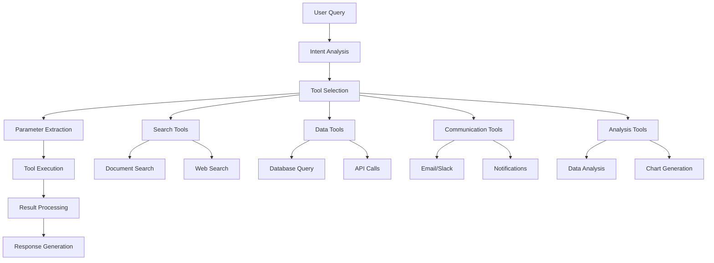

# 🧪 Exercise: Advanced Tool Calling & Function Integration

<InstructorNotes 
  timing="Advanced Tools Exercise (40-50 minutes)"
  notes={[
    "This is the most technical exercise - ensure strong foundation from previous exercises",
    "Focus on real-world tool integration patterns",
    "Show debugging techniques for function calling failures",
    "Demonstrate error handling and fallback strategies",
    "Address security considerations for external tool access",
    "Show both simple and complex tool orchestration examples"
  ]}
  tips={[
    "Start with simple tools (calculator, date) before complex APIs",
    "Show the JSON schema validation in action",
    "Demonstrate parallel vs sequential tool calling",
    "Use concrete business examples (not abstract demos)",
    "Show tool calling from both n8n and direct Gemini approaches"
  ]}
/>

## 🧪 Objective

Transform your PDF RAG agent into a sophisticated AI assistant that can execute complex tasks using external tools, APIs, and services through intelligent function calling.

<LiveStatusBadge />

## 🛠️ Setup

### Prerequisites
1. **Complete Exercises 30 & 31** - RAG agent with memory capabilities
2. **API Access** - Various external services for tool integration
3. **Security Planning** - API key management and access controls

### Tool Architecture Overview


## 🧠 Key Concepts

### Function Calling Fundamentals

**Tool Definition Schema:**
```javascript
{
  "name": "search_financial_data",
  "description": "Search for financial metrics and data in company documents",
  "parameters": {
    "type": "object",
    "properties": {
      "metric_type": {
        "type": "string",
        "enum": ["revenue", "profit", "expenses", "growth"],
        "description": "Type of financial metric to search for"
      },
      "time_period": {
        "type": "string", 
        "description": "Time period (e.g., 'Q3 2024', 'last quarter')"
      },
      "company_division": {
        "type": "string",
        "description": "Specific division or department (optional)"
      }
    },
    "required": ["metric_type", "time_period"]
  }
}
```

### Tool Categories

| Category | Purpose | Examples | Complexity |
|----------|---------|----------|------------|
| **Search Tools** | Information retrieval | Document search, web search, database queries | Low |
| **Data Tools** | Data processing | Calculations, transformations, analysis | Medium |
| **Communication** | External communication | Email, Slack, notifications | Medium |
| **Action Tools** | System actions | File operations, workflow triggers | High |

## ✅ Success Criteria

Your advanced tool-enabled agent should:

### Core Tool Functions
- [ ] **Tool Discovery** - Dynamically select appropriate tools for tasks
- [ ] **Parameter Extraction** - Extract correct parameters from natural language
- [ ] **Error Handling** - Gracefully handle tool failures and retries
- [ ] **Result Integration** - Combine tool outputs into coherent responses
- [ ] **Security** - Validate inputs and secure external communications

### Advanced Capabilities  
- [ ] **Multi-Tool Workflows** - Chain multiple tools for complex tasks
- [ ] **Parallel Execution** - Run independent tools simultaneously
- [ ] **Context Preservation** - Maintain context across tool calls
- [ ] **Learning** - Improve tool selection based on success patterns

## 🏗️ Implementation Steps

### Phase 1: Core Tool Infrastructure

<WorkshopExercise 
  title="Build Tool Registry & Execution Engine" 
  difficulty="advanced"
  timeEstimate="20 minutes"
  objectives={[
    "Create a flexible tool registry system",
    "Implement secure tool execution",
    "Build parameter validation and error handling"
  ]}
>

**Create tool infrastructure:**

1. **Tool Registry System**
   ```javascript
   // Function node: Tool registry
   const toolRegistry = {
     "search_documents": {
       name: "search_documents",
       description: "Search through uploaded PDF documents for specific information",
       parameters: {
         type: "object",
         properties: {
           query: {type: "string", description: "Search query"},
           document_filter: {type: "string", description: "Optional document name filter"},
           max_results: {type: "integer", default: 5, minimum: 1, maximum: 20}
         },
         required: ["query"]
       },
       endpoint: "/search-docs",
       security_level: "low"
     },
     
     "calculate_metrics": {
       name: "calculate_metrics", 
       description: "Perform financial calculations and metric analysis",
       parameters: {
         type: "object",
         properties: {
           operation: {type: "string", enum: ["sum", "average", "growth_rate", "percentage"]},
           values: {type: "array", items: {type: "number"}},
           time_periods: {type: "array", items: {type: "string"}}
         },
         required: ["operation", "values"]
       },
       endpoint: "/calculate",
       security_level: "low"
     },
     
     "send_notification": {
       name: "send_notification",
       description: "Send notifications via email or Slack",
       parameters: {
         type: "object",
         properties: {
           channel: {type: "string", enum: ["email", "slack"]},
           recipient: {type: "string"},
           message: {type: "string"},
           priority: {type: "string", enum: ["low", "medium", "high"], default: "medium"}
         },
         required: ["channel", "recipient", "message"]
       },
       endpoint: "/notify",
       security_level: "high"
     }
   };
   
   return { available_tools: Object.values(toolRegistry) };
   ```

2. **Parameter Validation Engine**
   ```javascript
   // Function node: Validate tool parameters
   function validateToolCall(toolName, parameters, toolRegistry) {
     const tool = toolRegistry[toolName];
     if (!tool) {
       throw new Error(`Tool '${toolName}' not found in registry`);
     }
     
     const schema = tool.parameters;
     const required = schema.required || [];
     
     // Check required parameters
     for (const param of required) {
       if (!(param in parameters)) {
         throw new Error(`Missing required parameter: ${param}`);
       }
     }
     
     // Validate parameter types and constraints
     for (const [param, value] of Object.entries(parameters)) {
       const paramSchema = schema.properties[param];
       if (!paramSchema) continue;
       
       if (paramSchema.type === "string" && paramSchema.enum) {
         if (!paramSchema.enum.includes(value)) {
           throw new Error(`Invalid value for ${param}: ${value}`);
         }
       }
       
       if (paramSchema.type === "integer") {
         if (paramSchema.minimum && value < paramSchema.minimum) {
           throw new Error(`${param} must be >= ${paramSchema.minimum}`);
         }
         if (paramSchema.maximum && value > paramSchema.maximum) {
           throw new Error(`${param} must be <= ${paramSchema.maximum}`);
         }
       }
     }
     
     return { valid: true, tool: tool };
   }
   
   const validation = validateToolCall(
     $json.tool_name, 
     $json.parameters, 
     $json.tool_registry
   );
   
   return validation;
   ```

3. **Secure Tool Execution**
   ```javascript
   // Function node: Execute tool with security checks
   async function executeToolSecurely(toolCall, userContext) {
     const { tool_name, parameters, validation } = toolCall;
     const tool = validation.tool;
     
     // Security checks
     if (tool.security_level === "high" && !userContext.admin_privileges) {
       throw new Error("Insufficient privileges for this tool");
     }
     
     // Rate limiting check
     const rateLimitKey = `${userContext.session_id}:${tool_name}`;
     const recentCalls = await checkRateLimit(rateLimitKey, 10, 60000); // 10 calls per minute
     
     if (recentCalls.exceeded) {
       throw new Error("Rate limit exceeded for this tool");
     }
     
     // Execute the tool
     try {
       const startTime = Date.now();
       const result = await callToolEndpoint(tool.endpoint, parameters);
       const executionTime = Date.now() - startTime;
       
       // Log successful execution
       await logToolExecution({
         tool_name,
         parameters,
         execution_time: executionTime,
         success: true,
         user_session: userContext.session_id
       });
       
       return {
         success: true,
         result: result,
         execution_time: executionTime,
         tool_name: tool_name
       };
       
     } catch (error) {
       // Log failed execution
       await logToolExecution({
         tool_name,
         parameters,
         error: error.message,
         success: false,
         user_session: userContext.session_id
       });
       
       throw error;
     }
   }
   ```

</WorkshopExercise>

### Phase 2: Intelligent Tool Selection

<WorkshopExercise 
  title="Implement Smart Tool Selection" 
  difficulty="advanced"
  timeEstimate="15 minutes"
  objectives={[
    "Analyze user queries to determine needed tools",
    "Select optimal tool combinations",
    "Handle ambiguous tool selection scenarios"
  ]}
>

**Build tool selection intelligence:**

1. **Intent Analysis with Gemini**
   ```javascript
   // HTTP Request: Analyze query for tool needs
   {
     "method": "POST",
     "url": "https://workshop-embedding-api.vercel.app/api/chat",
     "body": {
       "model": "gemini-2.0-flash-exp",
       "messages": [
         {
           "role": "system",
           "content": "You are a tool selection specialist. Analyze user queries and determine which tools are needed to fulfill the request. Consider the available tools and their capabilities."
         },
         {
           "role": "user",
           "content": "Available tools: {{$json.available_tools}}\n\nUser query: {{$json.user_query}}\n\nDetermine which tools to use and in what order."
         }
       ],
       "tools": [
         {
           "function": {
             "name": "select_tools",
             "description": "Select tools needed for the user's request",
             "parameters": {
               "type": "object",
               "properties": {
                 "tool_sequence": {
                   "type": "array",
                   "items": {
                     "type": "object",
                     "properties": {
                       "tool_name": {"type": "string"},
                       "reason": {"type": "string"},
                       "parameters": {"type": "object"},
                       "depends_on": {"type": "array", "items": {"type": "string"}},
                       "execution_order": {"type": "integer"}
                     }
                   }
                 },
                 "execution_strategy": {"type": "string", "enum": ["sequential", "parallel", "mixed"]},
                 "confidence": {"type": "number", "minimum": 0, "maximum": 1}
               }
             }
           }
         }
       ]
     }
   }
   ```

2. **Tool Orchestration Engine**
   ```javascript
   // Function node: Orchestrate tool execution
   async function orchestrateTools(toolSequence, executionStrategy) {
     const results = {};
     const errors = [];
     
     if (executionStrategy === "sequential") {
       // Execute tools one by one
       for (const toolCall of toolSequence.sort((a, b) => a.execution_order - b.execution_order)) {
         try {
           // Resolve parameter dependencies
           const resolvedParams = resolveDependencies(toolCall.parameters, results);
           
           const result = await executeToolSecurely({
             tool_name: toolCall.tool_name,
             parameters: resolvedParams,
             validation: await validateToolCall(toolCall.tool_name, resolvedParams)
           }, userContext);
           
           results[toolCall.tool_name] = result;
           
         } catch (error) {
           errors.push({
             tool: toolCall.tool_name,
             error: error.message,
             timestamp: new Date()
           });
           
           // Decide whether to continue or stop
           if (toolCall.critical) {
             throw new Error(`Critical tool ${toolCall.tool_name} failed: ${error.message}`);
           }
         }
       }
       
     } else if (executionStrategy === "parallel") {
       // Execute independent tools in parallel
       const independentTools = toolSequence.filter(t => !t.depends_on || t.depends_on.length === 0);
       
       const parallelPromises = independentTools.map(async (toolCall) => {
         try {
           const result = await executeToolSecurely({
             tool_name: toolCall.tool_name,
             parameters: toolCall.parameters,
             validation: await validateToolCall(toolCall.tool_name, toolCall.parameters)
           }, userContext);
           
           return { tool: toolCall.tool_name, result: result };
         } catch (error) {
           return { tool: toolCall.tool_name, error: error.message };
         }
       });
       
       const parallelResults = await Promise.all(parallelPromises);
       
       parallelResults.forEach(pr => {
         if (pr.result) {
           results[pr.tool] = pr.result;
         } else {
           errors.push({ tool: pr.tool, error: pr.error, timestamp: new Date() });
         }
       });
     }
     
     return {
       results: results,
       errors: errors,
       execution_summary: {
         total_tools: toolSequence.length,
         successful_tools: Object.keys(results).length,
         failed_tools: errors.length,
         execution_strategy: executionStrategy
       }
     };
   }
   ```

</WorkshopExercise>

### Phase 3: Specialized Tool Implementations

<WorkshopExercise 
  title="Build Specialized Business Tools" 
  difficulty="advanced"
  timeEstimate="25 minutes"
  objectives={[
    "Create domain-specific tools for business use cases",
    "Implement complex data processing tools",
    "Build communication and notification tools"
  ]}
>

**Implement business-specific tools:**

1. **Advanced Document Search Tool**
   ```javascript
   // HTTP Request node: Enhanced document search
   {
     "method": "POST",
     "url": "https://workshop-embedding-api.vercel.app/api/search-documents",
     "body": {
       "query": "{{$json.search_query}}",
       "filters": {
         "document_type": "{{$json.document_filter}}",
         "date_range": {
           "start": "{{$json.date_start}}",
           "end": "{{$json.date_end}}"
         },
         "metadata": "{{$json.metadata_filters}}"
       },
       "search_options": {
         "semantic_search": true,
         "keyword_search": true,
         "image_search": true,
         "hybrid_ranking": true
       },
       "result_options": {
         "max_results": "{{$json.max_results}}",
         "include_snippets": true,
         "include_images": true,
         "similarity_threshold": 0.7
       }
     }
   }
   ```

2. **Financial Analysis Tool**
   ```javascript
   // Function node: Financial calculations and analysis
   function performFinancialAnalysis(operation, data, options = {}) {
     const calculations = {
       growth_rate: (current, previous) => ((current - previous) / previous) * 100,
       
       compound_annual_growth_rate: (ending_value, beginning_value, years) => 
         (Math.pow(ending_value / beginning_value, 1 / years) - 1) * 100,
       
       moving_average: (values, period) => {
         const results = [];
         for (let i = period - 1; i < values.length; i++) {
           const sum = values.slice(i - period + 1, i + 1).reduce((a, b) => a + b, 0);
           results.push(sum / period);
         }
         return results;
       },
       
       trend_analysis: (values) => {
         const n = values.length;
         const x_mean = (n - 1) / 2;
         const y_mean = values.reduce((a, b) => a + b, 0) / n;
         
         let numerator = 0;
         let denominator = 0;
         
         for (let i = 0; i < n; i++) {
           numerator += (i - x_mean) * (values[i] - y_mean);
           denominator += Math.pow(i - x_mean, 2);
         }
         
         const slope = numerator / denominator;
         const direction = slope > 0 ? "increasing" : slope < 0 ? "decreasing" : "stable";
         
         return { slope, direction, confidence: Math.abs(slope) };
       },
       
       variance_analysis: (actual, budget) => {
         const variance = actual - budget;
         const variance_percentage = (variance / budget) * 100;
         
         return {
           absolute_variance: variance,
           percentage_variance: variance_percentage,
           status: variance >= 0 ? "favorable" : "unfavorable",
           significance: Math.abs(variance_percentage) > 10 ? "significant" : "minor"
         };
       }
     };
     
     const result = calculations[operation](data.values, data.secondary_values, data.periods);
     
     return {
       operation: operation,
       result: result,
       metadata: {
         calculation_date: new Date(),
         data_points: data.values?.length || 0,
         confidence_level: options.confidence_level || 0.95
       }
     };
   }
   
   const analysis = performFinancialAnalysis(
     $json.operation,
     $json.financial_data,
     $json.options
   );
   
   return analysis;
   ```

3. **Smart Notification Tool**
   ```javascript
   // Function node: Intelligent notification system
   async function sendSmartNotification(notification) {
     const { channel, recipient, message, priority, context } = notification;
     
     // Analyze message content for optimal delivery
     const messageAnalysis = await analyzeMessage(message);
     
     // Determine optimal timing
     const deliveryTiming = calculateOptimalTiming(recipient, priority, context);
     
     // Format message for channel
     const formattedMessage = formatMessageForChannel(message, channel, messageAnalysis);
     
     // Delivery options based on channel
     const deliveryMethods = {
       email: async (recipient, message) => {
         return await sendEmail({
           to: recipient,
           subject: generateSmartSubject(message),
           body: message,
           priority: priority,
           delivery_time: deliveryTiming.optimal_time
         });
       },
       
       slack: async (recipient, message) => {
         return await sendSlackMessage({
           channel: recipient,
           text: message,
           blocks: generateSlackBlocks(messageAnalysis),
           priority: priority
         });
       },
       
       sms: async (recipient, message) => {
         return await sendSMS({
           to: recipient,
           message: truncateForSMS(message),
           priority: priority
         });
       }
     };
     
     try {
       const deliveryResult = await deliveryMethods[channel](recipient, formattedMessage);
       
       // Log successful delivery
       await logNotification({
         channel,
         recipient,
         message_id: deliveryResult.id,
         delivered_at: new Date(),
         success: true,
         analysis: messageAnalysis
       });
       
       return {
         success: true,
         delivery_id: deliveryResult.id,
         channel: channel,
         estimated_read_time: deliveryTiming.estimated_read_time
       };
       
     } catch (error) {
       // Try fallback channel if available
       if (context.fallback_channel && context.fallback_channel !== channel) {
         return await sendSmartNotification({
           ...notification,
           channel: context.fallback_channel
         });
       }
       
       throw error;
     }
   }
   ```

</WorkshopExercise>

### Phase 4: Multi-Tool Workflows

<WorkshopExercise 
  title="Create Complex Multi-Tool Workflows" 
  difficulty="expert"
  timeEstimate="20 minutes"
  objectives={[
    "Chain multiple tools for complex business processes",
    "Handle tool dependencies and data flow",
    "Implement error recovery and fallback strategies"
  ]}
>

**Build sophisticated workflows:**

1. **Business Report Generation Workflow**
   ```javascript
   // Complex workflow: Generate comprehensive business report
   const reportWorkflow = {
     name: "generate_business_report",
     description: "Generate comprehensive business report with data analysis and insights",
     
     steps: [
       {
         step: 1,
         tool: "search_documents",
         parameters: {
           query: "{{$json.report_topic}}",
           document_filter: "financial_reports",
           max_results: 10
         },
         output_name: "source_documents"
       },
       
       {
         step: 2,
         tool: "calculate_metrics",
         parameters: {
           operation: "trend_analysis",
           values: "{{steps.source_documents.financial_data}}"
         },
         depends_on: ["source_documents"],
         output_name: "trend_analysis"
       },
       
       {
         step: 3,
         tool: "calculate_metrics", 
         parameters: {
           operation: "variance_analysis",
           values: "{{steps.source_documents.actual_values}}",
           secondary_values: "{{steps.source_documents.budget_values}}"
         },
         depends_on: ["source_documents"],
         output_name: "variance_analysis",
         parallel_with: [2] // Can run parallel with step 2
       },
       
       {
         step: 4,
         tool: "generate_insights",
         parameters: {
           trend_data: "{{steps.trend_analysis.result}}",
           variance_data: "{{steps.variance_analysis.result}}",
           source_context: "{{steps.source_documents.context}}"
         },
         depends_on: ["trend_analysis", "variance_analysis"],
         output_name: "business_insights"
       },
       
       {
         step: 5,
         tool: "create_visualization",
         parameters: {
           chart_type: "dashboard",
           data_sources: [
             "{{steps.trend_analysis.result}}",
             "{{steps.variance_analysis.result}}"
           ]
         },
         depends_on: ["trend_analysis", "variance_analysis"],
         output_name: "visualizations",
         parallel_with: [4]
       },
       
       {
         step: 6,
         tool: "generate_report",
         parameters: {
           insights: "{{steps.business_insights.result}}",
           charts: "{{steps.visualizations.result}}",
           template: "executive_summary"
         },
         depends_on: ["business_insights", "visualizations"],
         output_name: "final_report"
       },
       
       {
         step: 7,
         tool: "send_notification",
         parameters: {
           channel: "email",
           recipient: "{{$json.report_recipient}}",
           message: "Business report ready: {{steps.final_report.summary}}",
           priority: "medium"
         },
         depends_on: ["final_report"],
         optional: true // Don't fail workflow if notification fails
       }
     ],
     
     error_handling: {
       retry_failed_steps: true,
       max_retries: 2,
       fallback_strategy: "partial_completion",
       notify_on_failure: true
     }
   };
   
   return { workflow: reportWorkflow };
   ```

2. **Workflow Execution Engine**
   ```javascript
   // Function node: Execute complex multi-tool workflow
   async function executeWorkflow(workflow, inputData, userContext) {
     const executionPlan = analyzeWorkflowDependencies(workflow.steps);
     const stepResults = {};
     const errors = [];
     
     // Execute workflow in optimal order
     for (const phase of executionPlan.execution_phases) {
       const phasePromises = [];
       
       for (const step of phase.parallel_steps) {
         const promise = executeWorkflowStep(step, stepResults, inputData, userContext)
           .then(result => {
             stepResults[step.output_name] = result;
             return { step: step.step, success: true, result };
           })
           .catch(error => {
             errors.push({ step: step.step, error: error.message, timestamp: new Date() });
             
             if (workflow.error_handling.retry_failed_steps && step.retry_count < workflow.error_handling.max_retries) {
               step.retry_count = (step.retry_count || 0) + 1;
               return executeWorkflowStep(step, stepResults, inputData, userContext);
             }
             
             return { step: step.step, success: false, error: error.message };
           });
         
         phasePromises.push(promise);
       }
       
       const phaseResults = await Promise.all(phasePromises);
       
       // Check if critical steps failed
       const criticalFailures = phaseResults.filter(r => !r.success && !r.optional);
       if (criticalFailures.length > 0 && workflow.error_handling.fallback_strategy !== "partial_completion") {
         throw new Error(`Critical workflow steps failed: ${criticalFailures.map(f => f.step).join(', ')}`);
       }
     }
     
     return {
       success: errors.length === 0,
       results: stepResults,
       errors: errors,
       execution_summary: {
         total_steps: workflow.steps.length,
         successful_steps: Object.keys(stepResults).length,
         failed_steps: errors.length,
         execution_time: Date.now() - startTime
       }
     };
   }
   ```

</WorkshopExercise>

## 🧩 Advanced Tool Patterns

### Error Recovery Strategies
- **Graceful Degradation** - Continue with reduced functionality when tools fail
- **Retry Logic** - Exponential backoff for transient failures
- **Circuit Breakers** - Prevent cascading failures from external services

### Performance Optimization
- **Tool Caching** - Cache results from expensive tool operations
- **Batch Processing** - Combine multiple tool calls for efficiency
- **Async Execution** - Non-blocking tool execution where possible

### Security & Governance
- **Tool Permissions** - Role-based access to different tool categories
- **Audit Logging** - Complete audit trail of all tool executions
- **Data Validation** - Strict validation of all tool inputs and outputs

## 🔧 Testing Your Tool System

### Tool Integration Tests
1. **Individual Tool Tests** - Verify each tool works in isolation
2. **Parameter Validation** - Test edge cases and invalid inputs
3. **Error Handling** - Verify graceful failure handling
4. **Performance Tests** - Measure tool execution times under load

### Workflow Tests
1. **Simple Chains** - Test 2-3 tool sequences
2. **Complex Workflows** - Test full business process automation
3. **Parallel Execution** - Verify concurrent tool execution
4. **Failure Recovery** - Test error scenarios and recovery

## 📋 Advanced Tools Checklist

- [ ] **Tool Registry** - Dynamic tool discovery and registration
- [ ] **Parameter Validation** - Robust input validation and error handling
- [ ] **Security Controls** - Authentication, authorization, and rate limiting
- [ ] **Execution Engine** - Parallel and sequential tool orchestration
- [ ] **Error Recovery** - Retry logic and fallback strategies
- [ ] **Performance** - Caching, batching, and optimization
- [ ] **Monitoring** - Logging, metrics, and alerting
- [ ] **Documentation** - Clear tool schemas and usage examples

## 🎯 Key Takeaways

This exercise demonstrates:

1. **Tool Architecture** - Scalable, secure tool integration patterns
2. **Workflow Orchestration** - Complex business process automation
3. **Error Resilience** - Robust handling of real-world failures
4. **Security** - Enterprise-grade security and governance

## 📚 Next Steps

Ready for production deployment?

- **Production Architecture** - Coming soon!
- **Scaling & Performance** - Coming soon!
- **Security & Governance** - Coming soon!

You've built a sophisticated AI agent capable of complex task execution - the foundation of true business automation! 🛠️