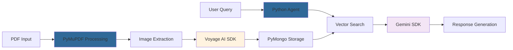

# 🐍 Path B: Code-First Development

**Build multimodal PDF agents using Python, Jupyter notebooks, and cutting-edge AI libraries**

Welcome to the code-first path! You're about to dive deep into the technical implementation of multimodal AI agents. You'll work directly with AI libraries, understand the algorithms, and have complete control over every aspect of your system.

---

## 🎯 What You'll Achieve

By the end of this path, you'll have built:

### 🤖 **Customizable AI Agent**
- Direct integration with AI libraries and SDKs
- Full control over model selection and parameters
- Custom preprocessing and postprocessing pipelines
- Research-ready experimental environment

### 🔧 **Technical Mastery**
- Deep understanding of embedding models
- Direct MongoDB integration patterns
- AI library optimization techniques
- Custom algorithm implementation

### 📈 **Developer Skills**
- Production Python code patterns
- Jupyter notebook best practices
- AI research and experimentation workflows
- Custom model deployment strategies

---

## 🗺️ Your Learning Journey

### **Phase 1: Foundation & Setup** *(30 minutes)*
- Environment Setup - Python and Jupyter configuration (see notebook)
- Library Installation - AI libraries and dependencies (see notebook)  
- [Prerequisites](./prerequisites) - API keys and database setup
- MongoDB Connection - Direct database integration (see notebook)

### **Phase 2: Core Implementation** *(90 minutes)*
- PDF Processing - Document parsing with PyMuPDF (see notebook Task 2-3)
- Embedding Generation - Voyage AI integration (see notebook Task 4)
- Vector Storage - MongoDB vector operations (see notebook Task 5)
- Search Implementation - Semantic retrieval (see notebook Task 6-7)

### **Phase 3: AI Agent Development** *(90 minutes)*
- Function Calling - Tool definition and selection (see notebook Task 8)
- LLM Integration - Google Gemini SDK (see notebook Task 9-12)
- Agent Architecture - ReAct pattern implementation (see notebook Task 10-12)
- Memory Systems - Conversation context (see notebook Task 13-14)

### **Phase 4: Advanced Features** *(60 minutes)*
- Custom Tools - Extending agent capabilities (covered in notebook)
- Performance Optimization - Speed and efficiency (covered in notebook)
- Research Extensions - Experimental features (extend the notebook)

---

## 🚀 Quick Start Checklist

Ready to code? Here's your launch sequence:

### ✅ **Pre-Flight Check**
- [ ] Python 3.8+ installed
- [ ] Jupyter notebook environment
- [ ] MongoDB Atlas account (free tier)
- [ ] Voyage AI API key
- [ ] Google AI Studio API key
- [ ] 3-4 hours of focused coding time

### 🛠️ **Setup Sequence**
1. **Setup Python Environment** - Virtual environment and dependencies (see notebook)
2. **Install AI Libraries** - Core packages and SDKs (see notebook Task 0)
3. **[Configure APIs](./prerequisites)** - Authentication and connections
4. **Test Notebook** - Verify environment setup (see notebook Task 1)

### 🎯 **Development Sequence**
1. **Process Documents** - PDF parsing and extraction (notebook Task 2-3)
2. **Generate Embeddings** - Multimodal understanding (notebook Task 4)
3. **Implement Search** - Vector similarity retrieval (notebook Task 6-7)
4. **Build Agent** - Intelligent reasoning system (notebook Task 8-12)
5. **Add Memory** - Context and learning (notebook Task 13-14)

---

## 🐍 Why Choose the Code-First Path?

### **🔍 Deep Understanding**
Write the algorithms yourself. Understand exactly how embeddings work, how vector search operates, and how AI agents make decisions.

### **⚡ Maximum Control**
Direct access to all parameters, models, and configurations. Optimize performance, experiment with cutting-edge models, and implement custom solutions.

### **🛠️ Research-Ready**
Perfect environment for experimentation. Try new models, test hypotheses, and contribute to the field of AI development.

### **🤝 Library Ecosystem**
Leverage the rich Python AI ecosystem. Integrate with any library, framework, or service using native Python code.

### **🔧 Custom Solutions**
Build exactly what you need. No constraints from visual workflow limitations - implement any algorithm or integration pattern.

---

## 🧠 Learning Philosophy

### **Code to Learn**
Every algorithm and integration is implemented step-by-step. You'll understand the "how" and "why" behind each component through direct implementation.

### **Library Mastery**
Learn to use professional AI libraries the way they're intended. Understand best practices, performance optimization, and advanced features.

### **Research Mindset**
Approach problems like an AI researcher. Experiment with different approaches, measure results, and iterate on solutions.

---

## 🔧 Technical Architecture Preview

Here's what you'll build with Python:



### **Core Libraries You'll Master:**

🔧 **Document Processing**
```python
import pymupdf         # PDF parsing and image extraction
from PIL import Image  # Image processing and manipulation
import base64          # Binary data encoding
```

🧠 **AI Integration**
```python
import voyageai               # Multimodal embeddings
from google import genai      # Gemini LLM integration
from google.genai import types # Function calling and tools
```

💾 **Data & Storage**
```python
import pymongo          # MongoDB operations
from datetime import datetime  # Timestamp management
import json            # Data serialization
```

🔍 **Analysis & Optimization**
```python
import numpy as np     # Numerical operations
from tqdm import tqdm  # Progress tracking
import asyncio         # Async operations
```

---

## 📚 Jupyter Notebook Experience

### **Interactive Development**
- Live code execution with immediate feedback
- Rich visualization of data and results  
- Markdown documentation alongside code
- Easy experimentation and iteration

### **Professional Workflow**
- Version control friendly development
- Reproducible research patterns
- Clear documentation and explanations
- Shareable and collaborative notebooks

### **Real-World Patterns**
- Production-ready code structure
- Error handling and logging
- Performance monitoring and optimization
- Testing and validation workflows

---

## 💡 Success Tips

### **🎯 Understand Before Implementing**
Each code cell includes detailed explanations. Read and understand the concepts before running the code.

### **🔍 Experiment Actively**
Modify parameters, try different models, and observe the results. The notebook environment is perfect for experimentation.

### **📚 Reference Documentation**
Use the extensive documentation for each library. Understanding the APIs will help you build better solutions.

### **🧪 Test Incrementally**
Run code cell by cell and verify outputs. This helps you understand the data flow and catch issues early.

### **🤝 Share and Discuss**
Save interesting experiments and share insights with other participants in the workshop discussions.

---

## 📖 Complete Notebook Structure

### **Task 0-1: Environment Setup**
```python
# Install and import all required libraries
!pip install -qU pymongo voyageai google-genai PyMuPDF Pillow tqdm

# Configure API keys and connections
import getpass
import os
```

### **Task 2-3: Document Processing**
```python
# Download and parse PDF documents
import pymupdf
import requests

# Extract pages as images for multimodal processing
zoom = 3.0
mat = pymupdf.Matrix(zoom, zoom)
```

### **Task 4-5: Embedding & Storage** 
```python
# Generate multimodal embeddings
from voyageai import Client
from PIL import Image

# Store in MongoDB with vector index
from pymongo import MongoClient
```

### **Task 6-7: Vector Search**
```python
# Implement semantic search
pipeline = [{
    "$vectorSearch": {
        "index": "vector_index",
        "queryVector": query_embedding,
        "path": "embedding",
        "numCandidates": 150,
        "limit": 5
    }
}]
```

### **Task 8-12: AI Agent Implementation**
```python
# Define agent tools and functions
def get_information_for_question_answering(user_query: str):
    # Vector search implementation
    
# Implement Gemini function calling
from google import genai
from google.genai import types

# Agent execution with ReAct pattern
def execute_agent(user_query, images=[]):
    # Tool selection and execution
```

### **Task 13-14: Memory & Context**
```python
# Implement conversation memory
def store_chat_message(session_id, role, type, content):
    # MongoDB session storage
    
def retrieve_session_history(session_id):
    # Context retrieval and management
```

---

## 🎪 Ready to Start Coding?

**Your development journey begins now!**

### **🚀 Next Step: Notebook Access**

Access the complete implementation notebook and start building your multimodal AI agent:

<div style={{textAlign: 'center', margin: '2rem 0'}}>
  <a 
    href="/static/notebooks/notebook.ipynb"
    download
    style={{
      display: 'inline-block',
      padding: '1rem 2rem',
      background: 'linear-gradient(135deg, #7C3AED 0%, #A855F7 100%)',
      color: 'white',
      textDecoration: 'none',
      borderRadius: '8px',
      fontWeight: 'bold',
      fontSize: '1.2rem',
      boxShadow: '0 4px 8px rgba(0, 0, 0, 0.2)',
      marginRight: '1rem'
    }}
  >
    📓 Download Jupyter Notebook
  </a>
  
  <a 
    href="https://colab.research.google.com/github/mongodb-developer/multimodal-pdf-agent-n8n/blob/main/notebooks/notebook.ipynb"
    target="_blank"
    style={{
      display: 'inline-block',
      padding: '1rem 2rem',
      background: 'linear-gradient(135deg, #F59E0B 0%, #F97316 100%)',
      color: 'white',
      textDecoration: 'none',
      borderRadius: '8px',
      fontWeight: 'bold',
      fontSize: '1.2rem',
      boxShadow: '0 4px 8px rgba(0, 0, 0, 0.2)'
    }}
  >
    🚀 Open in Google Colab
  </a>
</div>

**Estimated completion time**: 3-4 hours  
**Difficulty level**: Intermediate to Advanced  
**Prerequisites**: Python programming experience  

---

## 📚 Path Resources

### 🔗 **Quick Navigation**
- [Complete Notebook](https://github.com/mongodb-developer/multimodal-pdf-agent-n8n/blob/main/notebooks/notebook.ipynb) - Full implementation
- Library Documentation - API references (see external links)
- Code Examples - Reusable snippets (in notebook)

### 📖 **External Resources**
- [PyMongo Documentation](https://pymongo.readthedocs.io/) - MongoDB Python driver
- [Voyage AI Python SDK](https://docs.voyageai.com/docs/python-sdk) - Embedding integration
- [Google AI SDK](https://ai.google.dev/docs) - Gemini integration
- [Jupyter Best Practices](https://docs.jupyter.org/en/latest/) - Notebook optimization

### 🎯 **Learning Outcomes**
By completing this path, you'll be able to:
- Integrate AI libraries professionally
- Build custom multimodal processing pipelines
- Implement advanced AI agent patterns
- Optimize performance and memory usage
- Design research-ready AI systems

**Let's code something extraordinary together!** 🐍✨